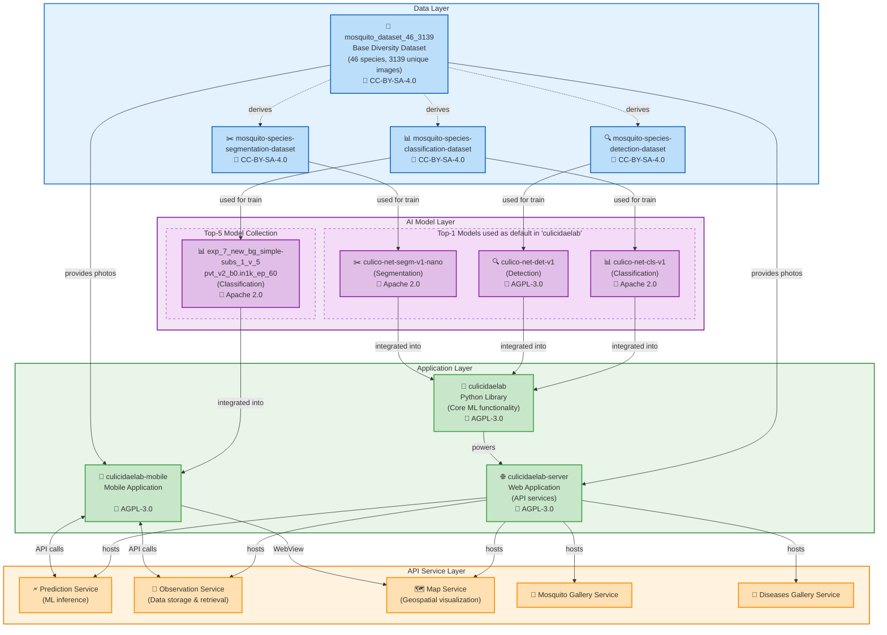

# CulicidaeLab

CulicidaeLab is a cross-platform Flutter application designed to help users identify mosquito species and learn about mosquito-borne diseases. The app provides educational information, a gallery of epidemiologically significant mosquito species, and details about diseases transmitted by mosquitoes.

## CulicidaeLab Ecosystem Architecture



An open-source system for mosquito research and analysis includes components:

- **Data**:

  - Base [diversity dataset (46 species, 3139 images](https://huggingface.co/datasets/iloncka/mosquito_dataset_46_3139)) under CC-BY-SA-4.0 license.
  - Specialized derivatives: [classification](https://huggingface.co/datasets/iloncka/mosquito-species-classification-dataset), [detection](https://huggingface.co/datasets/iloncka/mosquito-species-detection-dataset), and [segmentation](https://huggingface.co/datasets/iloncka/mosquito-species-segmentation-dataset) datasets under CC-BY-SA-4.0 licenses.

- **Models**:

  - Top-1 models (see reports), used as default by `culicidaelab` library: [classification (Apache 2.0)](https://huggingface.co/iloncka/culico-net-cls-v1), [detection (AGPL-3.0)](https://huggingface.co/iloncka/culico-net-det-v1), [segmentation (Apache 2.0)](https://huggingface.co/iloncka/culico-net-segm-v1-nano)
  - [Top-5 classification models collection](https://huggingface.co/collections/iloncka/mosquito-classification-17-top-5-68945bf60bca2c482395efa8) with accuracy >90% for 17 mosquito species.

- **Protocols**: All training parameters and metrics available at:

  - [Detection model reports](https://gitlab.com/mosquitoscan/experiments-reports-detection-models)
  - [Segmentation model reports](https://gitlab.com/mosquitoscan/experiments-reports-segmentation-models)
  - [Classification experiment reports - 1st round](https://gitlab.com/iloncka/mosal-reports)
  - [Classification experiment reports -2nd round](https://gitlab.com/mosquitoscan/experiments-reports)

- **Applications**:

  - [Python library (AGPL-3.0)](https://github.com/iloncka-ds/culicidaelab) providing core ML functionality
  - [Web server (AGPL-3.0)](https://github.com/iloncka-ds/culicidaelab-server) hosting API services
  - Mobile apps (AGPL-3.0): [mosquitoscan](https://gitlab.com/mosquitoscan/mosquitoscan-app) for independent use with optimized models and [culicidaelab-mobile](https://gitlab.com/iloncka-ds/culicidaelab-mobile) for educational and research purposes as part of the CulicidaeLab Ecosystem.

These components form a cohesive ecosystem where datasets used for training models that power applications, the Python library provides core functionality to the web server, and the server exposes services consumed by the mobile application. All components are openly licensed, promoting transparency and collaboration.

This integrated approach enables comprehensive mosquito research, from data collection to analysis and visualization, supporting both scientific research and public health initiatives.

## Key Features of `culicidaelab-mobile`

- **Mosquito Classification:** Take or upload a photo to identify mosquito species using an AI-powered model.
- **Mosquito Gallery:** Browse information and images of dangerous mosquito species.
- **Disease Information:** Learn about diseases transmitted by mosquitoes, including symptoms, prevention, and prevalence.
- **Localization:** Supports English, Spanish, and Russian languages.
- **Interactive Map:** View a map of mosquito activity reports (Android/iOS only).
- **Integrations:** The app supports integration with the CulicidaeLab(server) API for observations submissons, predictions and map features.
- **Educational Use:** The app is intended for educational and research purposes only.

## Practical Applications of the `culicidaelab-mobile`

-   **Citizen Science:**

    -   **Real-time Data Collection:** Engaging the general public in collecting data on the location and species of mosquitoes. This allows for the creation of dynamic distribution maps with unprecedented detail.
    -   **Early Warning System:** Rapidly detecting the emergence of dangerous invasive species (e.g., *Aedes aegypti* or *Aedes albopictus*) in new regions thanks to reports from citizens.

-   **Public Health and Personal Safety:**

    -   **Informing the Public:** Giving people the ability to instantly determine if a mosquito in their home is a potential carrier of diseases (dengue fever, Zika virus, chikungunya).
    -   **Raising Awareness:** An educational function that helps people better understand the risks associated with mosquitoes and take protective measures (e.g., eliminating standing water).

-   **Field Work:**

    -   **A Tool for Specialists:** Entomologists and staff from public health services can use the app for quick on-site identification and documentation of species.

## Getting Started

### Prerequisites

This project includes a [Dev Container](https://containers.dev/) configuration, which is the **recommended** way to set up your development environment. It ensures you have the correct versions of all tools and dependencies without needing to install them on your local machine.

#### Recommended: Using the Dev Container (One-Click Setup)

To use this method, you only need to have the following installed:

1.  [**Visual Studio Code**](https://code.visualstudio.com/)
2.  The [**Dev Containers** extension](https://marketplace.visualstudio.com/items?itemName=ms-vscode-remote.remote-containers) for VS Code.
3.  [**Docker Desktop**](https://www.docker.com/products/docker-desktop/) or another compatible container runtime.

Once these are installed, simply:
1.  Clone this repository.
2.  Open the repository folder in VS Code.
3.  When prompted, click **"Reopen in Container"**.

That's it! VS Code will build the container and install a fully configured environment with Flutter `3.29.3`, Java `17`, the correct Android SDK, and all recommended extensions.

---

#### Alternative: Manual Installation

If you prefer not to use a Dev Container, you can configure your environment manually. It is highly recommended to use the versions specified in the [devcontainer.json](./.devcontainer/devcontainer.json) to avoid potential compatibility issues.

*   **Flutter SDK:** Version **3.29.3** is recommended. You can install it by following the [official Flutter documentation](https://flutter.dev/docs/get-started/install).
*   **Java JDK:** Version **17** is required for building the Android app.
*   **For Android Development:**
    *   Install [Android Studio](https://developer.android.com/studio).
    *   Using the SDK Manager in Android Studio, ensure you have the following installed:
        *   Android SDK Platform **35**
        *   Android SDK Build-Tools **34.0.0**
        *   Android NDK **27.0.12077973**
*   **Editor:**
    *   [Visual Studio Code](https://code.visualstudio.com/) is recommended with the following extensions:
        *   `Dart` (dart-code.dart-code)
        *   `Flutter` (dart-code.flutter)

### Hardware Requirements

These are the recommended minimum hardware specifications for a smooth and responsive user experience, especially when using the on-device AI features.

*   **Processor (CPU):** A modern 64-bit ARM processor is required. A mid-range or better CPU is strongly recommended, as the performance of the on-device Machine Learning model (`PyTorch`) for image identification depends heavily on processing power.

*   **Memory (RAM):** **Minimum 3 GB.** A device with **4 GB or more is strongly recommended.** The app performs intensive image processing and runs a local AI model, which consumes significant memory. Devices with less than 3 GB of RAM may experience slowdowns or crashes during image analysis.

*   **Storage:** At least **300 MB** of free space. This is required to install the application, store the bundled ML model, cache map data (`flutter_map`), and save user data in the local database (`sqflite`).

*   **GPU:** A capable GPU is necessary for smooth UI rendering, which is standard on all supported devices.

### Software Requirements

*   **Operating System:**
    *   **Android:** Android 5.0 (API Level 21) or newer.
    *   **iOS:** iOS 12.0 or newer.

*   **Required Device Features & Permissions:**
    *   **Internet Connection:** Required for `flutter_map` to download map tiles and for other potential network requests.
    *   **Location Services (GPS):** Required for map functionality and tagging observations with geographic coordinates using the `geolocator` package.
    *   **Camera Access:** Required to capture new images for identification via the `image_picker` package.
    *   **Photo/Gallery Access:** Required to allow users to select existing images from their device for identification.

> For a full list of the Flutter packages and dependencies used in this project, please see the [`pubspec.yaml`](https://github.com/iloncka-ds/culicidaelab-mobile/blob/main/pubspec.yaml) file.

### Local Installation

If you have configured your development environment manually, follow these steps.

1.  **Clone the Repository:**
    ```sh
    git clone https://gitlab.com/culicidaelab/culicidaelab-mobile.git
    cd culicidaelab-mobile
    ```

2.  **Install Dependencies:**
    Fetch all the required packages from `pub.dev`.
    ```sh
    flutter pub get
    ```

3.  **(First-Time Setup) Generate App Assets:**
    This project uses packages to generate the launcher icon and native splash screen. Run these commands the first time you set up the project or after changing the source assets:
    ```sh
    # Generate the app launcher icons for Android and iOS
    flutter pub run flutter_launcher_icons

    # Generate the native splash screen files
    flutter pub run flutter_native_splash:create
    ```

4.  **Run the Application:**
    Ensure you have a physical device connected or an emulator/simulator running.
    ```sh
    # See a list of available devices
    flutter devices

    # Run the app on the selected device
    flutter run
    ```
    To run on a specific device from the list, use the `-d` flag:
    ```sh
    flutter run -d <your_device_id>
    ```

### Building for Release

To create an optimized production build of the application both options (dev-config and release-config) work fine:

*   **Android (APK):**
    ```sh
    flutter build apk --release
    ```
    The output file will be located at `build/app/outputs/flutter-apk/app-release.apk`.

*   **Android (App Bundle):**
    ```sh
    flutter build appbundle --release
    ```
    The output file will be located at `build/app/outputs/bundle/release/app-release.aab`.

## Project Structure

- main.dart – Application entry point
- l10n – Localization files (`.arb`)
- models – Data models
- providers – State management providers
- repositories – Data repositories
- screens – UI screens
- services – Business logic and platform services
- view_models – View models for stateful widgets
- widgets – Reusable UI components

## Localization

The app supports multiple languages. To add or update translations, edit the `.arb` files in l10n.

## Disclaimer

This platform is for educational and research purposes only. It does not replace professional medical advice or guidance from public health authorities.

## License

This project is licensed under the AGPL-3.0 License - see the [LICENSE](https://github.com/iloncka-ds/culicidaelab-mobile/blob/main/LICENSE) file for details.

---

## Acknowledgments

CulicidaeLab development is  supported by a grant from the [**Foundation for Assistance to Small Innovative Enterprises (FASIE)**](https://fasie.ru/).


---

For more information, see the project documentation or contact the development team.