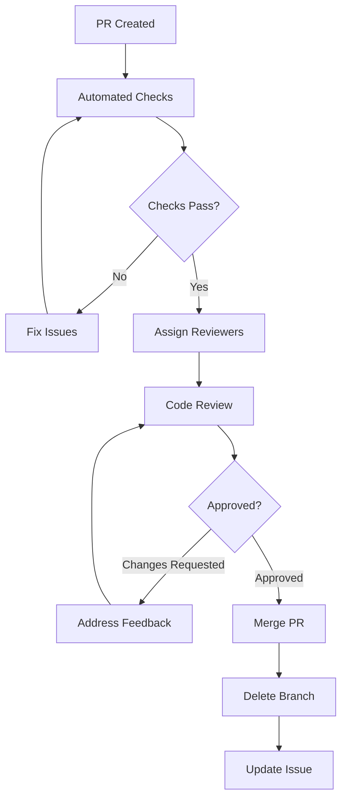

# Development Workflow

## Overview

This document outlines the development workflow for the CulicidaeLab project, including branching strategies, development processes, testing procedures, and deployment workflows. Following these guidelines ensures consistent code quality and smooth collaboration among team members.

## Table of Contents

- [Branching Strategy](#branching-strategy)
- [Development Process](#development-process)
- [Code Review Process](#code-review-process)
- [Testing Workflow](#testing-workflow)
- [Release Process](#release-process)
- [Continuous Integration](#continuous-integration)
- [Quality Assurance](#quality-assurance)
- [Deployment Process](#deployment-process)

## Branching Strategy

### Branch Types

We use a **feature branch workflow** with the following branch types:

#### Main Branches

1. **`main`** - Production-ready code
   - Always deployable
   - Protected branch requiring reviews
   - All releases are tagged from this branch
   - Direct commits not allowed

2. **`develop`** (optional) - Integration branch for features
   - Used for larger releases with multiple features
   - Created when needed for complex release cycles

#### Supporting Branches

1. **Feature Branches** - `feature/description`
   - Created from `main` (or `develop` if used)
   - Used for new features and enhancements
   - Merged back via pull request
   - Deleted after merge

2. **Bug Fix Branches** - `fix/description`
   - Created from `main`
   - Used for bug fixes
   - Can be merged directly to `main` for hotfixes
   - Deleted after merge

3. **Documentation Branches** - `docs/description`
   - Created from `main`
   - Used for documentation updates
   - Merged back via pull request
   - Deleted after merge

4. **Release Branches** - `release/version`
   - Created from `develop` (when used)
   - Used for release preparation
   - Bug fixes only, no new features
   - Merged to both `main` and `develop`

5. **Hotfix Branches** - `hotfix/description`
   - Created from `main`
   - Used for critical production fixes
   - Merged to both `main` and `develop`
   - Tagged immediately after merge

### Branch Naming Conventions

```bash
# Feature branches
feature/mosquito-species-filter
feature/user-authentication
feature/offline-mode

# Bug fix branches
fix/classification-timeout
fix/memory-leak-gallery
fix/crash-on-startup

# Documentation branches
docs/api-reference-update
docs/setup-guide-improvements
docs/architecture-diagrams

# Release branches
release/1.2.0
release/2.0.0-beta

# Hotfix branches
hotfix/critical-security-fix
hotfix/data-corruption-fix
```

## Development Process

### 1. Planning Phase

#### Issue Creation
1. **Create Issue**: Use appropriate issue template
2. **Label Assignment**: Add relevant labels (bug, feature, documentation, etc.)
3. **Priority Setting**: Assign priority level
4. **Milestone Assignment**: Link to appropriate milestone/release
5. **Assignee**: Assign to developer (if known)

#### Issue Refinement
1. **Requirements Clarification**: Ensure clear acceptance criteria
2. **Technical Discussion**: Discuss implementation approach
3. **Effort Estimation**: Estimate development time
4. **Dependencies**: Identify blocking issues or prerequisites

### 2. Development Phase

#### Starting Development
```bash
# 1. Update local main branch
git checkout main
git pull origin main

# 2. Create feature branch
git checkout -b feature/mosquito-species-filter

# 3. Set up tracking
git push -u origin feature/mosquito-species-filter
```

#### Development Workflow
1. **Small, Focused Commits**: Make atomic commits with clear messages
2. **Regular Pushes**: Push changes frequently to backup work
3. **Continuous Testing**: Run tests locally during development
4. **Code Quality**: Follow style guidelines and best practices

#### Commit Message Guidelines
Follow [Conventional Commits](https://www.conventionalcommits.org/) format:

```
type(scope): description

[optional body]

[optional footer]
```

**Types:**
- `feat`: New feature
- `fix`: Bug fix
- `docs`: Documentation changes
- `style`: Code style changes
- `refactor`: Code refactoring
- `test`: Adding or updating tests
- `chore`: Maintenance tasks
- `perf`: Performance improvements
- `ci`: CI/CD changes

**Examples:**
```bash
feat(gallery): add species filtering functionality

Add dropdown filter to mosquito gallery allowing users to filter
by species family. Includes search functionality and clear filters option.

Closes #123
```

```bash
fix(classification): resolve model loading timeout

Increase timeout for PyTorch model loading from 5s to 15s to handle
slower devices. Add retry mechanism with exponential backoff.

Fixes #456
```

### 3. Pre-Pull Request Phase

#### Self-Review Checklist
- [ ] Code follows project style guidelines
- [ ] All tests pass locally
- [ ] No debugging code or console logs
- [ ] Documentation updated (if needed)
- [ ] Commit messages follow conventions
- [ ] Branch is up to date with main

#### Code Quality Checks
```bash
# Format code
flutter format .

# Analyze code
flutter analyze

# Run tests
flutter test

# Check test coverage
flutter test --coverage
```

#### Update Branch
```bash
# Rebase on latest main
git checkout main
git pull origin main
git checkout feature/mosquito-species-filter
git rebase main

# Or merge if rebase is not preferred
git merge main
```

### 4. Pull Request Creation

#### PR Preparation
1. **Use PR Template**: Fill out all sections completely
2. **Clear Title**: Use conventional commit format
3. **Detailed Description**: Explain what, why, and how
4. **Link Issues**: Reference related issues
5. **Add Screenshots**: For UI changes
6. **Mark Draft**: If not ready for review

#### PR Requirements
- [ ] All CI checks pass
- [ ] Tests added/updated
- [ ] Documentation updated
- [ ] No merge conflicts
- [ ] Reviewers assigned

## Code Review Process

### Review Assignment

#### Automatic Assignment
- **Code Owners**: Automatically assigned based on CODEOWNERS file
- **Team Members**: Round-robin assignment for team members
- **Expertise-Based**: Assign based on area of expertise

#### Manual Assignment
- **Complex Changes**: Assign senior developers
- **Architecture Changes**: Assign architects/leads
- **Security Changes**: Assign security-focused reviewers
- **Performance Changes**: Assign performance experts

### Review Guidelines

#### For Authors

1. **Respond Promptly**: Address feedback within 24-48 hours
2. **Ask Questions**: Clarify unclear feedback
3. **Separate Commits**: Make review changes in separate commits
4. **Update Tests**: Ensure tests reflect changes
5. **Be Receptive**: Accept constructive feedback positively

#### For Reviewers

1. **Timely Reviews**: Complete reviews within 24-48 hours
2. **Constructive Feedback**: Be specific and helpful
3. **Explain Reasoning**: Provide context for suggestions
4. **Test Functionality**: Verify changes work as expected
5. **Check Standards**: Ensure code meets project standards

### Review Checklist

#### Functionality
- [ ] Code does what it's supposed to do
- [ ] Edge cases are handled
- [ ] Error handling is appropriate
- [ ] Performance is acceptable

#### Code Quality
- [ ] Code is readable and maintainable
- [ ] Follows project conventions
- [ ] No code duplication
- [ ] Appropriate abstractions

#### Testing
- [ ] Tests cover new functionality
- [ ] Tests are meaningful and thorough
- [ ] All tests pass
- [ ] Test coverage is adequate

#### Documentation
- [ ] Code is well-commented
- [ ] API documentation updated
- [ ] User documentation updated (if needed)
- [ ] README updated (if needed)

#### Security
- [ ] No security vulnerabilities
- [ ] Input validation implemented
- [ ] No hardcoded secrets
- [ ] Proper error handling

### Review Process Flow



## Testing Workflow

### Test Types

#### Unit Tests
- **Purpose**: Test individual functions/methods
- **Location**: `test/unit/`
- **Coverage**: All business logic and utilities
- **Run Command**: `flutter test test/unit/`

#### Widget Tests
- **Purpose**: Test UI components
- **Location**: `test/widget/`
- **Coverage**: All custom widgets and screens
- **Run Command**: `flutter test test/widget/`

#### Integration Tests
- **Purpose**: Test complete user flows
- **Location**: `integration_test/`
- **Coverage**: Critical user journeys
- **Run Command**: `flutter test integration_test/`

### Testing Standards

#### Test Coverage Requirements
- **Minimum Coverage**: 80% overall
- **Critical Code**: 95% coverage required
- **New Code**: 90% coverage required
- **UI Code**: 70% coverage acceptable

#### Test Quality Standards
- **Descriptive Names**: Tests should clearly describe what they test
- **Arrange-Act-Assert**: Follow AAA pattern
- **Independent Tests**: Tests should not depend on each other
- **Fast Execution**: Unit tests should run quickly

### Testing Workflow

#### Local Testing
```bash
# Run all tests
flutter test

# Run specific test suite
flutter test test/unit/services/
flutter test test/widget/screens/

# Run with coverage
flutter test --coverage
genhtml coverage/lcov.info -o coverage/html

# Run integration tests
flutter test integration_test/
```

#### CI Testing
- **Automated**: All tests run on every PR
- **Multiple Platforms**: Test on Android, iOS, Web
- **Performance Tests**: Run performance benchmarks
- **Security Scans**: Automated security vulnerability scanning

## Release Process

### Version Management

#### Semantic Versioning
We follow [Semantic Versioning](https://semver.org/):
- **MAJOR**: Breaking changes
- **MINOR**: New features (backward compatible)
- **PATCH**: Bug fixes (backward compatible)

#### Version Examples
- `1.0.0` → `1.0.1` (patch: bug fix)
- `1.0.1` → `1.1.0` (minor: new feature)
- `1.1.0` → `2.0.0` (major: breaking change)

### Release Workflow

#### 1. Release Planning
- **Feature Freeze**: Stop adding new features
- **Bug Fix Phase**: Focus on stability
- **Documentation Update**: Ensure docs are current
- **Testing Phase**: Comprehensive testing

#### 2. Release Preparation
```bash
# Create release branch
git checkout -b release/1.2.0

# Update version numbers
# - pubspec.yaml
# - Android build.gradle
# - iOS Info.plist

# Update CHANGELOG.md
# Add release notes

# Commit changes
git commit -m "chore: prepare release 1.2.0"
```

#### 3. Release Testing
- **Regression Testing**: Test all major features
- **Performance Testing**: Verify performance benchmarks
- **Device Testing**: Test on various devices
- **User Acceptance Testing**: Final user validation

#### 4. Release Deployment
```bash
# Merge to main
git checkout main
git merge release/1.2.0

# Tag release
git tag -a v1.2.0 -m "Release version 1.2.0"
git push origin v1.2.0

# Build and deploy
flutter build apk --release
flutter build appbundle --release
flutter build ios --release
```

#### 5. Post-Release
- **Monitor**: Watch for issues in production
- **Hotfixes**: Address critical issues quickly
- **Feedback**: Collect user feedback
- **Planning**: Plan next release cycle

### Release Types

#### Regular Releases
- **Schedule**: Monthly or bi-monthly
- **Content**: New features and bug fixes
- **Testing**: Full testing cycle
- **Documentation**: Complete documentation update

#### Hotfix Releases
- **Trigger**: Critical bugs or security issues
- **Timeline**: Within 24-48 hours
- **Scope**: Minimal changes, focused fixes
- **Testing**: Focused testing on fix area

#### Beta Releases
- **Purpose**: Early testing of major features
- **Audience**: Beta testers and early adopters
- **Feedback**: Collect feedback for final release
- **Stability**: May contain known issues

## Continuous Integration

### CI Pipeline

#### Automated Checks
1. **Code Quality**
   - Linting with `flutter analyze`
   - Code formatting with `flutter format`
   - Dependency vulnerability scanning

2. **Testing**
   - Unit tests execution
   - Widget tests execution
   - Integration tests execution
   - Test coverage reporting

3. **Build Verification**
   - Android APK build
   - Android App Bundle build
   - iOS build (if applicable)
   - Web build

4. **Security Scanning**
   - Dependency vulnerability check
   - Code security analysis
   - License compliance check

#### CI Configuration
```yaml
# Example GitHub Actions workflow
name: CI
on: [push, pull_request]

jobs:
  test:
    runs-on: ubuntu-latest
    steps:
      - uses: actions/checkout@v3
      - uses: subosito/flutter-action@v2
        with:
          flutter-version: '3.29.3'
      
      - name: Install dependencies
        run: flutter pub get
      
      - name: Analyze code
        run: flutter analyze
      
      - name: Format check
        run: flutter format --dry-run --set-exit-if-changed .
      
      - name: Run tests
        run: flutter test --coverage
      
      - name: Upload coverage
        uses: codecov/codecov-action@v3
```

### Quality Gates

#### PR Requirements
- [ ] All CI checks pass
- [ ] Test coverage meets minimum threshold
- [ ] No security vulnerabilities
- [ ] Code review approved
- [ ] Documentation updated

#### Merge Requirements
- [ ] Branch is up to date
- [ ] All conversations resolved
- [ ] Required approvals received
- [ ] No merge conflicts

## Quality Assurance

### Code Quality Metrics

#### Automated Metrics
- **Test Coverage**: Minimum 80%
- **Code Complexity**: Cyclomatic complexity < 10
- **Duplication**: < 3% code duplication
- **Maintainability Index**: > 70

#### Manual Review Points
- **Architecture Compliance**: Follows MVVM pattern
- **Performance**: No obvious performance issues
- **Security**: No security vulnerabilities
- **Usability**: Good user experience

### Quality Tools

#### Static Analysis
- **Flutter Analyzer**: Built-in Dart analyzer
- **Custom Lints**: Project-specific lint rules
- **SonarQube**: Code quality analysis (if used)

#### Testing Tools
- **Flutter Test**: Built-in testing framework
- **Mockito**: Mocking framework
- **Integration Test**: Flutter integration testing

#### Performance Tools
- **Flutter DevTools**: Performance profiling
- **Observatory**: Dart VM profiling
- **Custom Benchmarks**: App-specific performance tests

## Deployment Process

### Environment Strategy

#### Development Environment
- **Purpose**: Active development and testing
- **Deployment**: Automatic on feature branch push
- **Data**: Test data and mock services
- **Access**: Development team

#### Staging Environment
- **Purpose**: Pre-production testing
- **Deployment**: Automatic on main branch merge
- **Data**: Production-like test data
- **Access**: QA team and stakeholders

#### Production Environment
- **Purpose**: Live application
- **Deployment**: Manual trigger after approval
- **Data**: Real user data
- **Access**: End users

### Deployment Workflow

#### Automated Deployment
```yaml
# Example deployment workflow
name: Deploy
on:
  push:
    tags: ['v*']

jobs:
  deploy:
    runs-on: ubuntu-latest
    steps:
      - name: Build APK
        run: flutter build apk --release
      
      - name: Build App Bundle
        run: flutter build appbundle --release
      
      - name: Deploy to Play Store
        uses: r0adkll/upload-google-play@v1
        with:
          serviceAccountJsonPlainText: ${{ secrets.SERVICE_ACCOUNT_JSON }}
          packageName: com.culicidaelab.mobile
          releaseFiles: build/app/outputs/bundle/release/app-release.aab
          track: production
```

#### Manual Deployment Steps
1. **Pre-deployment Checks**
   - Verify all tests pass
   - Check deployment checklist
   - Confirm rollback plan

2. **Deployment Execution**
   - Build release artifacts
   - Deploy to app stores
   - Update documentation

3. **Post-deployment Verification**
   - Verify deployment success
   - Monitor application health
   - Check user feedback

### Rollback Procedures

#### Automatic Rollback
- **Health Checks**: Monitor app crash rates
- **Performance Metrics**: Watch for performance degradation
- **Error Rates**: Monitor error frequency

#### Manual Rollback
```bash
# Rollback to previous version
git checkout v1.1.0
flutter build apk --release
# Deploy previous version
```

## Conclusion

This development workflow ensures consistent code quality, efficient collaboration, and reliable releases. All team members should follow these guidelines to maintain project standards and deliver high-quality software.

For questions about the workflow or suggestions for improvements, please create an issue or start a discussion in the project repository.

---

**Remember**: The workflow is a living document that should evolve with the project's needs. Regular retrospectives help identify areas for improvement.