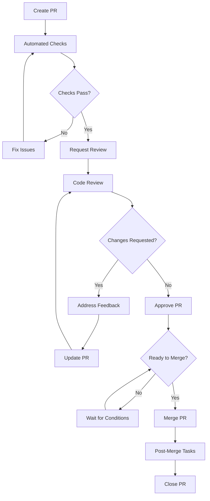
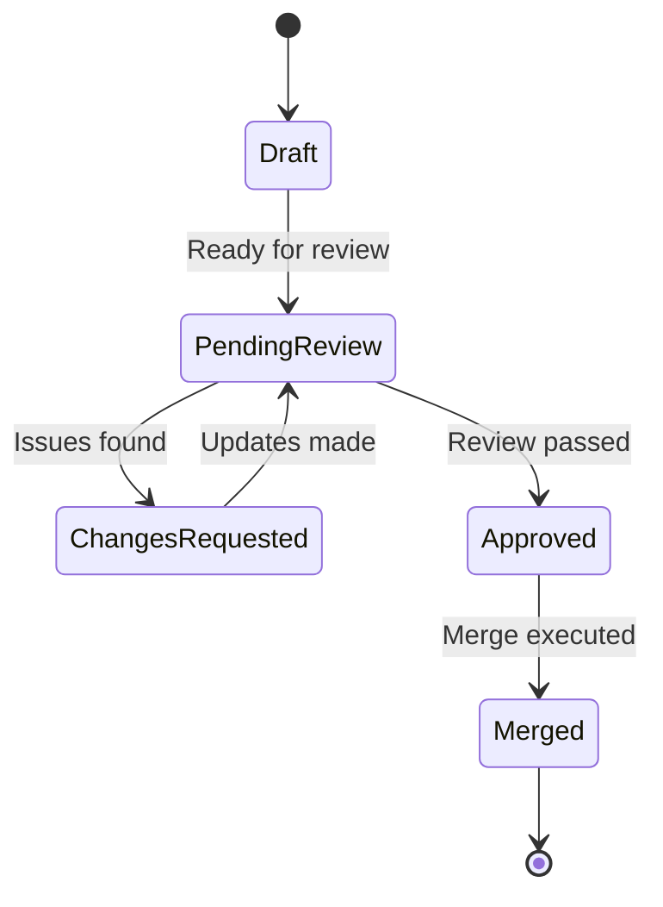

# Pull Request Process

## Overview

This document provides detailed guidelines for creating, reviewing, and managing pull requests in the CulicidaeLab project. Following this process ensures code quality, maintains project standards, and facilitates effective collaboration.

## Table of Contents

- [Pull Request Lifecycle](#pull-request-lifecycle)
- [Creating Pull Requests](#creating-pull-requests)
- [Review Process](#review-process)
- [Approval Workflow](#approval-workflow)
- [Merge Strategies](#merge-strategies)
- [Post-Merge Process](#post-merge-process)
- [Best Practices](#best-practices)
- [Troubleshooting](#troubleshooting)

## Pull Request Lifecycle

### Lifecycle Stages



### Stage Descriptions

1. **Draft**: Work in progress, not ready for review
2. **Ready for Review**: Complete and ready for team review
3. **In Review**: Actively being reviewed by team members
4. **Changes Requested**: Feedback provided, awaiting updates
5. **Approved**: Approved by required reviewers
6. **Ready to Merge**: All conditions met for merging
7. **Merged**: Successfully merged into target branch
8. **Closed**: PR lifecycle complete

## Creating Pull Requests

### Pre-Creation Checklist

Before creating a pull request, ensure:

- [ ] Feature/fix is complete and tested
- [ ] Code follows project style guidelines
- [ ] All tests pass locally
- [ ] Documentation is updated
- [ ] Commit messages follow conventions
- [ ] Branch is up to date with target branch

### PR Creation Steps

#### 1. Prepare Your Branch

```bash
# Ensure branch is up to date
git checkout main
git pull origin main
git checkout feature/your-feature
git rebase main  # or git merge main

# Run final checks
flutter analyze
flutter test
flutter format .
```

#### 2. Create the Pull Request

1. **Navigate to Repository**: Go to GitHub repository
2. **Compare & Pull Request**: Click the button for your branch
3. **Fill PR Template**: Complete all sections thoroughly
4. **Add Labels**: Apply appropriate labels
5. **Assign Reviewers**: Add relevant team members
6. **Link Issues**: Reference related issues

#### 3. PR Template Completion

**Required Sections:**
- **Description**: Clear summary of changes
- **Type of Change**: Select appropriate category
- **Testing**: Describe testing performed
- **Documentation**: List documentation updates
- **Breaking Changes**: Note any breaking changes
- **Screenshots**: Include for UI changes

### PR Title Guidelines

Follow conventional commit format:

```
type(scope): description

Examples:
feat(gallery): add species filtering functionality
fix(classification): resolve model loading timeout
docs(api): update classification service documentation
refactor(services): improve error handling consistency
```

### PR Description Best Practices

#### Structure
1. **Summary**: Brief overview of changes
2. **Motivation**: Why the change is needed
3. **Implementation**: How it was implemented
4. **Testing**: How it was tested
5. **Impact**: What areas are affected

#### Example Description
```markdown
## Summary
Adds species filtering functionality to the mosquito gallery, allowing users to filter by family, genus, and danger level.

## Motivation
Users requested the ability to quickly find specific types of mosquitoes without scrolling through the entire gallery. This improves user experience and makes the app more useful for educational purposes.

## Implementation
- Added FilterWidget with dropdown selectors
- Implemented filtering logic in MosquitoGalleryViewModel
- Added filter state management with Provider
- Updated gallery UI to show active filters

## Testing
- Unit tests for filtering logic
- Widget tests for FilterWidget
- Manual testing on Android and iOS
- Tested with various filter combinations

## Impact
- Affects mosquito gallery screen
- No breaking changes
- Improves performance by reducing rendered items
```

## Review Process

### Review Assignment

#### Automatic Assignment
- **CODEOWNERS**: Automatically assigns code owners
- **Team Assignment**: Round-robin for team members
- **Area Experts**: Based on changed files

#### Manual Assignment
- **Complex Changes**: Senior developers
- **Architecture Changes**: Technical leads
- **Security Changes**: Security-focused reviewers
- **UI Changes**: UX/UI specialists

### Review Types

#### 1. Code Review
**Focus Areas:**
- Code quality and style
- Logic correctness
- Performance implications
- Security considerations
- Maintainability

**Review Checklist:**
- [ ] Code is readable and well-structured
- [ ] Follows project conventions
- [ ] No obvious bugs or issues
- [ ] Appropriate error handling
- [ ] No security vulnerabilities

#### 2. Design Review
**Focus Areas:**
- Architecture compliance
- Design patterns usage
- API design
- Database schema changes
- Integration points

**Review Checklist:**
- [ ] Follows MVVM pattern
- [ ] Proper separation of concerns
- [ ] Consistent with existing architecture
- [ ] Scalable and maintainable design

#### 3. Testing Review
**Focus Areas:**
- Test coverage
- Test quality
- Test maintainability
- Edge case coverage
- Performance testing

**Review Checklist:**
- [ ] Adequate test coverage
- [ ] Tests are meaningful
- [ ] Edge cases covered
- [ ] Tests are maintainable
- [ ] Performance tests included (if needed)

### Review Guidelines

#### For Reviewers

**Review Principles:**
1. **Be Constructive**: Provide helpful, actionable feedback
2. **Be Specific**: Point to exact lines and explain issues
3. **Be Timely**: Complete reviews within 24-48 hours
4. **Be Thorough**: Check functionality, not just code style
5. **Be Respectful**: Maintain professional tone

**Review Process:**
1. **Understand Context**: Read PR description and linked issues
2. **Check CI Status**: Ensure automated checks pass
3. **Review Code**: Examine changes systematically
4. **Test Functionality**: Verify changes work as expected
5. **Provide Feedback**: Use GitHub review features

**Feedback Types:**
- **Comment**: General observations or questions
- **Suggestion**: Specific code improvements
- **Request Changes**: Issues that must be addressed
- **Approve**: Code meets standards and requirements

#### For Authors

**Responding to Reviews:**
1. **Read Carefully**: Understand all feedback
2. **Ask Questions**: Clarify unclear feedback
3. **Address All Points**: Respond to every comment
4. **Make Changes**: Implement requested improvements
5. **Update Tests**: Ensure tests reflect changes
6. **Re-request Review**: After addressing feedback

**Response Guidelines:**
- **Be Receptive**: Accept feedback positively
- **Be Responsive**: Address feedback promptly
- **Be Thorough**: Don't leave comments unresolved
- **Be Communicative**: Explain your reasoning

### Review Criteria

#### Approval Criteria
- [ ] Code quality meets standards
- [ ] Functionality works as expected
- [ ] Tests are adequate and passing
- [ ] Documentation is updated
- [ ] No security issues
- [ ] Performance is acceptable
- [ ] Follows project conventions

#### Change Request Criteria
- [ ] Code quality issues
- [ ] Functionality problems
- [ ] Insufficient testing
- [ ] Security vulnerabilities
- [ ] Performance problems
- [ ] Missing documentation
- [ ] Style violations

## Approval Workflow

### Approval Requirements

#### Standard PRs
- **Minimum Reviewers**: 1 approved review
- **Code Owner Approval**: Required for protected areas
- **CI Checks**: All automated checks must pass
- **Conflicts**: No merge conflicts allowed

#### Critical PRs
- **Minimum Reviewers**: 2 approved reviews
- **Senior Approval**: At least one senior developer
- **Extended Testing**: Additional testing required
- **Documentation**: Comprehensive documentation updates

#### Hotfix PRs
- **Fast Track**: Expedited review process
- **Minimum Reviewers**: 1 approved review (can be post-merge)
- **Immediate Merge**: Can merge with single approval
- **Follow-up**: Additional review after merge

### Approval Process

#### 1. Initial Review
- Reviewer examines code and provides feedback
- Author addresses feedback and updates PR
- Process repeats until reviewer is satisfied

#### 2. Final Approval
- Reviewer approves PR when all criteria are met
- PR status changes to "Approved"
- PR becomes eligible for merge

#### 3. Merge Readiness
- All required approvals received
- All CI checks passing
- No merge conflicts
- Branch is up to date

### Review Status Management

#### Status Indicators
- **🔴 Changes Requested**: Issues must be addressed
- **🟡 Pending Review**: Waiting for reviewer action
- **🟢 Approved**: Ready for merge
- **⚪ Draft**: Work in progress

#### Status Transitions


## Merge Strategies

### Merge Options

#### 1. Merge Commit
**When to Use:**
- Feature branches with multiple commits
- Want to preserve branch history
- Complex changes requiring context

**Advantages:**
- Preserves complete history
- Clear feature boundaries
- Easy to revert entire feature

**Disadvantages:**
- Creates merge commits
- More complex history graph

#### 2. Squash and Merge
**When to Use:**
- Multiple small commits
- Want clean linear history
- Single logical change

**Advantages:**
- Clean, linear history
- Single commit per feature
- Easier to read history

**Disadvantages:**
- Loses individual commit history
- Harder to track incremental changes

#### 3. Rebase and Merge
**When to Use:**
- Well-structured commit history
- Want to preserve individual commits
- Linear history preferred

**Advantages:**
- Linear history
- Preserves individual commits
- No merge commits

**Disadvantages:**
- Requires clean commit history
- Can be confusing for beginners

### Merge Decision Matrix

| Scenario | Recommended Strategy | Reason |
|----------|---------------------|---------|
| Single commit | Rebase and Merge | Maintains clean history |
| Multiple clean commits | Rebase and Merge | Preserves logical progression |
| Multiple messy commits | Squash and Merge | Creates clean single commit |
| Complex feature | Merge Commit | Preserves feature context |
| Hotfix | Squash and Merge | Simple, clean fix |
| Documentation | Squash and Merge | Usually single logical change |

### Pre-Merge Checklist

- [ ] All required approvals received
- [ ] All CI checks passing
- [ ] No merge conflicts
- [ ] Branch is up to date with target
- [ ] PR description is complete
- [ ] Related issues are linked
- [ ] Breaking changes documented
- [ ] Migration guide provided (if needed)

## Post-Merge Process

### Immediate Actions

#### 1. Branch Cleanup
```bash
# Delete feature branch (usually automatic)
git branch -d feature/your-feature
git push origin --delete feature/your-feature
```

#### 2. Issue Management
- Close related issues
- Update issue status
- Link to merged PR
- Update project boards

#### 3. Documentation Updates
- Update changelog
- Update version numbers (if needed)
- Publish documentation changes
- Notify stakeholders

### Follow-up Tasks

#### 1. Monitoring
- Watch for CI failures on main branch
- Monitor application metrics
- Check for user-reported issues
- Verify deployment success

#### 2. Communication
- Notify team of significant changes
- Update project status
- Communicate to stakeholders
- Update release notes

#### 3. Cleanup
- Archive related branches
- Update local repositories
- Clean up temporary resources
- Update development environment

## Best Practices

### For Authors

#### PR Creation
1. **Keep PRs Small**: Easier to review and merge
2. **Single Responsibility**: One feature/fix per PR
3. **Clear Description**: Explain what, why, and how
4. **Include Tests**: Ensure adequate test coverage
5. **Update Documentation**: Keep docs current

#### During Review
1. **Respond Promptly**: Address feedback quickly
2. **Be Open**: Accept constructive criticism
3. **Ask Questions**: Clarify unclear feedback
4. **Test Changes**: Verify fixes work correctly
5. **Update Thoroughly**: Address all feedback points

### For Reviewers

#### Review Quality
1. **Be Thorough**: Check functionality, not just style
2. **Be Constructive**: Provide helpful suggestions
3. **Be Timely**: Complete reviews promptly
4. **Be Specific**: Point to exact issues
5. **Be Respectful**: Maintain professional tone

#### Review Process
1. **Understand Context**: Read PR description fully
2. **Check CI**: Ensure automated checks pass
3. **Test Locally**: Verify changes work
4. **Consider Impact**: Think about broader implications
5. **Provide Examples**: Show better alternatives

### General Guidelines

#### Communication
- Use clear, professional language
- Explain reasoning behind suggestions
- Ask questions when unsure
- Acknowledge good work
- Be patient with learning process

#### Quality Standards
- Maintain consistent code style
- Ensure adequate test coverage
- Verify documentation accuracy
- Check for security issues
- Consider performance impact

## Troubleshooting

### Common Issues

#### 1. Merge Conflicts
**Problem**: Branch conflicts with target branch
**Solution:**
```bash
git checkout feature/your-feature
git rebase main
# Resolve conflicts
git add .
git rebase --continue
git push --force-with-lease
```

#### 2. Failed CI Checks
**Problem**: Automated checks failing
**Solution:**
- Check CI logs for specific errors
- Fix issues locally
- Run tests before pushing
- Ensure code follows style guidelines

#### 3. Review Delays
**Problem**: PRs not being reviewed promptly
**Solution:**
- Ping reviewers after 48 hours
- Request specific reviewers
- Break large PRs into smaller ones
- Provide clear context in description

#### 4. Approval Issues
**Problem**: Can't get required approvals
**Solution:**
- Address all feedback thoroughly
- Explain reasoning for decisions
- Request clarification on requirements
- Escalate to team lead if needed

### Emergency Procedures

#### Hotfix Process
1. **Create Hotfix Branch**: From main branch
2. **Make Minimal Changes**: Only fix critical issue
3. **Fast-Track Review**: Single reviewer approval
4. **Immediate Merge**: Merge as soon as approved
5. **Follow-up Review**: Additional review post-merge

#### Rollback Process
1. **Identify Issue**: Confirm problem with recent merge
2. **Create Revert PR**: Use GitHub revert feature
3. **Fast-Track Review**: Expedited approval process
4. **Immediate Merge**: Restore previous state
5. **Root Cause Analysis**: Investigate and prevent recurrence

## Conclusion

Following this pull request process ensures high code quality, effective collaboration, and smooth project development. All team members should familiarize themselves with these guidelines and apply them consistently.

For questions about the PR process or suggestions for improvements, please create an issue or start a discussion in the project repository.

---

**Remember**: The goal is to maintain code quality while enabling efficient development. The process should facilitate collaboration, not hinder it.