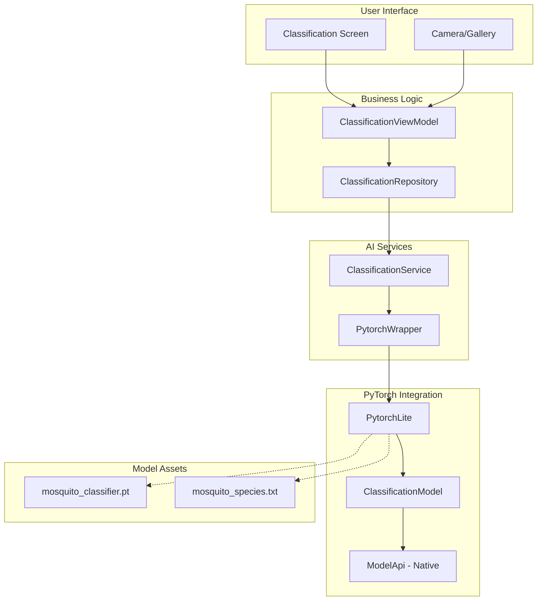
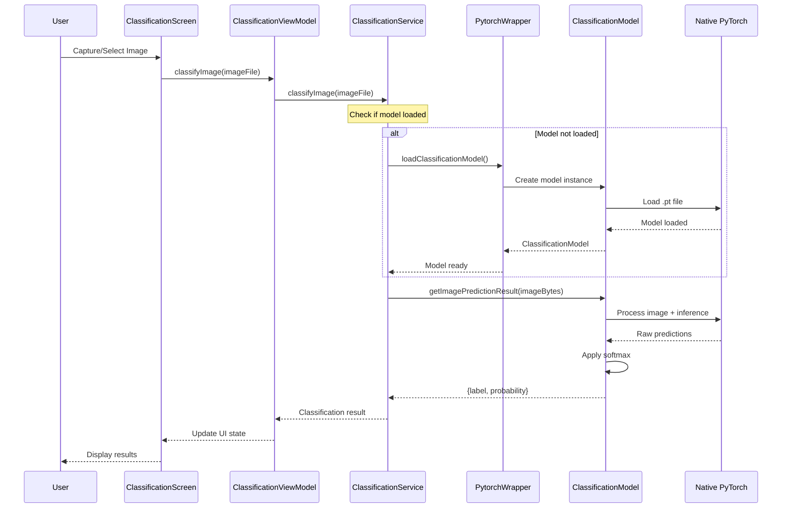

# AI Model Integration Guide

## Overview

CulicidaeLab integrates PyTorch Lite models for on-device mosquito species classification. This guide covers the complete AI pipeline, from model loading to inference, including architecture details, performance considerations, and troubleshooting.

## Architecture Overview

### AI Pipeline Components



### Data Flow



## Model Integration Components

### 1. PytorchWrapper

The `PytorchWrapper` class provides a testable interface around PyTorch Lite operations:

```dart
class PytorchWrapper {
  /// Loads a classification model from assets
  Future<ClassificationModel> loadClassificationModel(
    String pathImageModel,
    int imageWidth,
    int imageHeight, {
    String? labelPath,
  }) {
    return PytorchLite.loadClassificationModel(
      pathImageModel,
      imageWidth,
      imageHeight,
      labelPath: labelPath,
    );
  }
}
```

**Key Features:**
- **Testability**: Enables mocking for unit tests
- **Dependency Injection**: Supports service locator pattern
- **Future Extensibility**: Provides hooks for logging and caching

### 2. ClassificationService

The main service orchestrating AI operations:

```dart
class ClassificationService {
  final PytorchWrapper _pytorchWrapper;
  ClassificationModel? _model;
  
  /// Load the mosquito classification model
  Future<void> loadModel() async {
    String pathImageModel = "assets/models/mosquito_classifier.pt";
    try {
      _model = await _pytorchWrapper.loadClassificationModel(
        pathImageModel, 224, 224,
        labelPath: "assets/labels/mosquito_species.txt"
      );
    } on PlatformException {
      throw Exception("Model loading failed - only supported for Android/iOS");
    }
  }
  
  /// Classify a mosquito image
  Future<Map<String, dynamic>> classifyImage(File imageFile) async {
    if (_model == null) {
      throw Exception("Model not loaded - call loadModel() first");
    }
    
    final imageBytes = await imageFile.readAsBytes();
    final result = await _model!.getImagePredictionResult(imageBytes);
    
    return {
      'scientificName': result['label'].trim(),
      'confidence': result['probability'],
    };
  }
}
```

**Responsibilities:**
- Model lifecycle management
- Image preprocessing coordination
- Error handling and validation
- Performance monitoring

### 3. ClassificationModel

The PyTorch Lite model wrapper providing inference capabilities:

```dart
class ClassificationModel {
  final int _index;
  final List<String> labels;
  
  /// Get prediction with confidence score
  Future<Map<String, dynamic>> getImagePredictionResult(
    Uint8List imageAsBytes, {
    List<double> mean = TORCHVISION_NORM_MEAN_RGB,
    List<double> std = TORCHVISION_NORM_STD_RGB,
  }) async {
    final List<double?> prediction = await ModelApi()
        .getImagePredictionList(_index, imageAsBytes, null, null, null, mean, std);
    
    // Find max prediction
    int maxScoreIndex = 0;
    for (int i = 1; i < prediction.length; i++) {
      if (prediction[i]! > prediction[maxScoreIndex]!) {
        maxScoreIndex = i;
      }
    }
    
    // Apply softmax
    double sumExp = 0.0;
    for (var element in prediction) {
      sumExp += math.exp(element!);
    }
    
    final probabilities = prediction
        .map((element) => math.exp(element!) / sumExp)
        .toList();
    
    return {
      "label": labels[maxScoreIndex],
      "probability": probabilities[maxScoreIndex]
    };
  }
}
```

## Model Configuration

### Model Specifications

#### Current Model Details
- **File**: `assets/models/mosquito_classifier.pt`
- **Input Size**: 224x224 pixels
- **Color Space**: RGB
- **Normalization**: ImageNet standard (mean: [0.485, 0.456, 0.406], std: [0.229, 0.224, 0.225])
- **Output**: Softmax probabilities for mosquito species classes

#### Label Configuration
- **File**: `assets/labels/mosquito_species.txt`
- **Format**: One species name per line
- **Example**:
  ```
  Aedes aegypti
  Aedes albopictus
  Anopheles gambiae
  Culex pipiens
  ```

### Asset Organization

```
assets/
├── models/
│   └── mosquito_classifier.pt      # PyTorch Lite model file
└── labels/
    └── mosquito_species.txt        # Species label mappings
```

## Image Processing Pipeline

### 1. Image Input Handling

```dart
// From camera or gallery
final imageFile = File('/path/to/image.jpg');
final imageBytes = await imageFile.readAsBytes();
```

**Supported Formats:**
- JPEG (.jpg, .jpeg)
- PNG (.png)
- BMP (.bmp)
- WebP (.webp)

### 2. Preprocessing

The PyTorch Lite plugin handles:
- **Resizing**: Automatic resize to 224x224 pixels
- **Normalization**: ImageNet mean/std normalization
- **Color Space**: RGB conversion if needed
- **Tensor Conversion**: Convert to model input format

### 3. Model Inference

```dart
// Native inference through ModelApi
final List<double?> rawPrediction = await ModelApi()
    .getImagePredictionList(modelIndex, imageBytes, ...);
```

### 4. Post-processing

```dart
// Apply softmax to get probabilities
double sumExp = 0.0;
for (var logit in rawPrediction) {
  sumExp += math.exp(logit!);
}

final probabilities = rawPrediction
    .map((logit) => math.exp(logit!) / sumExp)
    .toList();

// Get top prediction
int maxIndex = probabilities.indexOf(probabilities.reduce(math.max));
String species = labels[maxIndex];
double confidence = probabilities[maxIndex];
```

## Performance Optimization

### Model Loading Optimization

```dart
class ClassificationService {
  static ClassificationService? _instance;
  ClassificationModel? _model;
  
  // Singleton pattern for model reuse
  static ClassificationService get instance {
    _instance ??= ClassificationService(pytorchWrapper: PytorchWrapper());
    return _instance!;
  }
  
  // Load model once and cache
  Future<void> ensureModelLoaded() async {
    if (_model == null) {
      await loadModel();
    }
  }
}
```

### Memory Management

```dart
// Dispose of large image data promptly
Future<Map<String, dynamic>> classifyImage(File imageFile) async {
  Uint8List? imageBytes;
  try {
    imageBytes = await imageFile.readAsBytes();
    final result = await _model!.getImagePredictionResult(imageBytes);
    return result;
  } finally {
    imageBytes = null; // Help GC
  }
}
```

### Inference Optimization

- **Batch Processing**: Use batch methods for multiple images
- **Image Size**: Optimize input image size before processing
- **Model Caching**: Keep model loaded in memory between predictions
- **Background Processing**: Run inference on background isolates for heavy workloads

## Error Handling

### Common Error Scenarios

#### 1. Platform Support
```dart
try {
  await classificationService.loadModel();
} on PlatformException catch (e) {
  // Handle unsupported platform (Web, Desktop)
  throw ClassificationException(
    'AI classification not supported on this platform',
    code: 'PLATFORM_UNSUPPORTED'
  );
}
```

#### 2. Model Loading Failures
```dart
try {
  _model = await _pytorchWrapper.loadClassificationModel(...);
} catch (e) {
  if (e.toString().contains('file not found')) {
    throw ClassificationException(
      'Model file not found in assets',
      code: 'MODEL_NOT_FOUND'
    );
  } else if (e.toString().contains('memory')) {
    throw ClassificationException(
      'Insufficient memory to load model',
      code: 'INSUFFICIENT_MEMORY'
    );
  }
  rethrow;
}
```

#### 3. Inference Errors
```dart
Future<Map<String, dynamic>> classifyImage(File imageFile) async {
  try {
    if (!imageFile.existsSync()) {
      throw ClassificationException('Image file not found');
    }
    
    final imageBytes = await imageFile.readAsBytes();
    if (imageBytes.isEmpty) {
      throw ClassificationException('Empty image file');
    }
    
    return await _model!.getImagePredictionResult(imageBytes);
  } catch (e) {
    if (e is ClassificationException) rethrow;
    throw ClassificationException('Classification failed: $e');
  }
}
```

### Error Recovery Strategies

```dart
class ClassificationService {
  int _retryCount = 0;
  static const int maxRetries = 3;
  
  Future<Map<String, dynamic>> classifyImageWithRetry(File imageFile) async {
    for (int attempt = 0; attempt <= maxRetries; attempt++) {
      try {
        return await classifyImage(imageFile);
      } catch (e) {
        if (attempt == maxRetries) rethrow;
        
        // Exponential backoff
        await Future.delayed(Duration(milliseconds: 100 * (1 << attempt)));
        
        // Reload model if needed
        if (e.toString().contains('model')) {
          _model = null;
          await loadModel();
        }
      }
    }
    throw ClassificationException('Max retries exceeded');
  }
}
```

## Testing AI Integration

### Unit Testing with Mocks

```dart
class MockPytorchWrapper extends Mock implements PytorchWrapper {}
class MockClassificationModel extends Mock implements ClassificationModel {}

void main() {
  group('ClassificationService', () {
    late ClassificationService service;
    late MockPytorchWrapper mockWrapper;
    late MockClassificationModel mockModel;
    
    setUp(() {
      mockWrapper = MockPytorchWrapper();
      mockModel = MockClassificationModel();
      service = ClassificationService(pytorchWrapper: mockWrapper);
    });
    
    test('should load model successfully', () async {
      // Arrange
      when(mockWrapper.loadClassificationModel(any, any, any, labelPath: any))
          .thenAnswer((_) async => mockModel);
      
      // Act
      await service.loadModel();
      
      // Assert
      expect(service.isModelLoaded, isTrue);
      verify(mockWrapper.loadClassificationModel(
        'assets/models/mosquito_classifier.pt',
        224,
        224,
        labelPath: 'assets/labels/mosquito_species.txt',
      )).called(1);
    });
    
    test('should classify image and return result', () async {
      // Arrange
      when(mockWrapper.loadClassificationModel(any, any, any, labelPath: any))
          .thenAnswer((_) async => mockModel);
      when(mockModel.getImagePredictionResult(any))
          .thenAnswer((_) async => {
            'label': 'Aedes aegypti',
            'probability': 0.85
          });
      
      await service.loadModel();
      final imageFile = File('test_image.jpg');
      
      // Act
      final result = await service.classifyImage(imageFile);
      
      // Assert
      expect(result['scientificName'], equals('Aedes aegypti'));
      expect(result['confidence'], equals(0.85));
    });
  });
}
```

### Integration Testing

```dart
void main() {
  group('AI Model Integration Tests', () {
    late ClassificationService service;
    
    setUpAll(() async {
      service = ClassificationService(pytorchWrapper: PytorchWrapper());
      await service.loadModel();
    });
    
    testWidgets('should classify real mosquito image', (tester) async {
      // Load test image from assets
      final ByteData imageData = await rootBundle.load('test_assets/aedes_aegypti.jpg');
      final File tempFile = File('${Directory.systemTemp.path}/test_image.jpg');
      await tempFile.writeAsBytes(imageData.buffer.asUint8List());
      
      // Classify image
      final result = await service.classifyImage(tempFile);
      
      // Verify results
      expect(result['scientificName'], isA<String>());
      expect(result['confidence'], isA<double>());
      expect(result['confidence'], greaterThan(0.0));
      expect(result['confidence'], lessThanOrEqualTo(1.0));
      
      // Clean up
      await tempFile.delete();
    });
  });
}
```

## Model Deployment and Updates

### Model Versioning

```dart
class ModelConfig {
  static const String currentVersion = 'v1.2.0';
  static const String modelPath = 'assets/models/mosquito_classifier_v1_2_0.pt';
  static const String labelsPath = 'assets/labels/mosquito_species_v1_2_0.txt';
  
  // Model metadata
  static const Map<String, dynamic> modelInfo = {
    'version': currentVersion,
    'inputSize': [224, 224],
    'numClasses': 12,
    'accuracy': 0.94,
    'trainedOn': '2024-01-15',
  };
}
```

### Dynamic Model Loading

```dart
class ModelManager {
  static Future<String> getModelPath() async {
    // Check for updated model in documents directory
    final documentsDir = await getApplicationDocumentsDirectory();
    final updatedModelPath = '${documentsDir.path}/models/latest_model.pt';
    
    if (await File(updatedModelPath).exists()) {
      return updatedModelPath;
    }
    
    // Fallback to bundled model
    return ModelConfig.modelPath;
  }
  
  static Future<void> downloadModelUpdate(String downloadUrl) async {
    // Implementation for downloading model updates
    // Include checksum verification and atomic replacement
  }
}
```

## Performance Monitoring

### Inference Metrics

```dart
class ClassificationMetrics {
  static final Stopwatch _inferenceTimer = Stopwatch();
  static final List<Duration> _inferenceTimes = [];
  
  static void startInference() {
    _inferenceTimer.reset();
    _inferenceTimer.start();
  }
  
  static void endInference() {
    _inferenceTimer.stop();
    _inferenceTimes.add(_inferenceTimer.elapsed);
    
    // Keep only last 100 measurements
    if (_inferenceTimes.length > 100) {
      _inferenceTimes.removeAt(0);
    }
  }
  
  static Duration get averageInferenceTime {
    if (_inferenceTimes.isEmpty) return Duration.zero;
    
    final totalMs = _inferenceTimes
        .map((d) => d.inMilliseconds)
        .reduce((a, b) => a + b);
    
    return Duration(milliseconds: totalMs ~/ _inferenceTimes.length);
  }
}
```

### Memory Usage Tracking

```dart
class MemoryMonitor {
  static Future<void> logMemoryUsage(String operation) async {
    final info = await DeviceInfoPlugin().androidInfo;
    // Log memory usage for performance analysis
    print('Memory usage during $operation: ${info.totalMemory}');
  }
}
```

## Troubleshooting Guide

### Common Issues

#### 1. Model Loading Fails
**Symptoms**: Exception during `loadModel()`
**Causes**:
- Missing model file in assets
- Corrupted model file
- Insufficient memory
- Unsupported platform

**Solutions**:
```dart
// Verify asset exists
final ByteData modelData = await rootBundle.load('assets/models/mosquito_classifier.pt');
print('Model size: ${modelData.lengthInBytes} bytes');

// Check available memory
final info = await DeviceInfoPlugin().androidInfo;
print('Available memory: ${info.totalMemory}');
```

#### 2. Poor Classification Accuracy
**Symptoms**: Low confidence scores or incorrect predictions
**Causes**:
- Poor image quality
- Incorrect preprocessing
- Model-data mismatch

**Solutions**:
```dart
// Validate image quality
Future<bool> validateImageQuality(File imageFile) async {
  final image = img.decodeImage(await imageFile.readAsBytes());
  if (image == null) return false;
  
  // Check minimum resolution
  if (image.width < 224 || image.height < 224) return false;
  
  // Check for blur (simplified)
  // Implement blur detection algorithm
  
  return true;
}
```

#### 3. Slow Inference Performance
**Symptoms**: Long classification times
**Causes**:
- Large input images
- Memory pressure
- CPU throttling

**Solutions**:
```dart
// Optimize image size
Future<File> optimizeImageForInference(File originalImage) async {
  final image = img.decodeImage(await originalImage.readAsBytes());
  if (image == null) throw Exception('Invalid image');
  
  // Resize if too large
  final resized = img.copyResize(image, width: 512, height: 512);
  
  // Compress
  final compressed = img.encodeJpg(resized, quality: 85);
  
  final optimizedFile = File('${originalImage.path}_optimized.jpg');
  await optimizedFile.writeAsBytes(compressed);
  
  return optimizedFile;
}
```

### Debug Mode Features

```dart
class ClassificationService {
  static const bool debugMode = kDebugMode;
  
  Future<Map<String, dynamic>> classifyImage(File imageFile) async {
    if (debugMode) {
      print('Classifying image: ${imageFile.path}');
      print('Image size: ${await imageFile.length()} bytes');
    }
    
    final stopwatch = Stopwatch()..start();
    final result = await _performClassification(imageFile);
    stopwatch.stop();
    
    if (debugMode) {
      print('Classification took: ${stopwatch.elapsedMilliseconds}ms');
      print('Result: ${result['scientificName']} (${result['confidence']})');
    }
    
    return result;
  }
}
```

## Future Enhancements

### Planned Improvements

1. **Model Quantization**: Reduce model size and improve inference speed
2. **Multi-Model Support**: Support for different model architectures
3. **Edge TPU Integration**: Hardware acceleration on supported devices
4. **Federated Learning**: Contribute to model improvement while preserving privacy
5. **Real-time Classification**: Video stream classification capabilities

### Extension Points

```dart
abstract class ClassificationProvider {
  Future<ClassificationResult> classify(File imageFile);
  bool get isAvailable;
  String get providerName;
}

class PyTorchClassificationProvider implements ClassificationProvider {
  // Current implementation
}

class TensorFlowLiteProvider implements ClassificationProvider {
  // Alternative implementation
}

class CloudMLProvider implements ClassificationProvider {
  // Cloud-based classification
}
```

## Conclusion

The AI model integration in CulicidaeLab provides robust, on-device mosquito species classification through PyTorch Lite. The architecture supports testing, performance monitoring, and future enhancements while maintaining reliability and user experience quality.

Key benefits:
- **Privacy**: On-device processing keeps user data local
- **Performance**: Optimized for mobile inference
- **Reliability**: Comprehensive error handling and recovery
- **Maintainability**: Clean architecture with dependency injection
- **Testability**: Mockable interfaces for comprehensive testing

For additional support or questions about AI model integration, refer to the PyTorch Mobile documentation or create an issue in the project repository.