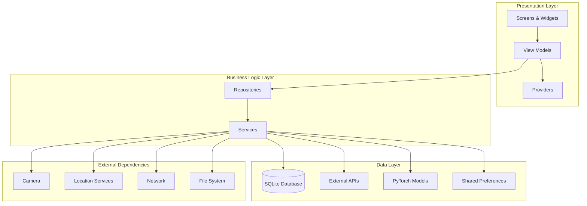
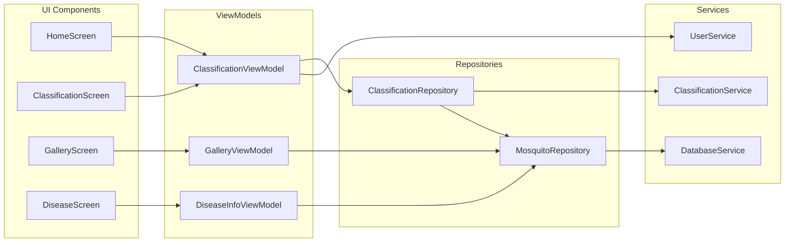
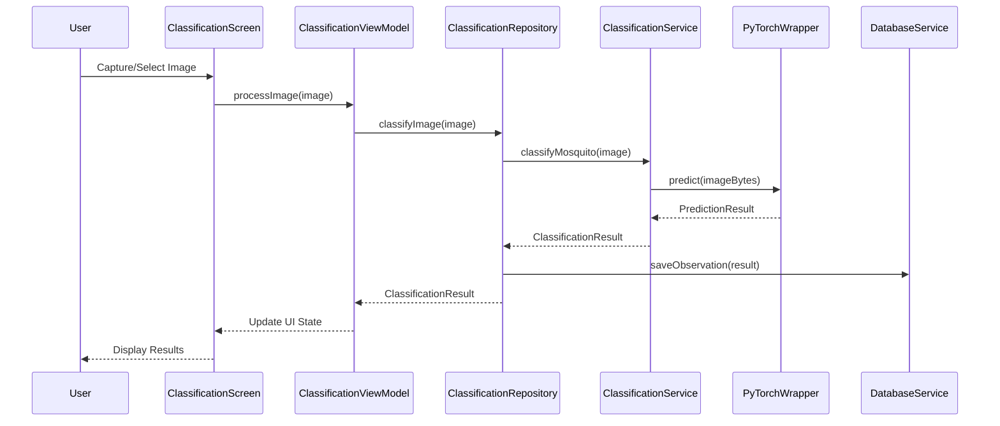
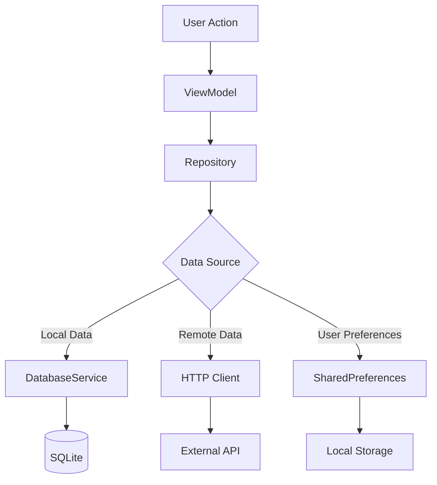
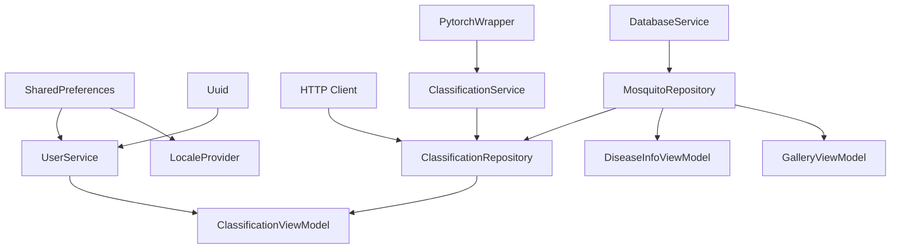
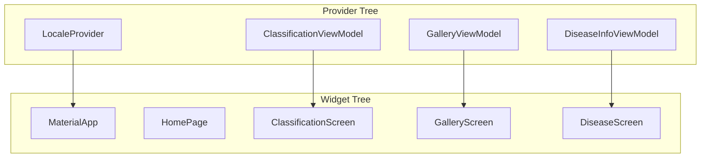
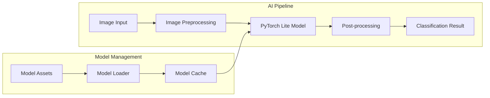
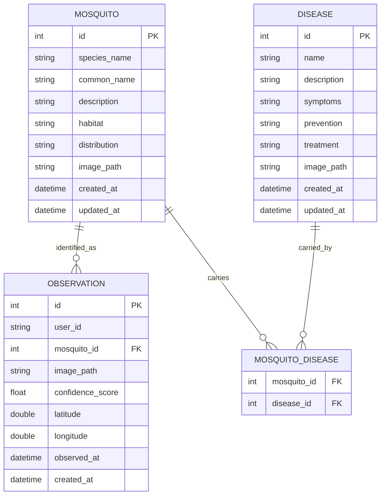
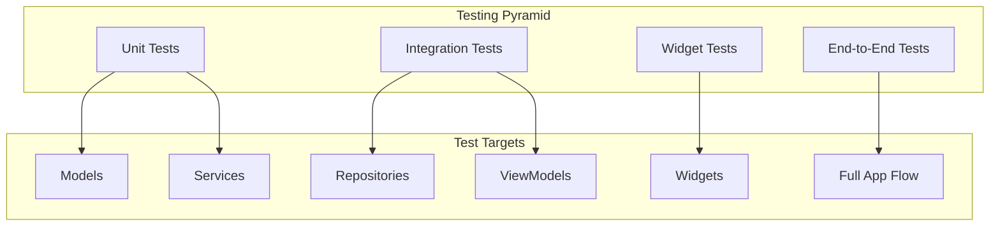

# CulicidaeLab Architecture Overview

## Introduction

CulicidaeLab is a Flutter mobile application designed for mosquito species identification and disease information dissemination. The application leverages AI-powered image classification using PyTorch Lite models to identify mosquito species from user-captured photos and provides comprehensive information about mosquito-borne diseases.

## High-Level Architecture

The application follows a layered architecture pattern with clear separation of concerns:

## MVVM Pattern Implementation

CulicidaeLab implements the Model-View-ViewModel (MVVM) architectural pattern with Provider for state management:

### View Layer
- **Screens**: Main UI components that represent different app pages
- **Widgets**: Reusable UI components and custom widgets
- **Navigation**: Route management and screen transitions

### ViewModel Layer
- **ClassificationViewModel**: Manages mosquito classification workflow
- **DiseaseInfoViewModel**: Handles disease information display
- **MosquitoGalleryViewModel**: Controls gallery browsing functionality

### Model Layer
- **Data Models**: Represent core entities (Mosquito, Disease, Observation)
- **Repositories**: Abstract data access and business logic
- **Services**: Handle specific functionality (AI, Database, Network)

## Component Relationships

### Core Components

## Data Flow Architecture

### Classification Workflow

### Data Persistence Flow

## Dependency Injection

The application uses GetIt for dependency injection, configured in `lib/locator.dart`:

### Service Registration Order

1. **External Packages**: SharedPreferences, HTTP Client, UUID
2. **Core Services**: Database, PyTorch, User, Classification
3. **Repositories**: Data access layer
4. **ViewModels**: Business logic layer
5. **Providers**: State management

### Dependency Graph

## State Management with Provider

### Provider Architecture

### State Flow Pattern

1. **User Interaction**: User performs action in UI
2. **ViewModel Update**: ViewModel processes action and updates state
3. **Provider Notification**: ViewModel notifies listeners via ChangeNotifier
4. **UI Rebuild**: Consumer widgets rebuild with new state
5. **Repository Interaction**: ViewModel calls repository methods for data operations

## AI Model Integration

### PyTorch Lite Integration

### Classification Service Architecture

- **Image Preprocessing**: Resize, normalize, and format images for model input
- **Model Inference**: Execute PyTorch Lite model prediction
- **Result Processing**: Parse model output and map to mosquito species
- **Confidence Scoring**: Evaluate prediction confidence and handle low-confidence results

## Database Architecture

### SQLite Schema

### Data Access Pattern

- **Repository Pattern**: Abstract data access through repository interfaces
- **Service Layer**: Business logic separated from data access
- **Model Classes**: Strongly-typed data models with validation
- **Migration Support**: Database schema versioning and migration handling

## Security Architecture

### Data Protection

- **Local Storage**: SQLite database with encrypted sensitive data
- **User Privacy**: Anonymous user identification with UUID
- **Image Security**: Local image storage with secure file paths
- **Network Security**: HTTPS for all external API communications

### Permission Management

- **Camera Access**: Required for image capture functionality
- **Location Services**: Optional for observation geo-tagging
- **Storage Access**: Required for image processing and caching
- **Network Access**: Required for external API integration

## Performance Considerations

### Memory Management

- **Image Processing**: Efficient image loading and disposal
- **Model Caching**: PyTorch model loaded once and cached
- **Database Connections**: Connection pooling and proper disposal
- **Widget Lifecycle**: Proper disposal of controllers and listeners

### Optimization Strategies

- **Lazy Loading**: Services and models loaded on-demand
- **Image Caching**: Cached network images for offline access
- **Database Indexing**: Optimized queries with proper indexing
- **Background Processing**: Heavy operations moved to background threads

## Testing Architecture

### Testing Layers

### Testing Strategy

- **Unit Tests**: Test individual components in isolation
- **Integration Tests**: Test component interactions and data flow
- **Widget Tests**: Test UI components and user interactions
- **End-to-End Tests**: Test complete user workflows

## Deployment Architecture

### Build Configuration

- **Development**: Debug builds with development tools
- **Staging**: Release builds with staging API endpoints
- **Production**: Optimized release builds with production configuration

### Platform-Specific Considerations

- **Android**: Gradle build configuration and permissions
- **iOS**: Xcode project settings and Info.plist configuration
- **Asset Management**: Platform-specific asset optimization

## Extension Points

### Customization Areas

- **New Classification Models**: Plugin architecture for additional AI models
- **Data Sources**: Extensible repository pattern for new data sources
- **UI Themes**: Configurable theming system
- **Localization**: Support for additional languages and regions

### Integration Capabilities

- **External APIs**: RESTful API integration framework
- **Third-party Services**: Plugin system for external service integration
- **Data Export**: Configurable data export formats and destinations
- **Analytics**: Pluggable analytics and monitoring systems

## Conclusion

The CulicidaeLab architecture provides a solid foundation for a scalable, maintainable, and extensible mobile application. The clear separation of concerns, dependency injection, and MVVM pattern ensure that the codebase remains organized and testable as the application grows in complexity and features.