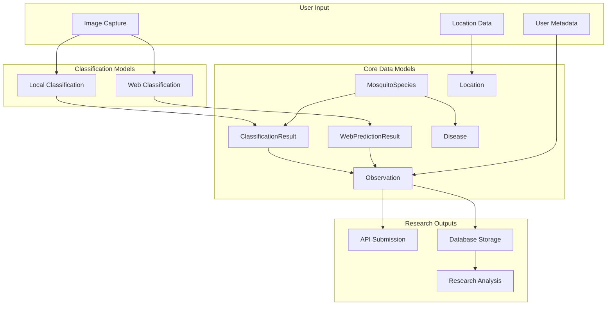
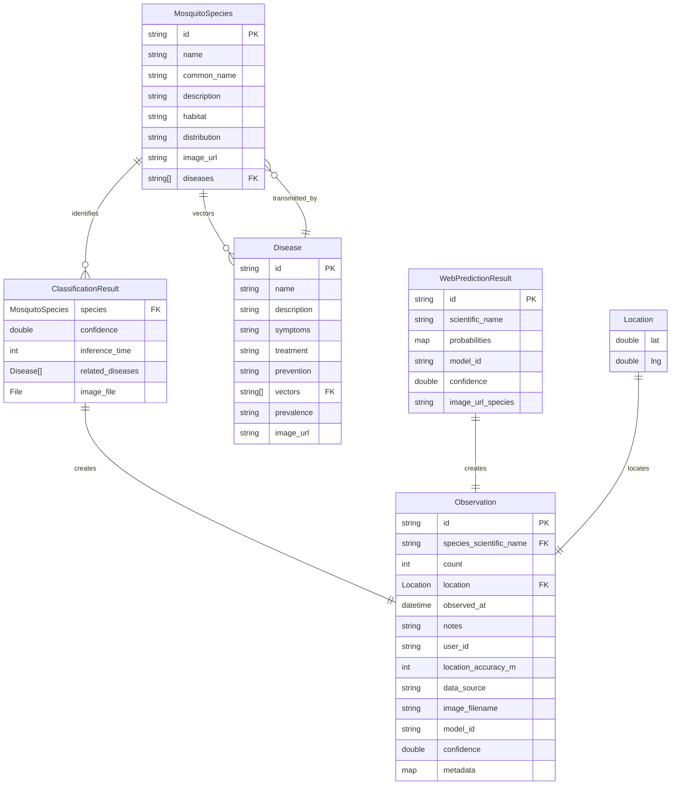

# CulicidaeLab Data Models for Research Applications

## Overview

The CulicidaeLab mobile application uses a comprehensive set of data models designed to support mosquito surveillance, species identification, and disease vector research. This document provides detailed technical documentation of all data structures, their relationships, and usage patterns for researchers and developers working with the CulicidaeLab ecosystem.

## Model Architecture

### Core Data Flow



## Location Model

### Structure

The `Location` model represents geographical coordinates using the WGS84 coordinate system (EPSG:4326).

```dart
class Location {
  final double lat;    // Latitude: -90.0 to 90.0
  final double lng;    // Longitude: -180.0 to 180.0
}
```

### JSON Schema

```json
{
  "type": "object",
  "properties": {
    "lat": {
      "type": "number",
      "minimum": -90.0,
      "maximum": 90.0,
      "description": "Latitude in decimal degrees"
    },
    "lng": {
      "type": "number", 
      "minimum": -180.0,
      "maximum": 180.0,
      "description": "Longitude in decimal degrees"
    }
  },
  "required": ["lat", "lng"]
}
```

### Research Applications

**Spatial Analysis:**
```dart
// Calculate distance between observations
final distance = location1.distanceTo(location2); // Returns km

// Spatial clustering example
List<Observation> findNearbyObservations(
  Location center, 
  double radiusKm,
  List<Observation> observations
) {
  return observations.where((obs) => 
    obs.location.distanceTo(center) <= radiusKm
  ).toList();
}
```

**Coordinate Validation:**
- Automatic validation ensures coordinates are within valid ranges
- Precision maintained to 6 decimal places (~0.1m accuracy)
- Compatible with standard GIS systems and mapping libraries

## MosquitoSpecies Model

### Structure

Comprehensive species information model supporting taxonomic classification and ecological data.

```dart
class MosquitoSpecies {
  final String id;              // Unique identifier (snake_case)
  final String name;            // Scientific name (binomial)
  final String commonName;      // Human-readable name
  final String description;     // Detailed species information
  final String habitat;         // Habitat preferences
  final String distribution;    // Geographic distribution
  final String imageUrl;        // Reference image path/URL
  final List<String> diseases;  // Associated disease IDs
}
```

### JSON Schema

```json
{
  "type": "object",
  "properties": {
    "id": {
      "type": "string",
      "pattern": "^[a-z_]+$",
      "description": "Unique species identifier in snake_case"
    },
    "name": {
      "type": "string",
      "description": "Scientific name following binomial nomenclature"
    },
    "common_name": {
      "type": "string",
      "description": "Common name(s) for the species"
    },
    "description": {
      "type": "string",
      "description": "Detailed species description and characteristics"
    },
    "habitat": {
      "type": "string",
      "description": "Preferred habitats and breeding sites"
    },
    "distribution": {
      "type": "string", 
      "description": "Geographic distribution and range"
    },
    "image_url": {
      "type": "string",
      "description": "Path or URL to species reference image"
    },
    "diseases": {
      "type": "array",
      "items": {"type": "string"},
      "description": "List of disease IDs this species can transmit"
    }
  },
  "required": ["id", "name", "common_name", "description", "habitat", "distribution", "image_url", "diseases"]
}
```

### Research Applications

**Taxonomic Analysis:**
```dart
// Species classification hierarchy
final genusSpecies = species.name.split(' ');
final genus = genusSpecies[0];
final specificEpithet = genusSpecies[1];

// Vector competence analysis
final vectorSpecies = allSpecies.where((s) => 
  s.diseases.contains('dengue')
).toList();
```

**Ecological Modeling:**
- Habitat preference analysis for distribution modeling
- Climate suitability assessment using distribution data
- Vector-disease relationship mapping

## Disease Model

### Structure

Comprehensive disease information model for vector-borne disease research.

```dart
class Disease {
  final String id;              // Unique disease identifier
  final String name;            // Common disease name
  final String description;     // Detailed disease information
  final String symptoms;        // Clinical manifestations
  final String treatment;       // Treatment approaches
  final String prevention;      // Prevention strategies
  final List<String> vectors;   // Vector species IDs
  final String prevalence;      // Geographic prevalence
  final String imageUrl;        // Disease-related image
}
```

### JSON Schema

```json
{
  "type": "object",
  "properties": {
    "id": {
      "type": "string",
      "pattern": "^[a-z_]+$",
      "description": "Unique disease identifier"
    },
    "name": {
      "type": "string",
      "description": "Common disease name"
    },
    "description": {
      "type": "string",
      "description": "Comprehensive disease description"
    },
    "symptoms": {
      "type": "string",
      "description": "Clinical symptoms and manifestations"
    },
    "treatment": {
      "type": "string",
      "description": "Treatment and management approaches"
    },
    "prevention": {
      "type": "string",
      "description": "Prevention methods and strategies"
    },
    "vectors": {
      "type": "array",
      "items": {"type": "string"},
      "description": "List of vector species IDs"
    },
    "prevalence": {
      "type": "string",
      "description": "Geographic prevalence and distribution"
    },
    "image_url": {
      "type": "string",
      "description": "Path or URL to disease-related image"
    }
  },
  "required": ["id", "name", "description", "symptoms", "treatment", "prevention", "vectors", "prevalence", "image_url"]
}
```

### Research Applications

**Epidemiological Analysis:**
```dart
// Vector-disease network analysis
Map<String, List<String>> buildVectorDiseaseNetwork(
  List<Disease> diseases
) {
  final network = <String, List<String>>{};
  for (final disease in diseases) {
    for (final vector in disease.vectors) {
      network.putIfAbsent(vector, () => []).add(disease.id);
    }
  }
  return network;
}

// Disease risk assessment
bool isHighRiskVector(String speciesId, List<Disease> diseases) {
  final transmittedDiseases = diseases.where((d) => 
    d.isTransmittedBy(speciesId)
  ).toList();
  return transmittedDiseases.length >= 2; // Multiple disease vector
}
```

## ClassificationResult Model

### Structure

Local device-based classification results with comprehensive metadata.

```dart
class ClassificationResult {
  final MosquitoSpecies species;        // Identified species
  final double confidence;              // Confidence score (0.0-1.0)
  final int inferenceTime;             // Processing time (ms)
  final List<Disease> relatedDiseases; // Associated diseases
  final File imageFile;                // Original image
}
```

### Research Applications

**Model Performance Analysis:**
```dart
// Performance metrics calculation
class ClassificationMetrics {
  static double calculateAccuracy(List<ClassificationResult> results, 
                                 List<String> groundTruth) {
    int correct = 0;
    for (int i = 0; i < results.length; i++) {
      if (results[i].species.name == groundTruth[i]) correct++;
    }
    return correct / results.length;
  }
  
  static Map<String, double> calculateConfidenceDistribution(
    List<ClassificationResult> results
  ) {
    final distribution = <String, double>{};
    for (final result in results) {
      final level = result.confidenceLevel;
      distribution[level] = (distribution[level] ?? 0) + 1;
    }
    return distribution.map((k, v) => MapEntry(k, v / results.length));
  }
}
```

**Inference Performance:**
```dart
// Processing time analysis
class PerformanceAnalyzer {
  static Map<String, dynamic> analyzeInferenceTime(
    List<ClassificationResult> results
  ) {
    final times = results.map((r) => r.inferenceTime).toList();
    times.sort();
    
    return {
      'mean': times.reduce((a, b) => a + b) / times.length,
      'median': times[times.length ~/ 2],
      'min': times.first,
      'max': times.last,
      'p95': times[(times.length * 0.95).floor()],
    };
  }
}
```

## WebPredictionResult Model

### Structure

Server-based classification results with full probability distributions.

```dart
class WebPredictionResult {
  final String id;                          // Unique prediction ID
  final String scientificName;              // Top predicted species
  final Map<String, double> probabilities;  // Full probability distribution
  final String modelId;                     // Server model identifier
  final double confidence;                  // Top prediction confidence
  final String? imageUrlSpecies;            // Species reference image URL
}
```

### JSON Schema

```json
{
  "type": "object",
  "properties": {
    "id": {
      "type": "string",
      "description": "Unique prediction identifier"
    },
    "scientific_name": {
      "type": "string",
      "description": "Top predicted species scientific name"
    },
    "probabilities": {
      "type": "object",
      "patternProperties": {
        "^[A-Z][a-z]+ [a-z]+$": {
          "type": "number",
          "minimum": 0.0,
          "maximum": 1.0
        }
      },
      "description": "Species probability distribution"
    },
    "model_id": {
      "type": "string",
      "description": "Server model identifier"
    },
    "confidence": {
      "type": "number",
      "minimum": 0.0,
      "maximum": 1.0,
      "description": "Top prediction confidence score"
    },
    "image_url_species": {
      "type": "string",
      "description": "Optional species reference image URL"
    }
  },
  "required": ["id", "scientific_name", "probabilities", "model_id", "confidence"]
}
```

### Research Applications

**Model Comparison:**
```dart
// Compare local vs web predictions
class ModelComparison {
  static double calculateAgreement(
    List<ClassificationResult> localResults,
    List<WebPredictionResult> webResults
  ) {
    int agreements = 0;
    for (int i = 0; i < localResults.length; i++) {
      if (localResults[i].species.name == webResults[i].scientificName) {
        agreements++;
      }
    }
    return agreements / localResults.length;
  }
  
  static Map<String, double> analyzeConfidenceCorrelation(
    List<ClassificationResult> localResults,
    List<WebPredictionResult> webResults
  ) {
    // Calculate Pearson correlation coefficient
    final localConf = localResults.map((r) => r.confidence).toList();
    final webConf = webResults.map((r) => r.confidence).toList();
    
    // Implementation of correlation calculation
    return {'correlation': calculatePearsonCorrelation(localConf, webConf)};
  }
}
```

**Uncertainty Analysis:**
```dart
// Analyze prediction uncertainty
class UncertaintyAnalyzer {
  static double calculateEntropy(Map<String, double> probabilities) {
    double entropy = 0.0;
    for (final prob in probabilities.values) {
      if (prob > 0) {
        entropy -= prob * (prob.log() / 2.302585); // log base 10
      }
    }
    return entropy;
  }
  
  static bool isAmbiguousPrediction(WebPredictionResult result) {
    return result.hasCloseAlternatives || 
           calculateEntropy(result.probabilities) > 0.5;
  }
}
```

## Observation Model

### Structure

Comprehensive observation record for research and surveillance applications.

```dart
class Observation {
  final String id;                      // Unique observation ID
  final String speciesScientificName;  // Identified species
  final int count;                      // Number of specimens
  final Location location;              // Geographic coordinates
  final DateTime observedAt;            // Observation timestamp
  final String? notes;                  // User notes
  final String? userId;                 // Observer identifier
  final int? locationAccuracyM;         // GPS accuracy (meters)
  final String? dataSource;             // Data source identifier
  final String? imageFilename;          // Associated image file
  final String? modelId;                // Classification model ID
  final double? confidence;             // Classification confidence
  final Map<String, dynamic>? metadata; // Additional metadata
}
```

### JSON Schema

```json
{
  "type": "object",
  "properties": {
    "id": {
      "type": "string",
      "description": "Unique observation identifier"
    },
    "species_scientific_name": {
      "type": "string",
      "description": "Scientific name of observed species"
    },
    "count": {
      "type": "integer",
      "minimum": 1,
      "description": "Number of specimens observed"
    },
    "location": {
      "$ref": "#/definitions/Location",
      "description": "Geographic location of observation"
    },
    "observed_at": {
      "type": "string",
      "format": "date-time",
      "description": "Observation timestamp in ISO 8601 format"
    },
    "notes": {
      "type": "string",
      "description": "Optional observer notes"
    },
    "user_id": {
      "type": "string",
      "description": "Observer identifier"
    },
    "location_accuracy_m": {
      "type": "integer",
      "minimum": 0,
      "description": "GPS accuracy in meters"
    },
    "data_source": {
      "type": "string",
      "enum": ["mobile_app", "web_app", "citizen_science", "research", "surveillance"],
      "description": "Source of the observation data"
    },
    "image_filename": {
      "type": "string",
      "description": "Associated image filename"
    },
    "model_id": {
      "type": "string",
      "description": "Classification model identifier"
    },
    "confidence": {
      "type": "number",
      "minimum": 0.0,
      "maximum": 1.0,
      "description": "Classification confidence score"
    },
    "metadata": {
      "type": "object",
      "description": "Additional structured metadata"
    }
  },
  "required": ["id", "species_scientific_name", "count", "location", "observed_at"]
}
```

### Research Applications

**Surveillance Analysis:**
```dart
// Temporal analysis
class TemporalAnalyzer {
  static Map<int, int> getMonthlyDistribution(List<Observation> observations) {
    final distribution = <int, int>{};
    for (final obs in observations) {
      final month = obs.observedAt.month;
      distribution[month] = (distribution[month] ?? 0) + 1;
    }
    return distribution;
  }
  
  static List<Observation> getObservationsInDateRange(
    List<Observation> observations,
    DateTime start,
    DateTime end
  ) {
    return observations.where((obs) =>
      obs.observedAt.isAfter(start) && obs.observedAt.isBefore(end)
    ).toList();
  }
}
```

**Spatial Analysis:**
```dart
// Spatial clustering and hotspot analysis
class SpatialAnalyzer {
  static Map<String, List<Observation>> clusterBySpecies(
    List<Observation> observations
  ) {
    final clusters = <String, List<Observation>>{};
    for (final obs in observations) {
      clusters.putIfAbsent(obs.speciesScientificName, () => []).add(obs);
    }
    return clusters;
  }
  
  static List<Location> identifyHotspots(
    List<Observation> observations,
    double radiusKm,
    int minObservations
  ) {
    final hotspots = <Location>[];
    final processed = <String>{};
    
    for (final obs in observations) {
      final key = '${obs.location.lat}_${obs.location.lng}';
      if (processed.contains(key)) continue;
      
      final nearby = observations.where((other) =>
        obs.location.distanceTo(other.location) <= radiusKm
      ).toList();
      
      if (nearby.length >= minObservations) {
        hotspots.add(obs.location);
        for (final nearbyObs in nearby) {
          processed.add('${nearbyObs.location.lat}_${nearbyObs.location.lng}');
        }
      }
    }
    
    return hotspots;
  }
}
```

**Data Quality Assessment:**
```dart
// Quality metrics and filtering
class QualityAssessment {
  static Map<String, dynamic> assessDataQuality(List<Observation> observations) {
    final total = observations.length;
    final highQuality = observations.where((obs) => obs.isHighQuality).length;
    final aiIdentified = observations.where((obs) => obs.isAiIdentified).length;
    final withLocation = observations.where((obs) => 
      obs.locationAccuracyM != null && obs.locationAccuracyM! <= 100
    ).length;
    
    return {
      'total_observations': total,
      'high_quality_percentage': (highQuality / total * 100).toStringAsFixed(1),
      'ai_identified_percentage': (aiIdentified / total * 100).toStringAsFixed(1),
      'accurate_location_percentage': (withLocation / total * 100).toStringAsFixed(1),
    };
  }
  
  static List<Observation> filterHighQuality(List<Observation> observations) {
    return observations.where((obs) => 
      obs.isHighQuality &&
      obs.locationAccuracyM != null &&
      obs.locationAccuracyM! <= 50 && // High GPS accuracy
      obs.confidence != null &&
      obs.confidence! >= 0.8 // High classification confidence
    ).toList();
  }
}
```

## Data Relationships

### Entity Relationship Diagram



### Relationship Patterns

**Species-Disease Relationships:**
```dart
// Many-to-many relationship through disease vectors
class SpeciesDiseaseAnalyzer {
  static Map<String, List<String>> getSpeciesDiseaseMap(
    List<MosquitoSpecies> species,
    List<Disease> diseases
  ) {
    final map = <String, List<String>>{};
    
    for (final sp in species) {
      final speciesDiseases = diseases
          .where((d) => d.vectors.contains(sp.id))
          .map((d) => d.id)
          .toList();
      map[sp.id] = speciesDiseases;
    }
    
    return map;
  }
}
```

**Classification-Observation Pipeline:**
```dart
// Transform classification results to observations
class ObservationFactory {
  static Observation fromClassificationResult(
    ClassificationResult result,
    Location location,
    String userId,
    {String? notes}
  ) {
    return Observation(
      id: 'obs_${DateTime.now().millisecondsSinceEpoch}',
      speciesScientificName: result.species.name,
      count: 1,
      location: location,
      observedAt: DateTime.now(),
      notes: notes,
      userId: userId,
      dataSource: 'mobile_app',
      modelId: 'local_pytorch_lite',
      confidence: result.confidence,
      metadata: {
        'inference_time_ms': result.inferenceTime,
        'related_diseases': result.relatedDiseases.map((d) => d.id).toList(),
      },
    );
  }
  
  static Observation fromWebPredictionResult(
    WebPredictionResult result,
    Location location,
    String userId,
    {String? notes}
  ) {
    return Observation(
      id: 'obs_${DateTime.now().millisecondsSinceEpoch}',
      speciesScientificName: result.scientificName,
      count: 1,
      location: location,
      observedAt: DateTime.now(),
      notes: notes,
      userId: userId,
      dataSource: 'mobile_app',
      modelId: result.modelId,
      confidence: result.confidence,
      metadata: {
        'prediction_id': result.id,
        'probabilities': result.probabilities,
        'has_close_alternatives': result.hasCloseAlternatives,
      },
    );
  }
}
```

## Data Export and Integration

### CSV Export Format

For research data analysis, observations can be exported in CSV format:

```dart
class DataExporter {
  static String exportObservationsToCSV(List<Observation> observations) {
    final buffer = StringBuffer();
    
    // Header
    buffer.writeln([
      'id',
      'species_scientific_name',
      'count',
      'latitude',
      'longitude',
      'observed_at',
      'notes',
      'user_id',
      'location_accuracy_m',
      'data_source',
      'image_filename',
      'model_id',
      'confidence',
      'metadata_json'
    ].join(','));
    
    // Data rows
    for (final obs in observations) {
      buffer.writeln([
        obs.id,
        '"${obs.speciesScientificName}"',
        obs.count,
        obs.location.lat,
        obs.location.lng,
        obs.observedAt.toIso8601String(),
        obs.notes != null ? '"${obs.notes!.replaceAll('"', '""')}"' : '',
        obs.userId ?? '',
        obs.locationAccuracyM ?? '',
        obs.dataSource ?? '',
        obs.imageFilename ?? '',
        obs.modelId ?? '',
        obs.confidence ?? '',
        obs.metadata != null ? '"${jsonEncode(obs.metadata!)}"' : ''
      ].join(','));
    }
    
    return buffer.toString();
  }
}
```

### GeoJSON Export

For spatial analysis and GIS integration:

```dart
class GeoJSONExporter {
  static Map<String, dynamic> exportObservationsToGeoJSON(
    List<Observation> observations
  ) {
    return {
      'type': 'FeatureCollection',
      'features': observations.map((obs) => {
        'type': 'Feature',
        'geometry': {
          'type': 'Point',
          'coordinates': [obs.location.lng, obs.location.lat]
        },
        'properties': {
          'id': obs.id,
          'species_scientific_name': obs.speciesScientificName,
          'count': obs.count,
          'observed_at': obs.observedAt.toIso8601String(),
          'confidence': obs.confidence,
          'data_source': obs.dataSource,
          'location_accuracy_m': obs.locationAccuracyM,
          'notes': obs.notes,
        }
      }).toList()
    };
  }
}
```

## Data Validation and Quality Control

### Validation Rules

```dart
class DataValidator {
  static List<String> validateObservation(Observation observation) {
    final errors = <String>[];
    
    // Required field validation
    if (observation.id.isEmpty) {
      errors.add('Observation ID is required');
    }
    
    if (observation.speciesScientificName.isEmpty) {
      errors.add('Species scientific name is required');
    }
    
    if (observation.count <= 0) {
      errors.add('Count must be positive');
    }
    
    // Location validation
    if (observation.location.lat < -90 || observation.location.lat > 90) {
      errors.add('Invalid latitude: ${observation.location.lat}');
    }
    
    if (observation.location.lng < -180 || observation.location.lng > 180) {
      errors.add('Invalid longitude: ${observation.location.lng}');
    }
    
    // Confidence validation
    if (observation.confidence != null) {
      if (observation.confidence! < 0.0 || observation.confidence! > 1.0) {
        errors.add('Confidence must be between 0.0 and 1.0');
      }
    }
    
    // Location accuracy validation
    if (observation.locationAccuracyM != null) {
      if (observation.locationAccuracyM! < 0) {
        errors.add('Location accuracy cannot be negative');
      }
    }
    
    // Temporal validation
    if (observation.observedAt.isAfter(DateTime.now())) {
      errors.add('Observation date cannot be in the future');
    }
    
    return errors;
  }
  
  static bool isValidSpeciesName(String scientificName) {
    // Basic binomial nomenclature validation
    final parts = scientificName.split(' ');
    if (parts.length < 2) return false;
    
    // Genus should start with capital letter
    if (!RegExp(r'^[A-Z][a-z]+$').hasMatch(parts[0])) return false;
    
    // Species epithet should be lowercase
    if (!RegExp(r'^[a-z]+$').hasMatch(parts[1])) return false;
    
    return true;
  }
}
```

## Performance Considerations

### Memory Management

```dart
class DataManager {
  // Efficient batch processing for large datasets
  static Future<void> processBatchObservations(
    List<Observation> observations,
    Function(Observation) processor,
    {int batchSize = 100}
  ) async {
    for (int i = 0; i < observations.length; i += batchSize) {
      final batch = observations.skip(i).take(batchSize);
      for (final obs in batch) {
        processor(obs);
      }
      // Allow other operations to run
      await Future.delayed(Duration.zero);
    }
  }
  
  // Memory-efficient streaming for large exports
  static Stream<String> streamObservationsAsCSV(
    Stream<Observation> observations
  ) async* {
    // Yield header
    yield 'id,species_scientific_name,count,latitude,longitude,observed_at\n';
    
    // Stream data rows
    await for (final obs in observations) {
      yield '${obs.id},"${obs.speciesScientificName}",${obs.count},'
            '${obs.location.lat},${obs.location.lng},'
            '${obs.observedAt.toIso8601String()}\n';
    }
  }
}
```

## Integration Examples

### Research Database Integration

```dart
// Example integration with research database
class ResearchDatabaseIntegration {
  static Future<void> syncObservationsToResearchDB(
    List<Observation> observations
  ) async {
    final validObservations = observations
        .where((obs) => DataValidator.validateObservation(obs).isEmpty)
        .toList();
    
    // Batch insert for efficiency
    await DataManager.processBatchObservations(
      validObservations,
      (obs) async {
        await insertObservationToResearchDB(obs);
      },
      batchSize: 50
    );
  }
  
  static Future<void> insertObservationToResearchDB(Observation obs) async {
    // Implementation would depend on specific database system
    // This is a conceptual example
    final query = '''
      INSERT INTO mosquito_observations 
      (id, species, count, lat, lng, observed_at, confidence, data_source)
      VALUES (?, ?, ?, ?, ?, ?, ?, ?)
    ''';
    
    // Execute database insertion
    // await database.execute(query, [
    //   obs.id, obs.speciesScientificName, obs.count,
    //   obs.location.lat, obs.location.lng, obs.observedAt,
    //   obs.confidence, obs.dataSource
    // ]);
  }
}
```

### Statistical Analysis Integration

```dart
// Example integration with R or Python for statistical analysis
class StatisticalAnalysis {
  static Map<String, dynamic> generateSpeciesStatistics(
    List<Observation> observations
  ) {
    final speciesGroups = <String, List<Observation>>{};
    
    // Group by species
    for (final obs in observations) {
      speciesGroups.putIfAbsent(obs.speciesScientificName, () => []).add(obs);
    }
    
    final statistics = <String, dynamic>{};
    
    for (final entry in speciesGroups.entries) {
      final species = entry.key;
      final speciesObs = entry.value;
      
      statistics[species] = {
        'count': speciesObs.length,
        'mean_confidence': speciesObs
            .where((obs) => obs.confidence != null)
            .map((obs) => obs.confidence!)
            .fold(0.0, (a, b) => a + b) / speciesObs.length,
        'geographic_spread': calculateGeographicSpread(speciesObs),
        'temporal_range': {
          'earliest': speciesObs.map((obs) => obs.observedAt).reduce(
            (a, b) => a.isBefore(b) ? a : b
          ),
          'latest': speciesObs.map((obs) => obs.observedAt).reduce(
            (a, b) => a.isAfter(b) ? a : b
          ),
        },
      };
    }
    
    return statistics;
  }
  
  static double calculateGeographicSpread(List<Observation> observations) {
    if (observations.length < 2) return 0.0;
    
    double maxDistance = 0.0;
    for (int i = 0; i < observations.length; i++) {
      for (int j = i + 1; j < observations.length; j++) {
        final distance = observations[i].location.distanceTo(
          observations[j].location
        );
        if (distance > maxDistance) maxDistance = distance;
      }
    }
    
    return maxDistance;
  }
}
```

## Best Practices for Research Use

### Data Collection Guidelines

1. **Location Accuracy**: Ensure GPS accuracy is ≤ 50m for spatial analysis
2. **Temporal Precision**: Record observation time, not submission time
3. **Species Validation**: Verify AI predictions with expert review when possible
4. **Metadata Completeness**: Include environmental conditions and context
5. **Image Quality**: Maintain high-resolution images for verification

### Quality Assurance

```dart
class QualityAssurance {
  static List<Observation> applyResearchQualityFilters(
    List<Observation> observations
  ) {
    return observations.where((obs) =>
      // High location accuracy
      obs.locationAccuracyM != null && obs.locationAccuracyM! <= 50 &&
      
      // High classification confidence
      obs.confidence != null && obs.confidence! >= 0.8 &&
      
      // Valid temporal range (not future, not too old)
      obs.observedAt.isBefore(DateTime.now()) &&
      obs.observedAt.isAfter(DateTime.now().subtract(Duration(days: 365 * 5))) &&
      
      // Valid species name format
      DataValidator.isValidSpeciesName(obs.speciesScientificName) &&
      
      // Has data source information
      obs.dataSource != null && obs.dataSource!.isNotEmpty
    ).toList();
  }
}
```

### Data Privacy and Ethics

- **Anonymization**: Remove or hash user identifiers for public datasets
- **Consent**: Ensure proper consent for research use of submitted data
- **Attribution**: Provide appropriate credit to citizen science contributors
- **Data Sharing**: Follow institutional and ethical guidelines for data sharing

## Future Enhancements

### Planned Model Extensions

1. **Environmental Data**: Temperature, humidity, precipitation integration
2. **Behavioral Observations**: Activity patterns, feeding behavior
3. **Population Dynamics**: Abundance estimates, seasonal variations
4. **Genetic Information**: Molecular markers, population genetics
5. **Disease Surveillance**: Pathogen detection, infection rates

### API Evolution

The data models are designed to be backward-compatible while supporting future enhancements:

```dart
// Future model extension example
class EnhancedObservation extends Observation {
  final EnvironmentalData? environmentalData;
  final BehavioralObservation? behavior;
  final PopulationEstimate? populationData;
  
  EnhancedObservation({
    required super.id,
    required super.speciesScientificName,
    required super.count,
    required super.location,
    required super.observedAt,
    super.notes,
    super.userId,
    super.locationAccuracyM,
    super.dataSource,
    super.imageFilename,
    super.modelId,
    super.confidence,
    super.metadata,
    this.environmentalData,
    this.behavior,
    this.populationData,
  });
}
```

This comprehensive data model documentation provides researchers and developers with the detailed information needed to effectively work with CulicidaeLab data for mosquito surveillance, species identification, and vector-borne disease research applications.