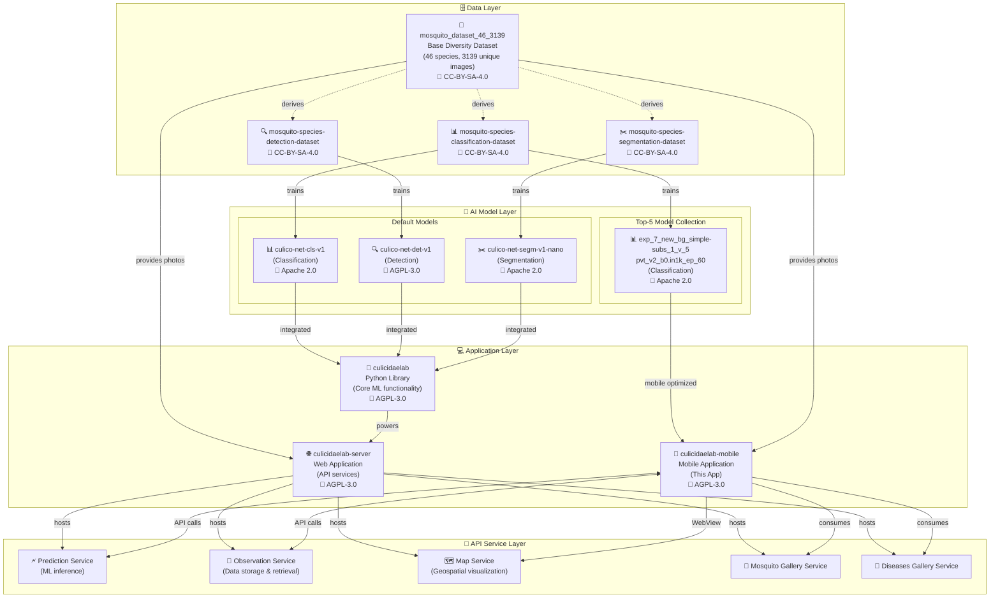
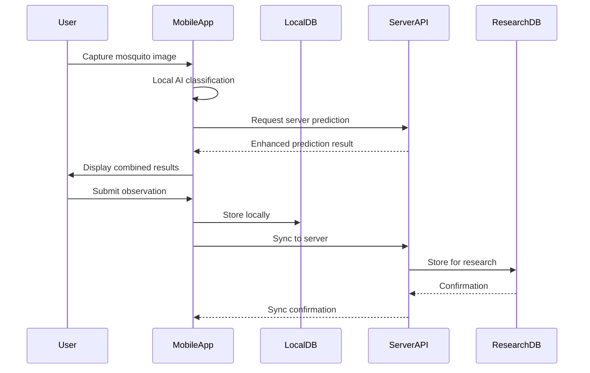

# CulicidaeLab Ecosystem Integration Guide

## Overview

The CulicidaeLab mobile application is part of a comprehensive ecosystem designed for mosquito research, species identification, and vector-borne disease surveillance. This guide provides detailed information on how the mobile app integrates with the broader CulicidaeLab ecosystem and how researchers and developers can extend its functionality.

## Ecosystem Architecture

### Complete System Overview

The CulicidaeLab ecosystem consists of four main layers working together to provide comprehensive mosquito research capabilities:



### Component Relationships

**Data Layer:**
- **Base Dataset**: 46 species, 3139 unique images under CC-BY-SA-4.0
- **Specialized Datasets**: Classification, detection, and segmentation derivatives
- **Open Access**: All datasets available on Hugging Face

**AI Model Layer:**
- **Production Models**: Default models used by the ecosystem
- **Research Models**: Top-5 collection with >90% accuracy for 17 species
- **Mobile Optimization**: Specialized models for mobile deployment

**Application Layer:**
- **Python Library**: Core ML functionality and research tools
- **Web Server**: API services and web interface
- **Mobile App**: Educational and field research tool

**Service Layer:**
- **Prediction Service**: Real-time species identification
- **Observation Service**: Data collection and storage
- **Map Service**: Geospatial visualization
- **Gallery Services**: Educational content delivery

## Mobile App Integration Points

### 1. Server API Integration

The mobile app integrates with the CulicidaeLab server through RESTful APIs:

```dart
// Core API endpoints
class CulicidaeLabAPI {
  static const String baseUrl = "https://culicidealab.ru";
  
  // Prediction service integration
  static const String predictionEndpoint = "/api/predict";
  
  // Observation service integration  
  static const String observationsEndpoint = "/api/observations";
  
  // Map service integration
  static const String mapEndpoint = "/map";
  
  // Gallery service integration
  static const String speciesGalleryEndpoint = "/api/species";
  static const String diseasesGalleryEndpoint = "/api/diseases";
}
```

### 2. Data Synchronization

**Observation Data Flow:**


### 3. Model Integration

**Hybrid Classification Approach:**
```dart
class HybridClassificationService {
  final ClassificationService _localService;
  final ClassificationRepository _repository;
  
  Future<ClassificationResult> classifyImage(File imageFile) async {
    // Local classification for immediate results
    final localResult = await _localService.classifyImage(imageFile);
    
    // Server classification for enhanced accuracy
    try {
      final webResult = await _repository.getWebPrediction(imageFile);
      
      // Combine results for comprehensive analysis
      return _combineResults(localResult, webResult);
    } catch (e) {
      // Fallback to local result if server unavailable
      return localResult;
    }
  }
  
  ClassificationResult _combineResults(
    ClassificationResult local,
    WebPredictionResult web
  ) {
    // Implementation combines local and server predictions
    // Provides confidence comparison and alternative suggestions
    return ClassificationResult(
      species: web.confidence > local.confidence ? 
               _getSpeciesFromWeb(web) : local.species,
      confidence: math.max(local.confidence, web.confidence),
      inferenceTime: local.inferenceTime,
      relatedDiseases: local.relatedDiseases,
      imageFile: local.imageFile,
      metadata: {
        'local_prediction': local.species.name,
        'local_confidence': local.confidence,
        'web_prediction': web.scientificName,
        'web_confidence': web.confidence,
        'prediction_agreement': local.species.name == web.scientificName,
      },
    );
  }
}
```

## Extending the Mobile App

### 1. Plugin Architecture

The mobile app supports extensions through a plugin-based architecture:

```dart
// Plugin interface for extending functionality
abstract class CulicidaeLabPlugin {
  String get name;
  String get version;
  List<String> get supportedFeatures;
  
  Future<void> initialize();
  Future<Map<String, dynamic>> processData(Map<String, dynamic> input);
  Future<void> cleanup();
}

// Example: Environmental data plugin
class EnvironmentalDataPlugin implements CulicidaeLabPlugin {
  @override
  String get name => 'Environmental Data Collector';
  
  @override
  String get version => '1.0.0';
  
  @override
  List<String> get supportedFeatures => [
    'temperature_measurement',
    'humidity_measurement', 
    'weather_integration'
  ];
  
  @override
  Future<void> initialize() async {
    // Initialize weather API connections
    // Set up sensor integrations
  }
  
  @override
  Future<Map<String, dynamic>> processData(Map<String, dynamic> input) async {
    final location = input['location'] as Location;
    
    return {
      'temperature': await _getTemperature(location),
      'humidity': await _getHumidity(location),
      'weather_conditions': await _getWeatherConditions(location),
      'timestamp': DateTime.now().toIso8601String(),
    };
  }
  
  Future<double> _getTemperature(Location location) async {
    // Implementation for temperature data collection
    return 25.0; // Example value
  }
  
  Future<double> _getHumidity(Location location) async {
    // Implementation for humidity data collection
    return 65.0; // Example value
  }
  
  Future<String> _getWeatherConditions(Location location) async {
    // Implementation for weather condition detection
    return 'partly_cloudy'; // Example value
  }
  
  @override
  Future<void> cleanup() async {
    // Cleanup resources
  }
}
```

### 2. Custom Model Integration

**Adding New Classification Models:**

```dart
// Interface for custom classification models
abstract class ClassificationModel {
  String get modelId;
  String get modelVersion;
  List<String> get supportedSpecies;
  
  Future<void> loadModel();
  Future<ClassificationResult> classify(File imageFile);
  Future<void> unloadModel();
}

// Example: Custom TensorFlow Lite model
class CustomTFLiteModel implements ClassificationModel {
  late Interpreter _interpreter;
  
  @override
  String get modelId => 'custom_tflite_v1';
  
  @override
  String get modelVersion => '1.0.0';
  
  @override
  List<String> get supportedSpecies => [
    'Aedes aegypti',
    'Aedes albopictus',
    'Culex pipiens',
    // ... additional species
  ];
  
  @override
  Future<void> loadModel() async {
    final modelFile = await _loadModelFile('assets/models/custom_model.tflite');
    _interpreter = Interpreter.fromFile(modelFile);
  }
  
  @override
  Future<ClassificationResult> classify(File imageFile) async {
    // Preprocess image
    final input = await _preprocessImage(imageFile);
    
    // Run inference
    final output = List.filled(supportedSpecies.length, 0.0);
    _interpreter.run(input, output);
    
    // Post-process results
    return _postprocessResults(output, imageFile);
  }
  
  Future<List<List<List<List<double>>>>> _preprocessImage(File imageFile) async {
    // Image preprocessing implementation
    // Resize, normalize, convert to tensor format
    return []; // Placeholder
  }
  
  ClassificationResult _postprocessResults(
    List<double> output, 
    File imageFile
  ) {
    // Find highest confidence prediction
    final maxIndex = output.indexOf(output.reduce(math.max));
    final confidence = output[maxIndex];
    final speciesName = supportedSpecies[maxIndex];
    
    // Create species object and related diseases
    final species = _createSpeciesFromName(speciesName);
    final diseases = _getRelatedDiseases(species);
    
    return ClassificationResult(
      species: species,
      confidence: confidence,
      inferenceTime: 0, // Would measure actual inference time
      relatedDiseases: diseases,
      imageFile: imageFile,
    );
  }
  
  @override
  Future<void> unloadModel() async {
    _interpreter.close();
  }
}
```

### 3. Data Export Extensions

**Custom Export Formats:**

```dart
// Interface for data export plugins
abstract class DataExporter {
  String get formatName;
  String get fileExtension;
  List<String> get supportedDataTypes;
  
  Future<String> exportObservations(List<Observation> observations);
  Future<String> exportClassificationResults(List<ClassificationResult> results);
  Future<String> exportSpeciesData(List<MosquitoSpecies> species);
}

// Example: Research-specific export format
class ResearchDataExporter implements DataExporter {
  @override
  String get formatName => 'Research Analysis Format';
  
  @override
  String get fileExtension => '.raf';
  
  @override
  List<String> get supportedDataTypes => [
    'observations',
    'classifications',
    'species_data',
    'environmental_data'
  ];
  
  @override
  Future<String> exportObservations(List<Observation> observations) async {
    final exportData = {
      'metadata': {
        'export_timestamp': DateTime.now().toIso8601String(),
        'format_version': '1.0',
        'total_observations': observations.length,
        'data_quality_summary': _generateQualitySummary(observations),
      },
      'observations': observations.map((obs) => {
        'id': obs.id,
        'species': obs.speciesScientificName,
        'location': {
          'lat': obs.location.lat,
          'lng': obs.location.lng,
          'accuracy_m': obs.locationAccuracyM,
        },
        'temporal': {
          'observed_at': obs.observedAt.toIso8601String(),
          'day_of_year': obs.observedAt.dayOfYear,
          'season': _getSeason(obs.observedAt),
        },
        'classification': {
          'confidence': obs.confidence,
          'model_id': obs.modelId,
          'data_source': obs.dataSource,
        },
        'context': {
          'notes': obs.notes,
          'metadata': obs.metadata,
        },
      }).toList(),
      'analysis': {
        'species_distribution': _analyzeSpeciesDistribution(observations),
        'temporal_patterns': _analyzeTemporalPatterns(observations),
        'spatial_clusters': _analyzeSpatialClusters(observations),
      },
    };
    
    return jsonEncode(exportData);
  }
  
  Map<String, dynamic> _generateQualitySummary(List<Observation> observations) {
    final highQuality = observations.where((obs) => obs.isHighQuality).length;
    final aiIdentified = observations.where((obs) => obs.isAiIdentified).length;
    
    return {
      'high_quality_percentage': (highQuality / observations.length * 100).round(),
      'ai_identified_percentage': (aiIdentified / observations.length * 100).round(),
      'average_location_accuracy': observations
          .where((obs) => obs.locationAccuracyM != null)
          .map((obs) => obs.locationAccuracyM!)
          .fold(0, (a, b) => a + b) / observations.length,
    };
  }
  
  String _getSeason(DateTime date) {
    final month = date.month;
    if (month >= 3 && month <= 5) return 'spring';
    if (month >= 6 && month <= 8) return 'summer';
    if (month >= 9 && month <= 11) return 'autumn';
    return 'winter';
  }
  
  @override
  Future<String> exportClassificationResults(List<ClassificationResult> results) async {
    // Implementation for classification results export
    return jsonEncode(results.map((r) => r.toJson()).toList());
  }
  
  @override
  Future<String> exportSpeciesData(List<MosquitoSpecies> species) async {
    // Implementation for species data export
    return jsonEncode(species.map((s) => s.toJson()).toList());
  }
}
```

## Research Integration Workflows

### 1. Citizen Science Integration

**Data Collection Workflow:**

```dart
class CitizenScienceWorkflow {
  static Future<void> submitCitizenScienceObservation({
    required ClassificationResult classificationResult,
    required Location location,
    required String participantId,
    String? notes,
    Map<String, dynamic>? environmentalData,
  }) async {
    // Create comprehensive observation record
    final observation = Observation(
      id: 'cs_${DateTime.now().millisecondsSinceEpoch}',
      speciesScientificName: classificationResult.species.name,
      count: 1,
      location: location,
      observedAt: DateTime.now(),
      notes: notes,
      userId: participantId,
      dataSource: 'citizen_science',
      modelId: 'mobile_hybrid_v1',
      confidence: classificationResult.confidence,
      metadata: {
        'participant_type': 'citizen_scientist',
        'app_version': await _getAppVersion(),
        'device_info': await _getDeviceInfo(),
        'environmental_data': environmentalData,
        'classification_metadata': {
          'local_confidence': classificationResult.confidence,
          'inference_time_ms': classificationResult.inferenceTime,
          'related_diseases': classificationResult.relatedDiseases.map((d) => d.id).toList(),
        },
      },
    );
    
    // Submit to research database
    await _submitToResearchDatabase(observation);
    
    // Update participant statistics
    await _updateParticipantStats(participantId, observation);
    
    // Send confirmation to participant
    await _sendParticipantConfirmation(participantId, observation);
  }
  
  static Future<void> _submitToResearchDatabase(Observation observation) async {
    // Implementation for research database submission
    final repository = locator<ClassificationRepository>();
    await repository.submitObservation(finalPayload: observation.toJson());
  }
  
  static Future<void> _updateParticipantStats(String participantId, Observation observation) async {
    // Update participant contribution statistics
    final stats = await _getParticipantStats(participantId);
    stats['total_observations'] = (stats['total_observations'] ?? 0) + 1;
    stats['species_identified'] = _updateSpeciesList(stats['species_identified'], observation.speciesScientificName);
    stats['last_contribution'] = observation.observedAt.toIso8601String();
    
    await _saveParticipantStats(participantId, stats);
  }
}
```

### 2. Professional Research Integration

**Field Research Workflow:**

```dart
class FieldResearchWorkflow {
  static Future<ResearchSession> startResearchSession({
    required String researcherId,
    required String projectId,
    required Location studyArea,
    required String methodology,
  }) async {
    final session = ResearchSession(
      id: 'rs_${DateTime.now().millisecondsSinceEpoch}',
      researcherId: researcherId,
      projectId: projectId,
      studyArea: studyArea,
      methodology: methodology,
      startTime: DateTime.now(),
      observations: [],
      environmentalConditions: await _collectEnvironmentalData(studyArea),
    );
    
    await _saveResearchSession(session);
    return session;
  }
  
  static Future<void> addObservationToSession({
    required String sessionId,
    required ClassificationResult classificationResult,
    required Location exactLocation,
    String? fieldNotes,
    Map<String, dynamic>? additionalData,
  }) async {
    final session = await _getResearchSession(sessionId);
    
    final observation = Observation(
      id: 'obs_${sessionId}_${session.observations.length + 1}',
      speciesScientificName: classificationResult.species.name,
      count: 1,
      location: exactLocation,
      observedAt: DateTime.now(),
      notes: fieldNotes,
      userId: session.researcherId,
      dataSource: 'field_research',
      modelId: 'mobile_research_v1',
      confidence: classificationResult.confidence,
      metadata: {
        'research_session_id': sessionId,
        'project_id': session.projectId,
        'methodology': session.methodology,
        'environmental_conditions': session.environmentalConditions,
        'additional_data': additionalData,
        'field_validation': {
          'expert_verified': false,
          'verification_notes': null,
          'verification_timestamp': null,
        },
      },
    );
    
    session.observations.add(observation);
    await _updateResearchSession(session);
    
    // Real-time sync to research database
    await _syncObservationToResearchDB(observation);
  }
  
  static Future<ResearchReport> generateSessionReport(String sessionId) async {
    final session = await _getResearchSession(sessionId);
    
    return ResearchReport(
      sessionId: sessionId,
      summary: _generateSessionSummary(session),
      speciesAnalysis: _analyzeSpeciesDistribution(session.observations),
      spatialAnalysis: _analyzeSpatialPatterns(session.observations),
      temporalAnalysis: _analyzeTemporalPatterns(session.observations),
      qualityMetrics: _calculateDataQuality(session.observations),
      recommendations: _generateRecommendations(session),
    );
  }
}

class ResearchSession {
  final String id;
  final String researcherId;
  final String projectId;
  final Location studyArea;
  final String methodology;
  final DateTime startTime;
  final List<Observation> observations;
  final Map<String, dynamic> environmentalConditions;
  DateTime? endTime;
  
  ResearchSession({
    required this.id,
    required this.researcherId,
    required this.projectId,
    required this.studyArea,
    required this.methodology,
    required this.startTime,
    required this.observations,
    required this.environmentalConditions,
    this.endTime,
  });
}
```

### 3. Public Health Integration

**Surveillance System Integration:**

```dart
class PublicHealthIntegration {
  static Future<void> submitSurveillanceData({
    required List<Observation> observations,
    required String healthDistrictId,
    required String surveillanceProgram,
  }) async {
    // Filter for epidemiologically significant species
    final significantObservations = observations.where((obs) =>
      _isEpidemiologicallySignificant(obs.speciesScientificName)
    ).toList();
    
    if (significantObservations.isEmpty) return;
    
    // Create surveillance report
    final report = SurveillanceReport(
      id: 'sr_${DateTime.now().millisecondsSinceEpoch}',
      healthDistrictId: healthDistrictId,
      program: surveillanceProgram,
      reportingPeriod: _getCurrentReportingPeriod(),
      observations: significantObservations,
      riskAssessment: await _assessVectorRisk(significantObservations),
      recommendations: await _generateHealthRecommendations(significantObservations),
    );
    
    // Submit to public health system
    await _submitToPublicHealthSystem(report);
    
    // Generate alerts if necessary
    await _checkForHealthAlerts(report);
  }
  
  static bool _isEpidemiologicallySignificant(String speciesName) {
    const significantSpecies = [
      'Aedes aegypti',
      'Aedes albopictus',
      'Anopheles gambiae',
      'Anopheles funestus',
      'Culex quinquefasciatus',
    ];
    return significantSpecies.contains(speciesName);
  }
  
  static Future<RiskAssessment> _assessVectorRisk(List<Observation> observations) async {
    // Implement risk assessment algorithm
    final speciesRisk = <String, double>{};
    final locationRisk = <Location, double>{};
    
    for (final obs in observations) {
      // Calculate species-specific risk
      speciesRisk[obs.speciesScientificName] = 
          (speciesRisk[obs.speciesScientificName] ?? 0.0) + 
          (obs.confidence ?? 0.5);
      
      // Calculate location-specific risk
      locationRisk[obs.location] = 
          (locationRisk[obs.location] ?? 0.0) + 1.0;
    }
    
    return RiskAssessment(
      overallRisk: _calculateOverallRisk(speciesRisk, locationRisk),
      speciesRisk: speciesRisk,
      locationRisk: locationRisk,
      recommendations: _generateRiskRecommendations(speciesRisk, locationRisk),
    );
  }
}

class SurveillanceReport {
  final String id;
  final String healthDistrictId;
  final String program;
  final DateRange reportingPeriod;
  final List<Observation> observations;
  final RiskAssessment riskAssessment;
  final List<String> recommendations;
  
  SurveillanceReport({
    required this.id,
    required this.healthDistrictId,
    required this.program,
    required this.reportingPeriod,
    required this.observations,
    required this.riskAssessment,
    required this.recommendations,
  });
}
```

## External System Integration

### 1. GIS System Integration

**Spatial Data Exchange:**

```dart
class GISIntegration {
  static Future<void> exportToGIS({
    required List<Observation> observations,
    required String gisFormat, // 'shapefile', 'geojson', 'kml'
    String? projectionSystem,
  }) async {
    switch (gisFormat.toLowerCase()) {
      case 'geojson':
        await _exportToGeoJSON(observations);
        break;
      case 'shapefile':
        await _exportToShapefile(observations, projectionSystem);
        break;
      case 'kml':
        await _exportToKML(observations);
        break;
      default:
        throw ArgumentError('Unsupported GIS format: $gisFormat');
    }
  }
  
  static Future<void> _exportToGeoJSON(List<Observation> observations) async {
    final geoJson = {
      'type': 'FeatureCollection',
      'crs': {
        'type': 'name',
        'properties': {'name': 'EPSG:4326'}
      },
      'features': observations.map((obs) => {
        'type': 'Feature',
        'geometry': {
          'type': 'Point',
          'coordinates': [obs.location.lng, obs.location.lat]
        },
        'properties': {
          'observation_id': obs.id,
          'species_scientific_name': obs.speciesScientificName,
          'confidence': obs.confidence,
          'observed_at': obs.observedAt.toIso8601String(),
          'data_source': obs.dataSource,
          'location_accuracy_m': obs.locationAccuracyM,
          'notes': obs.notes,
        }
      }).toList()
    };
    
    final file = File('observations_export.geojson');
    await file.writeAsString(jsonEncode(geoJson));
  }
  
  static Future<List<Observation>> importFromGIS({
    required String filePath,
    required String gisFormat,
  }) async {
    switch (gisFormat.toLowerCase()) {
      case 'geojson':
        return await _importFromGeoJSON(filePath);
      case 'shapefile':
        return await _importFromShapefile(filePath);
      default:
        throw ArgumentError('Unsupported import format: $gisFormat');
    }
  }
}
```

### 2. Database Integration

**Research Database Connectivity:**

```dart
class DatabaseIntegration {
  static Future<void> syncWithResearchDatabase({
    required String databaseType, // 'postgresql', 'mysql', 'mongodb'
    required Map<String, String> connectionConfig,
    required List<Observation> observations,
  }) async {
    switch (databaseType.toLowerCase()) {
      case 'postgresql':
        await _syncWithPostgreSQL(connectionConfig, observations);
        break;
      case 'mysql':
        await _syncWithMySQL(connectionConfig, observations);
        break;
      case 'mongodb':
        await _syncWithMongoDB(connectionConfig, observations);
        break;
      default:
        throw ArgumentError('Unsupported database type: $databaseType');
    }
  }
  
  static Future<void> _syncWithPostgreSQL(
    Map<String, String> config,
    List<Observation> observations
  ) async {
    // PostgreSQL integration implementation
    final connection = PostgreSQLConnection(
      config['host']!,
      int.parse(config['port']!),
      config['database']!,
      username: config['username'],
      password: config['password'],
    );
    
    await connection.open();
    
    try {
      for (final obs in observations) {
        await connection.execute('''
          INSERT INTO mosquito_observations 
          (id, species_scientific_name, count, latitude, longitude, 
           observed_at, confidence, data_source, notes, metadata)
          VALUES (@id, @species, @count, @lat, @lng, @observed_at, 
                  @confidence, @data_source, @notes, @metadata)
          ON CONFLICT (id) DO UPDATE SET
            confidence = EXCLUDED.confidence,
            metadata = EXCLUDED.metadata
        ''', substitutionValues: {
          'id': obs.id,
          'species': obs.speciesScientificName,
          'count': obs.count,
          'lat': obs.location.lat,
          'lng': obs.location.lng,
          'observed_at': obs.observedAt,
          'confidence': obs.confidence,
          'data_source': obs.dataSource,
          'notes': obs.notes,
          'metadata': jsonEncode(obs.metadata),
        });
      }
    } finally {
      await connection.close();
    }
  }
}
```

## Development Guidelines

### 1. Plugin Development Standards

**Plugin Structure:**
```
plugins/
├── my_plugin/
│   ├── lib/
│   │   ├── my_plugin.dart
│   │   └── src/
│   │       ├── models/
│   │       ├── services/
│   │       └── widgets/
│   ├── pubspec.yaml
│   ├── README.md
│   └── example/
```

**Plugin Registration:**
```dart
// In main.dart or plugin manager
class PluginManager {
  static final List<CulicidaeLabPlugin> _plugins = [];
  
  static Future<void> registerPlugin(CulicidaeLabPlugin plugin) async {
    await plugin.initialize();
    _plugins.add(plugin);
  }
  
  static Future<void> initializeAllPlugins() async {
    for (final plugin in _plugins) {
      try {
        await plugin.initialize();
      } catch (e) {
        print('Failed to initialize plugin ${plugin.name}: $e');
      }
    }
  }
  
  static List<CulicidaeLabPlugin> getPluginsByFeature(String feature) {
    return _plugins.where((p) => p.supportedFeatures.contains(feature)).toList();
  }
}
```

### 2. API Extension Guidelines

**Custom Endpoint Integration:**
```dart
// Extend the API client for custom endpoints
class ExtendedAPIClient extends CulicidaeLabAPIClient {
  Future<Map<String, dynamic>> callCustomEndpoint({
    required String endpoint,
    required Map<String, dynamic> data,
    String method = 'POST',
  }) async {
    final url = Uri.parse('${CulicidaeLabAPI.baseUrl}$endpoint');
    
    http.Response response;
    switch (method.toUpperCase()) {
      case 'GET':
        response = await httpClient.get(url);
        break;
      case 'POST':
        response = await httpClient.post(
          url,
          headers: {'Content-Type': 'application/json'},
          body: jsonEncode(data),
        );
        break;
      case 'PUT':
        response = await httpClient.put(
          url,
          headers: {'Content-Type': 'application/json'},
          body: jsonEncode(data),
        );
        break;
      default:
        throw ArgumentError('Unsupported HTTP method: $method');
    }
    
    if (response.statusCode >= 200 && response.statusCode < 300) {
      return jsonDecode(response.body);
    } else {
      throw APIException(
        statusCode: response.statusCode,
        message: 'Custom endpoint call failed',
        body: response.body,
      );
    }
  }
}
```

### 3. Data Model Extensions

**Custom Data Models:**
```dart
// Extend existing models for custom use cases
class ExtendedObservation extends Observation {
  final WeatherData? weatherData;
  final SoilData? soilData;
  final VegetationData? vegetationData;
  final List<String>? associatedSpecies;
  
  ExtendedObservation({
    required super.id,
    required super.speciesScientificName,
    required super.count,
    required super.location,
    required super.observedAt,
    super.notes,
    super.userId,
    super.locationAccuracyM,
    super.dataSource,
    super.imageFilename,
    super.modelId,
    super.confidence,
    super.metadata,
    this.weatherData,
    this.soilData,
    this.vegetationData,
    this.associatedSpecies,
  });
  
  @override
  Map<String, dynamic> toJson() {
    final json = super.toJson();
    json.addAll({
      if (weatherData != null) 'weather_data': weatherData!.toJson(),
      if (soilData != null) 'soil_data': soilData!.toJson(),
      if (vegetationData != null) 'vegetation_data': vegetationData!.toJson(),
      if (associatedSpecies != null) 'associated_species': associatedSpecies,
    });
    return json;
  }
  
  factory ExtendedObservation.fromJson(Map<String, dynamic> json) {
    final baseObservation = Observation.fromJson(json);
    
    return ExtendedObservation(
      id: baseObservation.id,
      speciesScientificName: baseObservation.speciesScientificName,
      count: baseObservation.count,
      location: baseObservation.location,
      observedAt: baseObservation.observedAt,
      notes: baseObservation.notes,
      userId: baseObservation.userId,
      locationAccuracyM: baseObservation.locationAccuracyM,
      dataSource: baseObservation.dataSource,
      imageFilename: baseObservation.imageFilename,
      modelId: baseObservation.modelId,
      confidence: baseObservation.confidence,
      metadata: baseObservation.metadata,
      weatherData: json['weather_data'] != null 
          ? WeatherData.fromJson(json['weather_data']) 
          : null,
      soilData: json['soil_data'] != null 
          ? SoilData.fromJson(json['soil_data']) 
          : null,
      vegetationData: json['vegetation_data'] != null 
          ? VegetationData.fromJson(json['vegetation_data']) 
          : null,
      associatedSpecies: json['associated_species'] != null 
          ? List<String>.from(json['associated_species']) 
          : null,
    );
  }
}

class WeatherData {
  final double temperature;
  final double humidity;
  final double pressure;
  final String conditions;
  final double windSpeed;
  final String windDirection;
  
  WeatherData({
    required this.temperature,
    required this.humidity,
    required this.pressure,
    required this.conditions,
    required this.windSpeed,
    required this.windDirection,
  });
  
  Map<String, dynamic> toJson() => {
    'temperature': temperature,
    'humidity': humidity,
    'pressure': pressure,
    'conditions': conditions,
    'wind_speed': windSpeed,
    'wind_direction': windDirection,
  };
  
  factory WeatherData.fromJson(Map<String, dynamic> json) => WeatherData(
    temperature: (json['temperature'] as num).toDouble(),
    humidity: (json['humidity'] as num).toDouble(),
    pressure: (json['pressure'] as num).toDouble(),
    conditions: json['conditions'] as String,
    windSpeed: (json['wind_speed'] as num).toDouble(),
    windDirection: json['wind_direction'] as String,
  );
}
```

## Best Practices

### 1. Integration Security

- **API Authentication**: Implement proper authentication for custom endpoints
- **Data Validation**: Validate all external data before processing
- **Error Handling**: Implement robust error handling for network operations
- **Rate Limiting**: Respect API rate limits and implement backoff strategies

### 2. Performance Optimization

- **Batch Operations**: Use batch processing for large data sets
- **Caching**: Implement appropriate caching strategies
- **Background Processing**: Use background tasks for heavy operations
- **Memory Management**: Monitor memory usage with large datasets

### 3. Data Quality

- **Validation Rules**: Implement comprehensive data validation
- **Quality Metrics**: Track and report data quality metrics
- **User Feedback**: Provide mechanisms for data quality feedback
- **Expert Review**: Support expert validation workflows

### 4. Documentation

- **API Documentation**: Maintain comprehensive API documentation
- **Plugin Documentation**: Document plugin interfaces and examples
- **Integration Guides**: Provide step-by-step integration guides
- **Version Compatibility**: Document version compatibility requirements

## Future Ecosystem Enhancements

### Planned Integrations

1. **Real-time Collaboration**: Multi-user research sessions
2. **Advanced Analytics**: Machine learning pipeline integration
3. **IoT Integration**: Environmental sensor data integration
4. **Blockchain**: Data provenance and verification
5. **AR/VR**: Augmented reality field guides

### Research Opportunities

1. **Federated Learning**: Distributed model training
2. **Edge Computing**: Advanced on-device processing
3. **Satellite Integration**: Remote sensing data fusion
4. **Climate Modeling**: Environmental prediction integration
5. **Genomic Data**: Molecular identification integration

This comprehensive ecosystem integration guide provides the foundation for extending the CulicidaeLab mobile application and integrating it with broader research and public health systems. The modular architecture and well-defined interfaces enable flexible customization while maintaining compatibility with the core ecosystem.