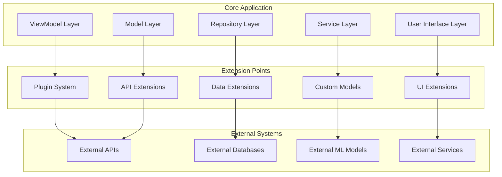

# Extending CulicidaeLab Mobile Functionality

## Overview

The CulicidaeLab mobile application is designed with extensibility in mind, providing multiple pathways for researchers, developers, and institutions to customize and extend its functionality. This guide covers plugin development, custom model integration, data pipeline extensions, and UI customization approaches.

## Architecture for Extensions

### Extension Points

The application provides several well-defined extension points:



### Plugin Architecture

The core plugin system provides a standardized way to extend functionality:

```dart
// Core plugin interface
abstract class CulicidaeLabPlugin {
  /// Unique plugin identifier
  String get pluginId;
  
  /// Human-readable plugin name
  String get name;
  
  /// Plugin version
  String get version;
  
  /// List of features this plugin provides
  List<String> get supportedFeatures;
  
  /// Plugin dependencies
  List<String> get dependencies;
  
  /// Initialize the plugin
  Future<void> initialize(PluginContext context);
  
  /// Process data through the plugin
  Future<PluginResult> processData(PluginInput input);
  
  /// Get plugin configuration UI
  Widget? getConfigurationWidget();
  
  /// Cleanup plugin resources
  Future<void> dispose();
  
  /// Plugin metadata
  Map<String, dynamic> get metadata;
}

// Plugin context provides access to core services
class PluginContext {
  final DatabaseService databaseService;
  final ClassificationService classificationService;
  final UserService userService;
  final Map<String, dynamic> appConfiguration;
  final PluginLogger logger;
  
  PluginContext({
    required this.databaseService,
    required this.classificationService,
    required this.userService,
    required this.appConfiguration,
    required this.logger,
  });
}

// Standardized plugin input/output
class PluginInput {
  final String operation;
  final Map<String, dynamic> data;
  final Map<String, dynamic> metadata;
  
  PluginInput({
    required this.operation,
    required this.data,
    this.metadata = const {},
  });
}

class PluginResult {
  final bool success;
  final Map<String, dynamic> data;
  final String? errorMessage;
  final Map<String, dynamic> metadata;
  
  PluginResult({
    required this.success,
    this.data = const {},
    this.errorMessage,
    this.metadata = const {},
  });
  
  factory PluginResult.success(Map<String, dynamic> data) {
    return PluginResult(success: true, data: data);
  }
  
  factory PluginResult.error(String message) {
    return PluginResult(success: false, errorMessage: message);
  }
}
```

## Custom Classification Models

### Model Integration Interface

```dart
// Interface for custom classification models
abstract class CustomClassificationModel {
  /// Model identifier
  String get modelId;
  
  /// Model version
  String get version;
  
  /// Supported species list
  List<String> get supportedSpecies;
  
  /// Model metadata
  ModelMetadata get metadata;
  
  /// Load the model
  Future<void> loadModel();
  
  /// Classify an image
  Future<ClassificationResult> classify(File imageFile);
  
  /// Batch classification
  Future<List<ClassificationResult>> classifyBatch(List<File> imageFiles);
  
  /// Get model performance metrics
  Future<ModelPerformanceMetrics> getPerformanceMetrics();
  
  /// Unload the model
  Future<void> unloadModel();
  
  /// Check if model is loaded
  bool get isLoaded;
}

class ModelMetadata {
  final String name;
  final String description;
  final String author;
  final DateTime createdAt;
  final String license;
  final List<String> trainingDatasets;
  final Map<String, dynamic> hyperparameters;
  final ModelPerformanceMetrics performanceMetrics;
  
  ModelMetadata({
    required this.name,
    required this.description,
    required this.author,
    required this.createdAt,
    required this.license,
    required this.trainingDatasets,
    required this.hyperparameters,
    required this.performanceMetrics,
  });
}

class ModelPerformanceMetrics {
  final double accuracy;
  final double precision;
  final double recall;
  final double f1Score;
  final Map<String, double> perClassAccuracy;
  final int totalParameters;
  final double modelSizeMB;
  final double averageInferenceTimeMs;
  
  ModelPerformanceMetrics({
    required this.accuracy,
    required this.precision,
    required this.recall,
    required this.f1Score,
    required this.perClassAccuracy,
    required this.totalParameters,
    required this.modelSizeMB,
    required this.averageInferenceTimeMs,
  });
}
```

### TensorFlow Lite Model Example

```dart
class CustomTensorFlowLiteModel implements CustomClassificationModel {
  late Interpreter _interpreter;
  late List<String> _labels;
  bool _isLoaded = false;
  
  @override
  String get modelId => 'custom_tflite_mosquito_v2';
  
  @override
  String get version => '2.1.0';
  
  @override
  List<String> get supportedSpecies => _labels;
  
  @override
  ModelMetadata get metadata => ModelMetadata(
    name: 'Custom TensorFlow Lite Mosquito Classifier',
    description: 'Enhanced mosquito species classification model with improved accuracy',
    author: 'Research Team XYZ',
    createdAt: DateTime(2024, 1, 15),
    license: 'Apache 2.0',
    trainingDatasets: ['mosquito_dataset_46_3139', 'custom_field_data_2024'],
    hyperparameters: {
      'learning_rate': 0.001,
      'batch_size': 32,
      'epochs': 100,
      'optimizer': 'Adam',
      'input_size': [224, 224, 3],
    },
    performanceMetrics: ModelPerformanceMetrics(
      accuracy: 0.94,
      precision: 0.93,
      recall: 0.92,
      f1Score: 0.925,
      perClassAccuracy: {
        'Aedes aegypti': 0.96,
        'Aedes albopictus': 0.94,
        'Culex pipiens': 0.91,
        // ... other species
      },
      totalParameters: 2500000,
      modelSizeMB: 9.8,
      averageInferenceTimeMs: 180.0,
    ),
  );
  
  @override
  bool get isLoaded => _isLoaded;
  
  @override
  Future<void> loadModel() async {
    try {
      // Load the TensorFlow Lite model
      final modelFile = await _loadModelAsset('assets/models/custom_model.tflite');
      _interpreter = Interpreter.fromFile(modelFile);
      
      // Load labels
      final labelsString = await rootBundle.loadString('assets/models/custom_labels.txt');
      _labels = labelsString.split('\n').where((label) => label.isNotEmpty).toList();
      
      _isLoaded = true;
      print('Custom TensorFlow Lite model loaded successfully');
    } catch (e) {
      throw ModelLoadException('Failed to load custom TensorFlow Lite model: $e');
    }
  }
  
  @override
  Future<ClassificationResult> classify(File imageFile) async {
    if (!_isLoaded) {
      throw ModelNotLoadedException('Model must be loaded before classification');
    }
    
    final stopwatch = Stopwatch()..start();
    
    try {
      // Preprocess image
      final input = await _preprocessImage(imageFile);
      
      // Run inference
      final output = List.filled(_labels.length, 0.0).reshape([1, _labels.length]);
      _interpreter.run(input, output);
      
      // Post-process results
      final probabilities = output[0] as List<double>;
      final maxIndex = probabilities.indexOf(probabilities.reduce(math.max));
      final confidence = probabilities[maxIndex];
      final speciesName = _labels[maxIndex];
      
      stopwatch.stop();
      
      // Create species object
      final species = await _createSpeciesFromName(speciesName);
      final relatedDiseases = await _getRelatedDiseases(species);
      
      return ClassificationResult(
        species: species,
        confidence: confidence,
        inferenceTime: stopwatch.elapsedMilliseconds,
        relatedDiseases: relatedDiseases,
        imageFile: imageFile,
      );
    } catch (e) {
      throw ClassificationException('Classification failed: $e');
    }
  }
  
  @override
  Future<List<ClassificationResult>> classifyBatch(List<File> imageFiles) async {
    final results = <ClassificationResult>[];
    
    for (final imageFile in imageFiles) {
      try {
        final result = await classify(imageFile);
        results.add(result);
      } catch (e) {
        print('Failed to classify ${imageFile.path}: $e');
        // Continue with other images
      }
    }
    
    return results;
  }
  
  Future<List<List<List<List<double>>>>> _preprocessImage(File imageFile) async {
    // Load and decode image
    final bytes = await imageFile.readAsBytes();
    final image = img.decodeImage(bytes);
    
    if (image == null) {
      throw ImageProcessingException('Failed to decode image');
    }
    
    // Resize to model input size
    final resized = img.copyResize(image, width: 224, height: 224);
    
    // Convert to normalized float array
    final input = List.generate(
      1,
      (batch) => List.generate(
        224,
        (y) => List.generate(
          224,
          (x) => List.generate(3, (c) {
            final pixel = resized.getPixel(x, y);
            switch (c) {
              case 0: return (pixel.r / 255.0 - 0.485) / 0.229; // Red channel
              case 1: return (pixel.g / 255.0 - 0.456) / 0.224; // Green channel
              case 2: return (pixel.b / 255.0 - 0.406) / 0.225; // Blue channel
              default: return 0.0;
            }
          }),
        ),
      ),
    );
    
    return input;
  }
  
  @override
  Future<ModelPerformanceMetrics> getPerformanceMetrics() async {
    return metadata.performanceMetrics;
  }
  
  @override
  Future<void> unloadModel() async {
    if (_isLoaded) {
      _interpreter.close();
      _isLoaded = false;
      print('Custom TensorFlow Lite model unloaded');
    }
  }
  
  Future<File> _loadModelAsset(String assetPath) async {
    final byteData = await rootBundle.load(assetPath);
    final tempDir = await getTemporaryDirectory();
    final file = File('${tempDir.path}/custom_model.tflite');
    await file.writeAsBytes(byteData.buffer.asUint8List());
    return file;
  }
}

// Custom exceptions
class ModelLoadException implements Exception {
  final String message;
  ModelLoadException(this.message);
  @override
  String toString() => 'ModelLoadException: $message';
}

class ModelNotLoadedException implements Exception {
  final String message;
  ModelNotLoadedException(this.message);
  @override
  String toString() => 'ModelNotLoadedException: $message';
}

class ClassificationException implements Exception {
  final String message;
  ClassificationException(this.message);
  @override
  String toString() => 'ClassificationException: $message';
}

class ImageProcessingException implements Exception {
  final String message;
  ImageProcessingException(this.message);
  @override
  String toString() => 'ImageProcessingException: $message';
}
```

### ONNX Model Integration

```dart
class ONNXClassificationModel implements CustomClassificationModel {
  late OnnxDart _session;
  late List<String> _labels;
  bool _isLoaded = false;
  
  @override
  String get modelId => 'onnx_mosquito_classifier_v1';
  
  @override
  String get version => '1.0.0';
  
  @override
  List<String> get supportedSpecies => _labels;
  
  @override
  bool get isLoaded => _isLoaded;
  
  @override
  Future<void> loadModel() async {
    try {
      // Load ONNX model
      final modelBytes = await rootBundle.load('assets/models/mosquito_classifier.onnx');
      _session = OnnxDart.createSession(modelBytes.buffer.asUint8List());
      
      // Load labels
      final labelsString = await rootBundle.loadString('assets/models/onnx_labels.txt');
      _labels = labelsString.split('\n').where((label) => label.isNotEmpty).toList();
      
      _isLoaded = true;
      print('ONNX model loaded successfully');
    } catch (e) {
      throw ModelLoadException('Failed to load ONNX model: $e');
    }
  }
  
  @override
  Future<ClassificationResult> classify(File imageFile) async {
    if (!_isLoaded) {
      throw ModelNotLoadedException('ONNX model must be loaded before classification');
    }
    
    final stopwatch = Stopwatch()..start();
    
    try {
      // Preprocess image for ONNX
      final inputTensor = await _preprocessImageForONNX(imageFile);
      
      // Run ONNX inference
      final outputs = _session.run({'input': inputTensor});
      final probabilities = outputs['output'] as List<double>;
      
      // Find best prediction
      final maxIndex = probabilities.indexOf(probabilities.reduce(math.max));
      final confidence = probabilities[maxIndex];
      final speciesName = _labels[maxIndex];
      
      stopwatch.stop();
      
      // Create result
      final species = await _createSpeciesFromName(speciesName);
      final relatedDiseases = await _getRelatedDiseases(species);
      
      return ClassificationResult(
        species: species,
        confidence: confidence,
        inferenceTime: stopwatch.elapsedMilliseconds,
        relatedDiseases: relatedDiseases,
        imageFile: imageFile,
      );
    } catch (e) {
      throw ClassificationException('ONNX classification failed: $e');
    }
  }
  
  Future<List<List<List<double>>>> _preprocessImageForONNX(File imageFile) async {
    // ONNX-specific preprocessing
    final bytes = await imageFile.readAsBytes();
    final image = img.decodeImage(bytes);
    
    if (image == null) {
      throw ImageProcessingException('Failed to decode image for ONNX');
    }
    
    final resized = img.copyResize(image, width: 224, height: 224);
    
    // ONNX expects CHW format (Channel, Height, Width)
    final input = List.generate(3, (c) =>
      List.generate(224, (h) =>
        List.generate(224, (w) {
          final pixel = resized.getPixel(w, h);
          switch (c) {
            case 0: return (pixel.r / 255.0 - 0.485) / 0.229;
            case 1: return (pixel.g / 255.0 - 0.456) / 0.224;
            case 2: return (pixel.b / 255.0 - 0.406) / 0.225;
            default: return 0.0;
          }
        })
      )
    );
    
    return input;
  }
  
  @override
  Future<void> unloadModel() async {
    if (_isLoaded) {
      _session.release();
      _isLoaded = false;
      print('ONNX model unloaded');
    }
  }
}
```

## Data Pipeline Extensions

### Custom Data Processors

```dart
// Interface for data processing plugins
abstract class DataProcessor {
  String get processorId;
  String get name;
  List<String> get supportedDataTypes;
  
  Future<ProcessingResult> processData(ProcessingInput input);
  Future<void> initialize();
  Future<void> dispose();
}

// Environmental data processor example
class EnvironmentalDataProcessor implements DataProcessor {
  late WeatherAPI _weatherAPI;
  late SoilAPI _soilAPI;
  
  @override
  String get processorId => 'environmental_data_processor';
  
  @override
  String get name => 'Environmental Data Processor';
  
  @override
  List<String> get supportedDataTypes => [
    'weather_data',
    'soil_data',
    'vegetation_data',
    'water_quality_data'
  ];
  
  @override
  Future<void> initialize() async {
    _weatherAPI = WeatherAPI(apiKey: await _getWeatherAPIKey());
    _soilAPI = SoilAPI(apiKey: await _getSoilAPIKey());
  }
  
  @override
  Future<ProcessingResult> processData(ProcessingInput input) async {
    final location = Location.fromJson(input.data['location']);
    final timestamp = DateTime.parse(input.data['timestamp']);
    
    try {
      final results = <String, dynamic>{};
      
      // Collect weather data
      if (input.requestedTypes.contains('weather_data')) {
        results['weather_data'] = await _collectWeatherData(location, timestamp);
      }
      
      // Collect soil data
      if (input.requestedTypes.contains('soil_data')) {
        results['soil_data'] = await _collectSoilData(location);
      }
      
      // Collect vegetation data
      if (input.requestedTypes.contains('vegetation_data')) {
        results['vegetation_data'] = await _collectVegetationData(location);
      }
      
      return ProcessingResult.success(results);
    } catch (e) {
      return ProcessingResult.error('Environmental data collection failed: $e');
    }
  }
  
  Future<Map<String, dynamic>> _collectWeatherData(Location location, DateTime timestamp) async {
    final weatherData = await _weatherAPI.getWeatherData(
      latitude: location.lat,
      longitude: location.lng,
      timestamp: timestamp,
    );
    
    return {
      'temperature_celsius': weatherData.temperature,
      'humidity_percent': weatherData.humidity,
      'pressure_hpa': weatherData.pressure,
      'wind_speed_ms': weatherData.windSpeed,
      'wind_direction_degrees': weatherData.windDirection,
      'precipitation_mm': weatherData.precipitation,
      'cloud_cover_percent': weatherData.cloudCover,
      'uv_index': weatherData.uvIndex,
      'visibility_km': weatherData.visibility,
    };
  }
  
  Future<Map<String, dynamic>> _collectSoilData(Location location) async {
    final soilData = await _soilAPI.getSoilData(
      latitude: location.lat,
      longitude: location.lng,
    );
    
    return {
      'soil_type': soilData.type,
      'ph_level': soilData.phLevel,
      'organic_matter_percent': soilData.organicMatter,
      'nitrogen_ppm': soilData.nitrogen,
      'phosphorus_ppm': soilData.phosphorus,
      'potassium_ppm': soilData.potassium,
      'moisture_percent': soilData.moisture,
      'temperature_celsius': soilData.temperature,
    };
  }
  
  Future<Map<String, dynamic>> _collectVegetationData(Location location) async {
    // Use satellite imagery or local databases for vegetation data
    return {
      'vegetation_type': 'mixed_forest',
      'canopy_cover_percent': 75.0,
      'dominant_species': ['Oak', 'Pine', 'Birch'],
      'ndvi_index': 0.65,
      'leaf_area_index': 4.2,
    };
  }
  
  @override
  Future<void> dispose() async {
    await _weatherAPI.dispose();
    await _soilAPI.dispose();
  }
}

class ProcessingInput {
  final Map<String, dynamic> data;
  final List<String> requestedTypes;
  final Map<String, dynamic> options;
  
  ProcessingInput({
    required this.data,
    required this.requestedTypes,
    this.options = const {},
  });
}

class ProcessingResult {
  final bool success;
  final Map<String, dynamic> data;
  final String? errorMessage;
  final Map<String, dynamic> metadata;
  
  ProcessingResult({
    required this.success,
    this.data = const {},
    this.errorMessage,
    this.metadata = const {},
  });
  
  factory ProcessingResult.success(Map<String, dynamic> data) {
    return ProcessingResult(success: true, data: data);
  }
  
  factory ProcessingResult.error(String message) {
    return ProcessingResult(success: false, errorMessage: message);
  }
}
```

### Custom Export Formats

```dart
// Interface for custom export formats
abstract class DataExporter {
  String get exporterId;
  String get name;
  String get fileExtension;
  List<String> get supportedDataTypes;
  
  Future<ExportResult> exportData(ExportRequest request);
  Future<bool> validateData(List<dynamic> data);
}

// Research-specific exporter
class ResearchDataExporter implements DataExporter {
  @override
  String get exporterId => 'research_data_exporter';
  
  @override
  String get name => 'Research Data Exporter';
  
  @override
  String get fileExtension => '.rdf'; // Research Data Format
  
  @override
  List<String> get supportedDataTypes => [
    'observations',
    'classifications',
    'environmental_data',
    'species_data'
  ];
  
  @override
  Future<ExportResult> exportData(ExportRequest request) async {
    try {
      final exportData = <String, dynamic>{};
      
      // Add metadata
      exportData['metadata'] = {
        'export_timestamp': DateTime.now().toIso8601String(),
        'exporter_version': '1.0.0',
        'data_format_version': '2.1',
        'total_records': request.data.length,
        'export_parameters': request.parameters,
      };
      
      // Process different data types
      if (request.dataType == 'observations') {
        exportData['observations'] = await _exportObservations(request.data as List<Observation>);
      } else if (request.dataType == 'classifications') {
        exportData['classifications'] = await _exportClassifications(request.data as List<ClassificationResult>);
      }
      
      // Add analysis if requested
      if (request.parameters['include_analysis'] == true) {
        exportData['analysis'] = await _generateAnalysis(request.data);
      }
      
      // Convert to specified format
      final content = await _formatData(exportData, request.format);
      
      return ExportResult.success(content);
    } catch (e) {
      return ExportResult.error('Export failed: $e');
    }
  }
  
  Future<List<Map<String, dynamic>>> _exportObservations(List<Observation> observations) async {
    return observations.map((obs) => {
      'observation_id': obs.id,
      'species': {
        'scientific_name': obs.speciesScientificName,
        'taxonomic_classification': await _getTaxonomicClassification(obs.speciesScientificName),
      },
      'spatial': {
        'latitude': obs.location.lat,
        'longitude': obs.location.lng,
        'coordinate_system': 'WGS84',
        'accuracy_meters': obs.locationAccuracyM,
        'elevation_meters': null, // Could be added if available
      },
      'temporal': {
        'observed_at': obs.observedAt.toIso8601String(),
        'day_of_year': obs.observedAt.dayOfYear,
        'season': _calculateSeason(obs.observedAt),
        'time_of_day': _calculateTimeOfDay(obs.observedAt),
      },
      'identification': {
        'confidence': obs.confidence,
        'model_id': obs.modelId,
        'identification_method': obs.dataSource,
        'expert_verified': false, // Could be extended
      },
      'context': {
        'observer_notes': obs.notes,
        'specimen_count': obs.count,
        'additional_metadata': obs.metadata,
      },
    }).toList();
  }
  
  Future<String> _formatData(Map<String, dynamic> data, String format) async {
    switch (format.toLowerCase()) {
      case 'json':
        return jsonEncode(data);
      case 'yaml':
        return _convertToYAML(data);
      case 'xml':
        return _convertToXML(data);
      case 'csv':
        return _convertToCSV(data);
      default:
        throw ArgumentError('Unsupported format: $format');
    }
  }
  
  @override
  Future<bool> validateData(List<dynamic> data) async {
    // Implement data validation logic
    for (final item in data) {
      if (item is Observation) {
        if (!_isValidObservation(item)) return false;
      } else if (item is ClassificationResult) {
        if (!_isValidClassificationResult(item)) return false;
      }
    }
    return true;
  }
  
  bool _isValidObservation(Observation obs) {
    return obs.id.isNotEmpty &&
           obs.speciesScientificName.isNotEmpty &&
           obs.location.lat >= -90 && obs.location.lat <= 90 &&
           obs.location.lng >= -180 && obs.location.lng <= 180;
  }
}

class ExportRequest {
  final String dataType;
  final List<dynamic> data;
  final String format;
  final Map<String, dynamic> parameters;
  
  ExportRequest({
    required this.dataType,
    required this.data,
    required this.format,
    this.parameters = const {},
  });
}

class ExportResult {
  final bool success;
  final String? content;
  final String? errorMessage;
  final Map<String, dynamic> metadata;
  
  ExportResult({
    required this.success,
    this.content,
    this.errorMessage,
    this.metadata = const {},
  });
  
  factory ExportResult.success(String content) {
    return ExportResult(success: true, content: content);
  }
  
  factory ExportResult.error(String message) {
    return ExportResult(success: false, errorMessage: message);
  }
}
```

## UI Extensions

### Custom Screens and Widgets

```dart
// Interface for UI extensions
abstract class UIExtension {
  String get extensionId;
  String get name;
  List<String> get supportedScreens;
  
  Widget buildExtensionWidget(BuildContext context, Map<String, dynamic> parameters);
  List<NavigationItem> getNavigationItems();
  List<ActionItem> getActionItems(String screenId);
}

// Research tools UI extension
class ResearchToolsExtension implements UIExtension {
  @override
  String get extensionId => 'research_tools_extension';
  
  @override
  String get name => 'Research Tools';
  
  @override
  List<String> get supportedScreens => [
    'data_analysis',
    'field_session',
    'batch_processing',
    'export_manager'
  ];
  
  @override
  Widget buildExtensionWidget(BuildContext context, Map<String, dynamic> parameters) {
    final screenId = parameters['screen_id'] as String;
    
    switch (screenId) {
      case 'data_analysis':
        return DataAnalysisScreen();
      case 'field_session':
        return FieldSessionScreen();
      case 'batch_processing':
        return BatchProcessingScreen();
      case 'export_manager':
        return ExportManagerScreen();
      default:
        return Container(
          child: Text('Unknown screen: $screenId'),
        );
    }
  }
  
  @override
  List<NavigationItem> getNavigationItems() {
    return [
      NavigationItem(
        id: 'research_tools',
        title: 'Research Tools',
        icon: Icons.science,
        route: '/research-tools',
      ),
      NavigationItem(
        id: 'data_analysis',
        title: 'Data Analysis',
        icon: Icons.analytics,
        route: '/research-tools/analysis',
      ),
    ];
  }
  
  @override
  List<ActionItem> getActionItems(String screenId) {
    switch (screenId) {
      case 'classification_screen':
        return [
          ActionItem(
            id: 'start_field_session',
            title: 'Start Field Session',
            icon: Icons.play_arrow,
            onTap: (context) => _startFieldSession(context),
          ),
        ];
      case 'observation_details_screen':
        return [
          ActionItem(
            id: 'add_environmental_data',
            title: 'Add Environmental Data',
            icon: Icons.eco,
            onTap: (context) => _addEnvironmentalData(context),
          ),
        ];
      default:
        return [];
    }
  }
  
  void _startFieldSession(BuildContext context) {
    Navigator.push(
      context,
      MaterialPageRoute(builder: (context) => FieldSessionScreen()),
    );
  }
  
  void _addEnvironmentalData(BuildContext context) {
    showDialog(
      context: context,
      builder: (context) => EnvironmentalDataDialog(),
    );
  }
}

class NavigationItem {
  final String id;
  final String title;
  final IconData icon;
  final String route;
  
  NavigationItem({
    required this.id,
    required this.title,
    required this.icon,
    required this.route,
  });
}

class ActionItem {
  final String id;
  final String title;
  final IconData icon;
  final Function(BuildContext) onTap;
  
  ActionItem({
    required this.id,
    required this.title,
    required this.icon,
    required this.onTap,
  });
}

// Custom research screen example
class DataAnalysisScreen extends StatefulWidget {
  @override
  _DataAnalysisScreenState createState() => _DataAnalysisScreenState();
}

class _DataAnalysisScreenState extends State<DataAnalysisScreen> {
  List<Observation> _observations = [];
  Map<String, dynamic> _analysisResults = {};
  bool _isAnalyzing = false;
  
  @override
  void initState() {
    super.initState();
    _loadObservations();
  }
  
  @override
  Widget build(BuildContext context) {
    return Scaffold(
      appBar: AppBar(
        title: Text('Data Analysis'),
        actions: [
          IconButton(
            icon: Icon(Icons.refresh),
            onPressed: _refreshAnalysis,
          ),
          IconButton(
            icon: Icon(Icons.export_notes),
            onPressed: _exportResults,
          ),
        ],
      ),
      body: Column(
        children: [
          _buildAnalysisControls(),
          Expanded(
            child: _isAnalyzing
                ? Center(child: CircularProgressIndicator())
                : _buildAnalysisResults(),
          ),
        ],
      ),
    );
  }
  
  Widget _buildAnalysisControls() {
    return Card(
      margin: EdgeInsets.all(16),
      child: Padding(
        padding: EdgeInsets.all(16),
        child: Column(
          crossAxisAlignment: CrossAxisAlignment.start,
          children: [
            Text(
              'Analysis Options',
              style: Theme.of(context).textTheme.titleLarge,
            ),
            SizedBox(height: 16),
            Row(
              children: [
                Expanded(
                  child: ElevatedButton.icon(
                    icon: Icon(Icons.timeline),
                    label: Text('Temporal Analysis'),
                    onPressed: () => _runAnalysis('temporal'),
                  ),
                ),
                SizedBox(width: 8),
                Expanded(
                  child: ElevatedButton.icon(
                    icon: Icon(Icons.map),
                    label: Text('Spatial Analysis'),
                    onPressed: () => _runAnalysis('spatial'),
                  ),
                ),
              ],
            ),
            SizedBox(height: 8),
            Row(
              children: [
                Expanded(
                  child: ElevatedButton.icon(
                    icon: Icon(Icons.pie_chart),
                    label: Text('Species Distribution'),
                    onPressed: () => _runAnalysis('species'),
                  ),
                ),
                SizedBox(width: 8),
                Expanded(
                  child: ElevatedButton.icon(
                    icon: Icon(Icons.assessment),
                    label: Text('Quality Metrics'),
                    onPressed: () => _runAnalysis('quality'),
                  ),
                ),
              ],
            ),
          ],
        ),
      ),
    );
  }
  
  Widget _buildAnalysisResults() {
    if (_analysisResults.isEmpty) {
      return Center(
        child: Column(
          mainAxisAlignment: MainAxisAlignment.center,
          children: [
            Icon(Icons.analytics, size: 64, color: Colors.grey),
            SizedBox(height: 16),
            Text(
              'Select an analysis type to begin',
              style: Theme.of(context).textTheme.titleMedium,
            ),
          ],
        ),
      );
    }
    
    return ListView(
      padding: EdgeInsets.all(16),
      children: [
        _buildResultCard('Summary', _analysisResults['summary']),
        _buildResultCard('Charts', _analysisResults['charts']),
        _buildResultCard('Statistics', _analysisResults['statistics']),
        _buildResultCard('Recommendations', _analysisResults['recommendations']),
      ],
    );
  }
  
  Widget _buildResultCard(String title, dynamic data) {
    if (data == null) return SizedBox.shrink();
    
    return Card(
      margin: EdgeInsets.only(bottom: 16),
      child: Padding(
        padding: EdgeInsets.all(16),
        child: Column(
          crossAxisAlignment: CrossAxisAlignment.start,
          children: [
            Text(
              title,
              style: Theme.of(context).textTheme.titleLarge,
            ),
            SizedBox(height: 8),
            _buildDataVisualization(title, data),
          ],
        ),
      ),
    );
  }
  
  Widget _buildDataVisualization(String type, dynamic data) {
    // Implement different visualizations based on data type
    switch (type) {
      case 'Charts':
        return _buildCharts(data);
      case 'Statistics':
        return _buildStatistics(data);
      case 'Summary':
        return _buildSummary(data);
      case 'Recommendations':
        return _buildRecommendations(data);
      default:
        return Text(data.toString());
    }
  }
  
  Future<void> _loadObservations() async {
    // Load observations from database
    final repository = locator<ClassificationRepository>();
    // Implementation would load observations
  }
  
  Future<void> _runAnalysis(String analysisType) async {
    setState(() {
      _isAnalyzing = true;
    });
    
    try {
      final analyzer = DataAnalyzer();
      final results = await analyzer.runAnalysis(analysisType, _observations);
      
      setState(() {
        _analysisResults = results;
        _isAnalyzing = false;
      });
    } catch (e) {
      setState(() {
        _isAnalyzing = false;
      });
      
      ScaffoldMessenger.of(context).showSnackBar(
        SnackBar(content: Text('Analysis failed: $e')),
      );
    }
  }
  
  void _refreshAnalysis() {
    _loadObservations();
    setState(() {
      _analysisResults.clear();
    });
  }
  
  void _exportResults() {
    // Implement export functionality
    showDialog(
      context: context,
      builder: (context) => ExportDialog(data: _analysisResults),
    );
  }
}
```

## Configuration and Settings

### Plugin Configuration System

```dart
// Plugin configuration management
class PluginConfigurationManager {
  static const String _configKey = 'plugin_configurations';
  
  static Future<Map<String, dynamic>> getPluginConfiguration(String pluginId) async {
    final prefs = await SharedPreferences.getInstance();
    final configJson = prefs.getString('${_configKey}_$pluginId');
    
    if (configJson != null) {
      return jsonDecode(configJson);
    }
    
    return {};
  }
  
  static Future<void> savePluginConfiguration(
    String pluginId,
    Map<String, dynamic> configuration
  ) async {
    final prefs = await SharedPreferences.getInstance();
    await prefs.setString('${_configKey}_$pluginId', jsonEncode(configuration));
  }
  
  static Future<List<String>> getEnabledPlugins() async {
    final prefs = await SharedPreferences.getInstance();
    return prefs.getStringList('enabled_plugins') ?? [];
  }
  
  static Future<void> setPluginEnabled(String pluginId, bool enabled) async {
    final prefs = await SharedPreferences.getInstance();
    final enabledPlugins = await getEnabledPlugins();
    
    if (enabled && !enabledPlugins.contains(pluginId)) {
      enabledPlugins.add(pluginId);
    } else if (!enabled && enabledPlugins.contains(pluginId)) {
      enabledPlugins.remove(pluginId);
    }
    
    await prefs.setStringList('enabled_plugins', enabledPlugins);
  }
}

// Configuration UI
class PluginConfigurationScreen extends StatefulWidget {
  @override
  _PluginConfigurationScreenState createState() => _PluginConfigurationScreenState();
}

class _PluginConfigurationScreenState extends State<PluginConfigurationScreen> {
  List<CulicidaeLabPlugin> _availablePlugins = [];
  List<String> _enabledPlugins = [];
  
  @override
  void initState() {
    super.initState();
    _loadPluginConfiguration();
  }
  
  @override
  Widget build(BuildContext context) {
    return Scaffold(
      appBar: AppBar(
        title: Text('Plugin Configuration'),
      ),
      body: ListView.builder(
        itemCount: _availablePlugins.length,
        itemBuilder: (context, index) {
          final plugin = _availablePlugins[index];
          final isEnabled = _enabledPlugins.contains(plugin.pluginId);
          
          return Card(
            margin: EdgeInsets.symmetric(horizontal: 16, vertical: 8),
            child: ListTile(
              title: Text(plugin.name),
              subtitle: Column(
                crossAxisAlignment: CrossAxisAlignment.start,
                children: [
                  Text('Version: ${plugin.version}'),
                  Text('Features: ${plugin.supportedFeatures.join(', ')}'),
                ],
              ),
              trailing: Switch(
                value: isEnabled,
                onChanged: (value) => _togglePlugin(plugin.pluginId, value),
              ),
              onTap: () => _showPluginDetails(plugin),
            ),
          );
        },
      ),
    );
  }
  
  Future<void> _loadPluginConfiguration() async {
    final enabledPlugins = await PluginConfigurationManager.getEnabledPlugins();
    
    setState(() {
      _enabledPlugins = enabledPlugins;
      // _availablePlugins would be loaded from plugin registry
    });
  }
  
  Future<void> _togglePlugin(String pluginId, bool enabled) async {
    await PluginConfigurationManager.setPluginEnabled(pluginId, enabled);
    await _loadPluginConfiguration();
  }
  
  void _showPluginDetails(CulicidaeLabPlugin plugin) {
    showDialog(
      context: context,
      builder: (context) => AlertDialog(
        title: Text(plugin.name),
        content: Column(
          mainAxisSize: MainAxisSize.min,
          crossAxisAlignment: CrossAxisAlignment.start,
          children: [
            Text('Plugin ID: ${plugin.pluginId}'),
            Text('Version: ${plugin.version}'),
            SizedBox(height: 8),
            Text('Supported Features:'),
            ...plugin.supportedFeatures.map((feature) => Text('• $feature')),
            SizedBox(height: 8),
            if (plugin.dependencies.isNotEmpty) ...[
              Text('Dependencies:'),
              ...plugin.dependencies.map((dep) => Text('• $dep')),
            ],
          ],
        ),
        actions: [
          TextButton(
            onPressed: () => Navigator.pop(context),
            child: Text('Close'),
          ),
          if (plugin.getConfigurationWidget() != null)
            TextButton(
              onPressed: () => _showPluginConfiguration(plugin),
              child: Text('Configure'),
            ),
        ],
      ),
    );
  }
  
  void _showPluginConfiguration(CulicidaeLabPlugin plugin) {
    Navigator.pop(context); // Close details dialog
    
    showDialog(
      context: context,
      builder: (context) => AlertDialog(
        title: Text('Configure ${plugin.name}'),
        content: plugin.getConfigurationWidget(),
        actions: [
          TextButton(
            onPressed: () => Navigator.pop(context),
            child: Text('Cancel'),
          ),
          TextButton(
            onPressed: () {
              // Save configuration
              Navigator.pop(context);
            },
            child: Text('Save'),
          ),
        ],
      ),
    );
  }
}
```

## Testing Extensions

### Plugin Testing Framework

```dart
// Testing utilities for plugins
class PluginTestingFramework {
  static Future<TestResult> testPlugin(CulicidaeLabPlugin plugin) async {
    final results = <String, bool>{};
    final errors = <String, String>{};
    
    try {
      // Test initialization
      await plugin.initialize(MockPluginContext());
      results['initialization'] = true;
    } catch (e) {
      results['initialization'] = false;
      errors['initialization'] = e.toString();
    }
    
    try {
      // Test data processing
      final testInput = PluginInput(
        operation: 'test',
        data: {'test_key': 'test_value'},
      );
      
      final result = await plugin.processData(testInput);
      results['data_processing'] = result.success;
      
      if (!result.success) {
        errors['data_processing'] = result.errorMessage ?? 'Unknown error';
      }
    } catch (e) {
      results['data_processing'] = false;
      errors['data_processing'] = e.toString();
    }
    
    try {
      // Test cleanup
      await plugin.dispose();
      results['cleanup'] = true;
    } catch (e) {
      results['cleanup'] = false;
      errors['cleanup'] = e.toString();
    }
    
    return TestResult(
      pluginId: plugin.pluginId,
      testResults: results,
      errors: errors,
      overallSuccess: !results.values.contains(false),
    );
  }
  
  static Future<List<TestResult>> testAllPlugins(List<CulicidaeLabPlugin> plugins) async {
    final results = <TestResult>[];
    
    for (final plugin in plugins) {
      final result = await testPlugin(plugin);
      results.add(result);
    }
    
    return results;
  }
}

class TestResult {
  final String pluginId;
  final Map<String, bool> testResults;
  final Map<String, String> errors;
  final bool overallSuccess;
  
  TestResult({
    required this.pluginId,
    required this.testResults,
    required this.errors,
    required this.overallSuccess,
  });
}

class MockPluginContext implements PluginContext {
  @override
  DatabaseService get databaseService => MockDatabaseService();
  
  @override
  ClassificationService get classificationService => MockClassificationService();
  
  @override
  UserService get userService => MockUserService();
  
  @override
  Map<String, dynamic> get appConfiguration => {
    'app_version': '1.0.0',
    'debug_mode': true,
  };
  
  @override
  PluginLogger get logger => MockPluginLogger();
}
```

## Deployment and Distribution

### Plugin Package Structure

```yaml
# pubspec.yaml for a plugin
name: culicidaelab_environmental_plugin
description: Environmental data collection plugin for CulicidaeLab
version: 1.0.0

environment:
  sdk: '>=3.0.0 <4.0.0'
  flutter: ">=3.10.0"

dependencies:
  flutter:
    sdk: flutter
  culicidaelab_core: ^1.0.0  # Core app interfaces
  http: ^1.1.0
  geolocator: ^10.1.0

dev_dependencies:
  flutter_test:
    sdk: flutter
  mockito: ^5.4.2

flutter:
  plugin:
    platforms:
      android:
        package: com.culicidaelab.environmental_plugin
        pluginClass: EnvironmentalPlugin
      ios:
        pluginClass: EnvironmentalPlugin
```

### Plugin Registry

```dart
// Plugin registry for managing available plugins
class PluginRegistry {
  static final Map<String, PluginMetadata> _registeredPlugins = {};
  static final List<CulicidaeLabPlugin> _loadedPlugins = [];
  
  static void registerPlugin(PluginMetadata metadata) {
    _registeredPlugins[metadata.pluginId] = metadata;
  }
  
  static Future<CulicidaeLabPlugin?> loadPlugin(String pluginId) async {
    final metadata = _registeredPlugins[pluginId];
    if (metadata == null) return null;
    
    try {
      final plugin = await metadata.loader();
      _loadedPlugins.add(plugin);
      return plugin;
    } catch (e) {
      print('Failed to load plugin $pluginId: $e');
      return null;
    }
  }
  
  static List<PluginMetadata> getAvailablePlugins() {
    return _registeredPlugins.values.toList();
  }
  
  static List<CulicidaeLabPlugin> getLoadedPlugins() {
    return List.unmodifiable(_loadedPlugins);
  }
  
  static Future<void> unloadPlugin(String pluginId) async {
    final plugin = _loadedPlugins.firstWhere(
      (p) => p.pluginId == pluginId,
      orElse: () => throw ArgumentError('Plugin not loaded: $pluginId'),
    );
    
    await plugin.dispose();
    _loadedPlugins.remove(plugin);
  }
}

class PluginMetadata {
  final String pluginId;
  final String name;
  final String version;
  final String description;
  final String author;
  final List<String> supportedFeatures;
  final List<String> dependencies;
  final Future<CulicidaeLabPlugin> Function() loader;
  
  PluginMetadata({
    required this.pluginId,
    required this.name,
    required this.version,
    required this.description,
    required this.author,
    required this.supportedFeatures,
    required this.dependencies,
    required this.loader,
  });
}

// Plugin registration in main app
void registerBuiltInPlugins() {
  PluginRegistry.registerPlugin(
    PluginMetadata(
      pluginId: 'environmental_data_processor',
      name: 'Environmental Data Processor',
      version: '1.0.0',
      description: 'Collects environmental data for observations',
      author: 'CulicidaeLab Team',
      supportedFeatures: ['weather_data', 'soil_data'],
      dependencies: [],
      loader: () async => EnvironmentalDataProcessor(),
    ),
  );
  
  PluginRegistry.registerPlugin(
    PluginMetadata(
      pluginId: 'research_data_exporter',
      name: 'Research Data Exporter',
      version: '1.0.0',
      description: 'Exports data in research-specific formats',
      author: 'CulicidaeLab Team',
      supportedFeatures: ['data_export'],
      dependencies: [],
      loader: () async => ResearchDataExporter(),
    ),
  );
}
```

This comprehensive guide provides the foundation for extending the CulicidaeLab mobile application with custom functionality, models, data processors, and UI components. The modular architecture ensures that extensions can be developed, tested, and deployed independently while maintaining compatibility with the core application.