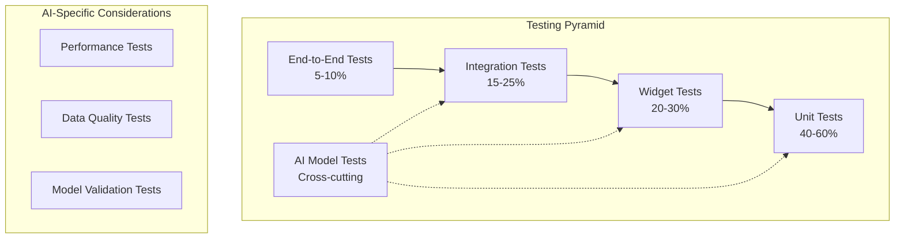

# Testing Guide for AI-Powered Mobile Applications

This comprehensive guide covers testing strategies and approaches specifically designed for AI-powered mobile applications, with examples from the CulicidaeLab project's mosquito classification system.

## Table of Contents

1. [Testing Strategy Overview](#testing-strategy-overview)
2. [Unit Testing](#unit-testing)
3. [Widget Testing](#widget-testing)
4. [Integration Testing](#integration-testing)
5. [AI Model Testing](#ai-model-testing)
6. [Performance Testing](#performance-testing)
7. [End-to-End Testing](#end-to-end-testing)
8. [Mock Strategies](#mock-strategies)
9. [Test Data Management](#test-data-management)
10. [Continuous Integration Testing](#continuous-integration-testing)

## Testing Strategy Overview

### Testing Pyramid for AI Applications



### Test Categories

1. **Unit Tests**: Test individual components in isolation
2. **Widget Tests**: Test UI components and their interactions
3. **Integration Tests**: Test component interactions and data flow
4. **AI Model Tests**: Validate model behavior and performance
5. **Performance Tests**: Measure and validate performance metrics
6. **End-to-End Tests**: Test complete user workflows

## Unit Testing

### ViewModel Testing

ViewModels contain the core business logic and should be thoroughly tested.

#### Basic ViewModel Test Structure

```dart
// test/unit/view_models/classification_view_model_test.dart
import 'package:flutter_test/flutter_test.dart';
import 'package:mockito/mockito.dart';
import 'package:mockito/annotations.dart';

@GenerateMocks([ClassificationRepository, UserService])
import 'classification_view_model_test.mocks.dart';

void main() {
  group('ClassificationViewModel', () {
    late ClassificationViewModel viewModel;
    late MockClassificationRepository mockRepository;
    late MockUserService mockUserService;
    
    setUp(() {
      mockRepository = MockClassificationRepository();
      mockUserService = MockUserService();
      viewModel = ClassificationViewModel(
        repository: mockRepository,
        userService: mockUserService,
      );
    });
    
    tearDown(() {
      viewModel.dispose();
    });
    
    group('Initial State', () {
      test('should start with correct initial state', () {
        expect(viewModel.state, ClassificationState.initial);
        expect(viewModel.hasImage, false);
        expect(viewModel.result, null);
        expect(viewModel.errorMessage, null);
      });
    });
    
    group('Image Classification', () {
      test('should update state during classification process', () async {
        // Arrange
        final testFile = File('test_image.jpg');
        final expectedResult = ClassificationResult(
          species: createTestSpecies(),
          confidence: 95.0,
          inferenceTime: 150,
          relatedDiseases: [],
          imageFile: testFile,
        );
        
        when(mockRepository.classifyImage(any, any))
            .thenAnswer((_) async => expectedResult);
        
        viewModel.setImageFile(testFile);
        
        // Act & Assert
        expect(viewModel.state, ClassificationState.initial);
        
        final future = viewModel.classifyImage(MockAppLocalizations());
        expect(viewModel.state, ClassificationState.loading);
        
        await future;
        expect(viewModel.state, ClassificationState.success);
        expect(viewModel.result, expectedResult);
      });
      
      test('should handle classification errors gracefully', () async {
        // Arrange
        when(mockRepository.classifyImage(any, any))
            .thenThrow(Exception('Network error'));
        
        viewModel.setImageFile(File('test_image.jpg'));
        
        // Act
        await viewModel.classifyImage(MockAppLocalizations());
        
        // Assert
        expect(viewModel.state, ClassificationState.error);
        expect(viewModel.errorMessage, contains('Classification failed'));
        expect(viewModel.result, null);
      });
    });
  });
}
```

### Service Testing

Test services that handle external dependencies and complex logic.

#### Classification Service Tests

```dart
// test/unit/services/classification_service_test.dart
void main() {
  group('ClassificationService', () {
    late ClassificationService service;
    late MockPytorchWrapper mockWrapper;
    late MockClassificationModel mockModel;
    
    setUp(() {
      mockWrapper = MockPytorchWrapper();
      mockModel = MockClassificationModel();
      service = ClassificationService(pytorchWrapper: mockWrapper);
    });
    
    group('Model Loading', () {
      test('should load model successfully', () async {
        // Arrange
        when(mockWrapper.loadClassificationModel(any, any, any, labelPath: any))
            .thenAnswer((_) async => mockModel);
        
        // Act
        await service.loadModel();
        
        // Assert
        expect(service.isModelLoaded, true);
        verify(mockWrapper.loadClassificationModel(
          'assets/models/mosquito_classifier.pt',
          224,
          224,
          labelPath: 'assets/labels/mosquito_species.txt',
        )).called(1);
      });
      
      test('should handle platform exceptions', () async {
        // Arrange
        when(mockWrapper.loadClassificationModel(any, any, any, labelPath: any))
            .thenThrow(PlatformException(code: 'UNAVAILABLE'));
        
        // Act & Assert
        expect(
          () => service.loadModel(),
          throwsA(isA<Exception>().having(
            (e) => e.toString(),
            'message',
            contains('only supported for Android/iOS'),
          )),
        );
      });
    });
    
    group('Image Classification', () {
      test('should classify image and return results', () async {
        // Arrange
        final testFile = File('test_image.jpg');
        final mockBytes = Uint8List.fromList([1, 2, 3, 4]);
        
        when(mockModel.getImagePredictionResult(any))
            .thenAnswer((_) async => {
              'label': 'Aedes aegypti',
              'probability': 0.95,
            });
        
        // Mock file operations
        when(testFile.readAsBytes()).thenAnswer((_) async => mockBytes);
        
        service.setModel(mockModel); // Test helper method
        
        // Act
        final result = await service.classifyImage(testFile);
        
        // Assert
        expect(result['scientificName'], 'Aedes aegypti');
        expect(result['confidence'], 0.95);
        verify(mockModel.getImagePredictionResult(mockBytes)).called(1);
      });
      
      test('should throw exception when model not loaded', () async {
        // Arrange
        final testFile = File('test_image.jpg');
        
        // Act & Assert
        expect(
          () => service.classifyImage(testFile),
          throwsA(isA<Exception>().having(
            (e) => e.toString(),
            'message',
            contains('Model not loaded'),
          )),
        );
      });
    });
  });
}
```

### Repository Testing

Test data access layer and business logic integration.

```dart
// test/unit/repositories/classification_repository_test.dart
void main() {
  group('ClassificationRepository', () {
    late ClassificationRepository repository;
    late MockClassificationService mockService;
    late MockMosquitoRepository mockMosquitoRepo;
    late MockHttpClient mockHttpClient;
    
    setUp(() {
      mockService = MockClassificationService();
      mockMosquitoRepo = MockMosquitoRepository();
      mockHttpClient = MockHttpClient();
      
      repository = ClassificationRepository(
        classificationService: mockService,
        mosquitoRepository: mockMosquitoRepo,
        httpClient: mockHttpClient,
      );
    });
    
    test('should enrich classification results with species data', () async {
      // Arrange
      final testFile = File('test_image.jpg');
      final rawResult = {
        'scientificName': 'Aedes aegypti',
        'confidence': 0.95,
      };
      final species = createTestSpecies(name: 'Aedes aegypti');
      final diseases = [createTestDisease()];
      
      when(mockService.classifyImage(testFile))
          .thenAnswer((_) async => rawResult);
      when(mockMosquitoRepo.getSpeciesByName('Aedes aegypti', 'en'))
          .thenAnswer((_) async => species);
      when(mockMosquitoRepo.getDiseasesByVector('Aedes aegypti', 'en'))
          .thenAnswer((_) async => diseases);
      
      // Act
      final result = await repository.classifyImage(testFile, 'en');
      
      // Assert
      expect(result.species, species);
      expect(result.confidence, 95.0);
      expect(result.relatedDiseases, diseases);
      expect(result.imageFile, testFile);
    });
  });
}
```

## Widget Testing

Widget tests verify UI components and their interactions with ViewModels.

### Screen Widget Testing

```dart
// test/widget/classification_screen_test.dart
void main() {
  group('ClassificationScreen Widget Tests', () {
    late MockClassificationViewModel mockViewModel;
    late MockAppLocalizations mockLocalizations;
    
    setUp(() {
      mockViewModel = MockClassificationViewModel();
      mockLocalizations = MockAppLocalizations();
      
      // Setup default mock responses
      when(mockViewModel.state).thenReturn(ClassificationState.initial);
      when(mockViewModel.hasImage).thenReturn(false);
      when(mockViewModel.errorMessage).thenReturn(null);
      
      // Setup locator
      locator.registerSingleton<ClassificationViewModel>(mockViewModel);
    });
    
    tearDown(() {
      locator.reset();
    });
    
    Widget createTestWidget() {
      return MaterialApp(
        localizationsDelegates: [MockAppLocalizationsDelegate(mockLocalizations)],
        home: ClassificationScreen(),
      );
    }
    
    testWidgets('should display initial state correctly', (tester) async {
      // Arrange
      when(mockLocalizations.classificationScreenTitle)
          .thenReturn('Classify Mosquito');
      when(mockLocalizations.uploadImageHint)
          .thenReturn('Upload a clear image');
      
      // Act
      await tester.pumpWidget(createTestWidget());
      
      // Assert
      expect(find.text('Classify Mosquito'), findsOneWidget);
      expect(find.text('Upload a clear image'), findsOneWidget);
      expect(find.byType(CircularProgressIndicator), findsNothing);
    });
    
    testWidgets('should show loading state during processing', (tester) async {
      // Arrange
      when(mockViewModel.state).thenReturn(ClassificationState.loading);
      when(mockViewModel.isProcessing).thenReturn(true);
      when(mockLocalizations.analyzingImage).thenReturn('Analyzing...');
      
      // Act
      await tester.pumpWidget(createTestWidget());
      
      // Assert
      expect(find.byType(CircularProgressIndicator), findsOneWidget);
      expect(find.text('Analyzing...'), findsOneWidget);
    });
    
    testWidgets('should display results when classification succeeds', (tester) async {
      // Arrange
      final mockResult = MockClassificationResult();
      final mockSpecies = MockMosquitoSpecies();
      
      when(mockSpecies.name).thenReturn('Aedes aegypti');
      when(mockSpecies.commonName).thenReturn('Yellow Fever Mosquito');
      when(mockResult.species).thenReturn(mockSpecies);
      when(mockResult.confidence).thenReturn(95.0);
      when(mockResult.inferenceTime).thenReturn(150);
      
      when(mockViewModel.state).thenReturn(ClassificationState.success);
      when(mockViewModel.result).thenReturn(mockResult);
      
      // Act
      await tester.pumpWidget(createTestWidget());
      
      // Assert
      expect(find.text('Aedes aegypti'), findsOneWidget);
      expect(find.text('Yellow Fever Mosquito'), findsOneWidget);
      expect(find.text('95.0%'), findsOneWidget);
    });
    
    testWidgets('should handle user interactions correctly', (tester) async {
      // Arrange
      await tester.pumpWidget(createTestWidget());
      
      // Act
      await tester.tap(find.byIcon(Icons.camera_alt));
      await tester.pump();
      
      // Assert
      verify(mockViewModel.pickImage(ImageSource.camera, any)).called(1);
    });
  });
}
```

### Custom Widget Testing

```dart
// test/widget/mosquito_card_test.dart
void main() {
  group('MosquitoCard Widget', () {
    testWidgets('should display species information correctly', (tester) async {
      // Arrange
      final species = MosquitoSpecies(
        id: '1',
        name: 'Aedes aegypti',
        commonName: 'Yellow Fever Mosquito',
        description: 'A dangerous vector',
        habitat: 'Urban areas',
        distribution: 'Tropical regions',
        imageUrl: 'test_image.jpg',
        diseases: ['dengue', 'zika'],
      );
      
      // Act
      await tester.pumpWidget(
        MaterialApp(
          home: Scaffold(
            body: MosquitoCard(species: species),
          ),
        ),
      );
      
      // Assert
      expect(find.text('Aedes aegypti'), findsOneWidget);
      expect(find.text('Yellow Fever Mosquito'), findsOneWidget);
      expect(find.text('A dangerous vector'), findsOneWidget);
    });
    
    testWidgets('should handle tap interactions', (tester) async {
      // Arrange
      bool tapped = false;
      final species = createTestSpecies();
      
      // Act
      await tester.pumpWidget(
        MaterialApp(
          home: Scaffold(
            body: MosquitoCard(
              species: species,
              onTap: () => tapped = true,
            ),
          ),
        ),
      );
      
      await tester.tap(find.byType(MosquitoCard));
      
      // Assert
      expect(tapped, true);
    });
  });
}
```

## Integration Testing

Integration tests verify that multiple components work together correctly.

### Repository Integration Tests

```dart
// test/integration/classification_integration_test.dart
void main() {
  group('Classification Integration Tests', () {
    late ClassificationRepository repository;
    late ClassificationService service;
    late MosquitoRepository mosquitoRepo;
    
    setUpAll(() async {
      // Setup real services with test database
      await setupTestDatabase();
      service = ClassificationService(pytorchWrapper: PytorchWrapper());
      mosquitoRepo = MosquitoRepository(databaseService: TestDatabaseService());
      repository = ClassificationRepository(
        classificationService: service,
        mosquitoRepository: mosquitoRepo,
        httpClient: http.Client(),
      );
    });
    
    test('should perform end-to-end classification', () async {
      // Arrange
      await repository.loadModel();
      final testImage = File('test/fixtures/test_mosquito.jpg');
      
      // Act
      final result = await repository.classifyImage(testImage, 'en');
      
      // Assert
      expect(result.species.name, isNotEmpty);
      expect(result.confidence, greaterThan(0));
      expect(result.confidence, lessThanOrEqualTo(100));
      expect(result.inferenceTime, greaterThan(0));
      expect(result.imageFile, testImage);
    });
    
    test('should handle unknown species correctly', () async {
      // Arrange
      final unknownImage = File('test/fixtures/unknown_insect.jpg');
      
      // Act
      final result = await repository.classifyImage(unknownImage, 'en');
      
      // Assert
      expect(result.species.id, '0'); // Unknown species marker
      expect(result.confidence, lessThan(50)); // Low confidence
    });
  });
}
```

## AI Model Testing

AI model testing focuses on validating model behavior, performance, and edge cases.

### Model Validation Tests

```dart
// test/ai/model_validation_test.dart
void main() {
  group('AI Model Validation', () {
    late ClassificationService service;
    
    setUpAll(() async {
      service = ClassificationService(pytorchWrapper: PytorchWrapper());
      await service.loadModel();
    });
    
    group('Model Accuracy Tests', () {
      test('should classify known species correctly', () async {
        final testCases = [
          TestCase('aedes_aegypti_1.jpg', 'Aedes aegypti', minConfidence: 0.8),
          TestCase('anopheles_gambiae_1.jpg', 'Anopheles gambiae', minConfidence: 0.7),
          TestCase('culex_pipiens_1.jpg', 'Culex pipiens', minConfidence: 0.75),
        ];
        
        for (final testCase in testCases) {
          final image = File('test/fixtures/species/${testCase.imagePath}');
          final result = await service.classifyImage(image);
          
          expect(
            result['scientificName'],
            testCase.expectedSpecies,
            reason: 'Failed for ${testCase.imagePath}',
          );
          expect(
            result['confidence'],
            greaterThanOrEqualTo(testCase.minConfidence),
            reason: 'Low confidence for ${testCase.imagePath}',
          );
        }
      });
      
      test('should handle edge cases appropriately', () async {
        final edgeCases = [
          'blurry_mosquito.jpg',
          'partial_mosquito.jpg',
          'multiple_mosquitoes.jpg',
          'no_mosquito.jpg',
        ];
        
        for (final imagePath in edgeCases) {
          final image = File('test/fixtures/edge_cases/$imagePath');
          final result = await service.classifyImage(image);
          
          // Should not crash and should return valid result structure
          expect(result, contains('scientificName'));
          expect(result, contains('confidence'));
          expect(result['confidence'], inInclusiveRange(0.0, 1.0));
        }
      });
    });
    
    group('Model Performance Tests', () {
      test('should meet inference time requirements', () async {
        final testImage = File('test/fixtures/test_mosquito.jpg');
        final stopwatch = Stopwatch()..start();
        
        await service.classifyImage(testImage);
        
        stopwatch.stop();
        expect(
          stopwatch.elapsedMilliseconds,
          lessThan(5000), // Should complete within 5 seconds
        );
      });
      
      test('should handle batch processing efficiently', () async {
        final images = List.generate(
          10,
          (i) => File('test/fixtures/batch/mosquito_$i.jpg'),
        );
        
        final stopwatch = Stopwatch()..start();
        
        for (final image in images) {
          await service.classifyImage(image);
        }
        
        stopwatch.stop();
        final avgTime = stopwatch.elapsedMilliseconds / images.length;
        
        expect(avgTime, lessThan(2000)); // Average under 2 seconds per image
      });
    });
  });
}

class TestCase {
  final String imagePath;
  final String expectedSpecies;
  final double minConfidence;
  
  TestCase(this.imagePath, this.expectedSpecies, {required this.minConfidence});
}
```

## Performance Testing

Performance tests measure and validate system performance characteristics.

### Classification Performance Tests

```dart
// test/performance/classification_performance_test.dart
void main() {
  group('Classification Performance Tests', () {
    late ClassificationViewModel viewModel;
    late List<File> testImages;
    
    setUpAll(() async {
      viewModel = ClassificationViewModel(
        repository: ClassificationRepository(),
        userService: UserService(),
      );
      await viewModel.initModel(TestLocalizations());
      
      testImages = await loadTestImages();
    });
    
    testWidgets('should meet performance benchmarks', (tester) async {
      final results = <PerformanceResult>[];
      
      for (final image in testImages) {
        final result = await measurePerformance(
          'Image Classification',
          () async {
            viewModel.setImageFile(image);
            await viewModel.classifyImage(TestLocalizations());
            return viewModel.result;
          },
        );
        
        results.add(result);
      }
      
      // Analyze results
      final avgInferenceTime = results
          .map((r) => r.duration)
          .reduce((a, b) => a + b) / results.length;
      
      expect(avgInferenceTime, lessThan(3000)); // Average under 3 seconds
      
      // Check for performance regressions
      final maxTime = results.map((r) => r.duration).reduce(math.max);
      expect(maxTime, lessThan(10000)); // No single inference over 10 seconds
    });
    
    testWidgets('should handle memory efficiently', (tester) async {
      final initialMemory = await getMemoryUsage();
      
      // Process multiple images
      for (int i = 0; i < 20; i++) {
        final image = testImages[i % testImages.length];
        viewModel.setImageFile(image);
        await viewModel.classifyImage(TestLocalizations());
        viewModel.reset(); // Simulate user resetting
      }
      
      // Force garbage collection
      await Future.delayed(Duration(seconds: 1));
      
      final finalMemory = await getMemoryUsage();
      final memoryIncrease = finalMemory - initialMemory;
      
      // Memory increase should be reasonable (less than 100MB)
      expect(memoryIncrease, lessThan(100 * 1024 * 1024));
    });
  });
}
```

## End-to-End Testing

E2E tests validate complete user workflows across the entire application.

### User Journey Tests

```dart
// integration_test/classification_journey_test.dart
void main() {
  group('Classification User Journey', () {
    testWidgets('complete mosquito classification workflow', (tester) async {
      // Setup
      app.main();
      await tester.pumpAndSettle();
      
      // Navigate to classification screen
      await tester.tap(find.byKey(Key('classify_button')));
      await tester.pumpAndSettle();
      
      // Select image from gallery
      await tester.tap(find.byKey(Key('gallery_button')));
      await tester.pumpAndSettle();
      
      // Mock image picker result
      mockImagePicker('test_mosquito.jpg');
      
      // Wait for image to load
      await tester.pumpAndSettle();
      expect(find.byType(Image), findsOneWidget);
      
      // Trigger classification
      await tester.tap(find.byKey(Key('analyze_button')));
      
      // Wait for classification to complete
      await tester.pumpAndSettle(Duration(seconds: 10));
      
      // Verify results are displayed
      expect(find.textContaining('Species:'), findsOneWidget);
      expect(find.textContaining('Confidence:'), findsOneWidget);
      
      // Navigate to species details
      await tester.tap(find.byKey(Key('species_info_button')));
      await tester.pumpAndSettle();
      
      // Verify species detail screen
      expect(find.textContaining('Description'), findsOneWidget);
      expect(find.textContaining('Habitat'), findsOneWidget);
      
      // Go back and submit observation
      await tester.pageBack();
      await tester.pumpAndSettle();
      
      await tester.tap(find.byKey(Key('add_observation_button')));
      await tester.pumpAndSettle();
      
      // Fill observation form
      await tester.enterText(
        find.byKey(Key('notes_field')),
        'Found in backyard pond',
      );
      
      // Submit observation
      await tester.tap(find.byKey(Key('submit_button')));
      await tester.pumpAndSettle();
      
      // Verify success message
      expect(find.textContaining('Thank you'), findsOneWidget);
    });
  });
}
```

## Mock Strategies

Effective mocking is crucial for isolated and reliable tests.

### Service Mocking

```dart
// test/mocks/mock_services.dart
class MockClassificationService extends Mock implements ClassificationService {
  @override
  Future<Map<String, dynamic>> classifyImage(File imageFile) async {
    return {
      'scientificName': 'Aedes aegypti',
      'confidence': 0.95,
    };
  }
}

class MockPytorchWrapper extends Mock implements PytorchWrapper {
  @override
  Future<ClassificationModel> loadClassificationModel(
    String pathImageModel,
    int imageWidth,
    int imageHeight, {
    String? labelPath,
  }) async {
    return MockClassificationModel();
  }
}
```

### Data Mocking

```dart
// test/fixtures/test_data.dart
class TestDataFactory {
  static MosquitoSpecies createTestSpecies({
    String? id,
    String? name,
    String? commonName,
  }) {
    return MosquitoSpecies(
      id: id ?? '1',
      name: name ?? 'Aedes aegypti',
      commonName: commonName ?? 'Yellow Fever Mosquito',
      description: 'Test description',
      habitat: 'Test habitat',
      distribution: 'Test distribution',
      imageUrl: 'test_image.jpg',
      diseases: ['dengue', 'zika'],
    );
  }
  
  static Disease createTestDisease({
    String? id,
    String? name,
  }) {
    return Disease(
      id: id ?? '1',
      name: name ?? 'Dengue Fever',
      description: 'Test disease description',
      symptoms: 'Test symptoms',
      treatment: 'Test treatment',
      prevention: 'Test prevention',
      vectors: ['Aedes aegypti'],
      prevalence: 'Common in tropical areas',
      imageUrl: 'test_disease.jpg',
    );
  }
}
```

## Test Data Management

### Test Image Management

```dart
// test/utils/test_image_utils.dart
class TestImageUtils {
  static const String testImagesPath = 'test/fixtures/images';
  
  static Future<List<File>> loadTestImages() async {
    final directory = Directory(testImagesPath);
    if (!directory.existsSync()) {
      throw Exception('Test images directory not found: $testImagesPath');
    }
    
    return directory
        .listSync()
        .where((entity) => entity is File && entity.path.endsWith('.jpg'))
        .map((entity) => File(entity.path))
        .toList();
  }
  
  static Uint8List createTestImageBytes({
    int width = 224,
    int height = 224,
  }) {
    // Create a simple test image
    final image = img.Image(width: width, height: height);
    img.fill(image, color: img.ColorRgb8(128, 128, 128));
    return Uint8List.fromList(img.encodeJpg(image));
  }
  
  static Future<File> createTempTestImage() async {
    final tempDir = await getTemporaryDirectory();
    final file = File('${tempDir.path}/test_image_${DateTime.now().millisecondsSinceEpoch}.jpg');
    await file.writeAsBytes(createTestImageBytes());
    return file;
  }
}
```

### Database Test Setup

```dart
// test/utils/test_database_setup.dart
class TestDatabaseSetup {
  static Future<void> setupTestDatabase() async {
    final databaseService = DatabaseService();
    await databaseService.initializeDatabase();
    
    // Insert test data
    await _insertTestSpecies();
    await _insertTestDiseases();
  }
  
  static Future<void> _insertTestSpecies() async {
    final species = [
      TestDataFactory.createTestSpecies(
        id: '1',
        name: 'Aedes aegypti',
        commonName: 'Yellow Fever Mosquito',
      ),
      TestDataFactory.createTestSpecies(
        id: '2',
        name: 'Anopheles gambiae',
        commonName: 'African Malaria Mosquito',
      ),
    ];
    
    final db = await DatabaseService().database;
    for (final s in species) {
      await db.insert('mosquito_species', s.toMap());
    }
  }
  
  static Future<void> cleanupTestDatabase() async {
    final db = await DatabaseService().database;
    await db.delete('mosquito_species');
    await db.delete('diseases');
  }
}
```

## Continuous Integration Testing

### GitHub Actions Test Configuration

```yaml
# .github/workflows/test.yml
name: Tests

on:
  push:
    branches: [ main, develop ]
  pull_request:
    branches: [ main ]

jobs:
  test:
    runs-on: ubuntu-latest
    
    steps:
    - uses: actions/checkout@v3
    
    - name: Setup Flutter
      uses: subosito/flutter-action@v2
      with:
        flutter-version: '3.16.0'
        
    - name: Install dependencies
      run: flutter pub get
      
    - name: Run code generation
      run: flutter packages pub run build_runner build
      
    - name: Run unit tests
      run: flutter test test/unit/ --coverage
      
    - name: Run widget tests
      run: flutter test test/widget/
      
    - name: Run integration tests
      run: flutter test test/integration/
      
    - name: Upload coverage to Codecov
      uses: codecov/codecov-action@v3
      with:
        file: coverage/lcov.info
        
  performance_test:
    runs-on: ubuntu-latest
    
    steps:
    - uses: actions/checkout@v3
    
    - name: Setup Flutter
      uses: subosito/flutter-action@v2
      
    - name: Run performance tests
      run: flutter test test/performance/ --reporter=json > performance_results.json
      
    - name: Analyze performance results
      run: dart scripts/analyze_performance.dart performance_results.json
```

### Test Quality Gates

```dart
// scripts/test_quality_gates.dart
void main(List<String> args) {
  final coverageFile = File('coverage/lcov.info');
  if (!coverageFile.existsSync()) {
    print('Coverage file not found');
    exit(1);
  }
  
  final coverage = parseCoverageFile(coverageFile);
  
  // Enforce minimum coverage thresholds
  if (coverage.lineCoverage < 80.0) {
    print('Line coverage ${coverage.lineCoverage}% is below threshold (80%)');
    exit(1);
  }
  
  if (coverage.branchCoverage < 70.0) {
    print('Branch coverage ${coverage.branchCoverage}% is below threshold (70%)');
    exit(1);
  }
  
  print('All quality gates passed!');
  print('Line coverage: ${coverage.lineCoverage}%');
  print('Branch coverage: ${coverage.branchCoverage}%');
}
```

## Best Practices Summary

### Unit Testing
- Test business logic in isolation
- Use mocks for external dependencies
- Follow AAA pattern (Arrange, Act, Assert)
- Test both success and failure scenarios
- Maintain high test coverage (>80%)

### Widget Testing
- Test UI behavior and user interactions
- Mock ViewModels and services
- Verify state changes and navigation
- Test accessibility features
- Use realistic test data

### Integration Testing
- Test component interactions
- Use real services where possible
- Validate data flow between layers
- Test critical user paths
- Include performance validations

### AI Model Testing
- Validate model accuracy with known datasets
- Test edge cases and error conditions
- Monitor inference performance
- Verify model behavior consistency
- Test with various input qualities

### Performance Testing
- Set clear performance benchmarks
- Monitor memory usage patterns
- Test under various load conditions
- Validate on different device types
- Include regression testing

### Test Maintenance
- Keep tests simple and focused
- Update tests with code changes
- Remove obsolete tests
- Maintain test data quality
- Regular test suite optimization

This comprehensive testing strategy ensures robust, reliable AI-powered mobile applications with high quality and performance standards.