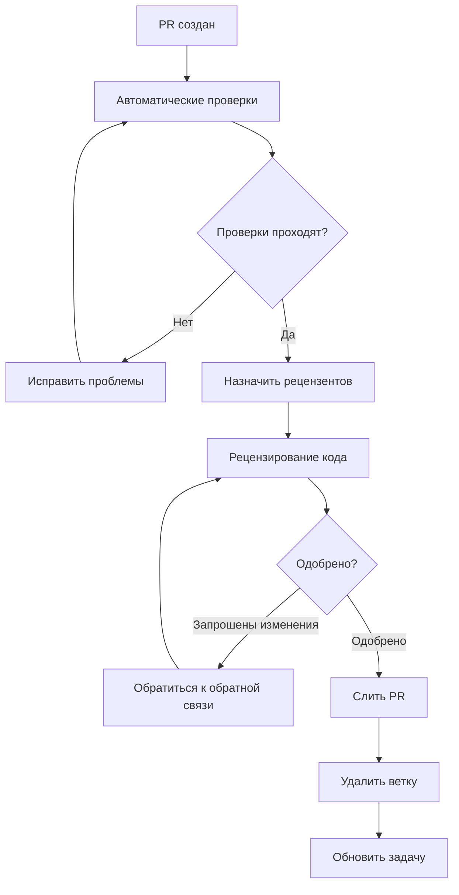

# Рабочий процесс разработки

## Обзор

Этот документ описывает рабочий процесс разработки для проекта CulicidaeLab, включая стратегии ветвления, процессы разработки, процедуры тестирования и рабочие процессы развертывания. Следование этим руководящим принципам обеспечивает постоянное качество кода и плавное сотрудничество между членами команды.

## Содержание

- [Стратегия ветвления](#стратегия-ветвления)
- [Процесс разработки](#процесс-разработки)
- [Процесс рецензирования кода](#процесс-рецензирования-кода)
- [Рабочий процесс тестирования](#рабочий-процесс-тестирования)
- [Процесс релиза](#процесс-релиза)
- [Непрерывная интеграция](#непрерывная-интеграция)
- [Обеспечение качества](#обеспечение-качества)
- [Процесс развертывания](#процесс-развертывания)

## Стратегия ветвления

### Типы веток

Мы используем **рабочий процесс feature branch** со следующими типами веток:

#### Основные ветки

1. **`main`** - Готовый к продакшну код
   - Всегда развертываемый
   - Защищенная ветка, требующая рецензирования
   - Все релизы помечаются из этой ветки
   - Прямые коммиты не разрешены

2. **`develop`** (опционально) - Интеграционная ветка для функций
   - Используется для больших релизов с несколькими функциями
   - Создается при необходимости для сложных циклов релиза

#### Поддерживающие ветки

1. **Feature ветки** - `feature/description`
   - Создаются из `main` (или `develop` если используется)
   - Используются для новых функций и улучшений
   - Сливаются обратно через pull request
   - Удаляются после слияния

2. **Bug Fix ветки** - `fix/description`
   - Создаются из `main`
   - Используются для исправления ошибок
   - Могут сливаться напрямую в `main` для hotfixes
   - Удаляются после слияния

3. **Documentation ветки** - `docs/description`
   - Создаются из `main`
   - Используются для обновлений документации
   - Сливаются обратно через pull request
   - Удаляются после слияния

4. **Release ветки** - `release/version`
   - Создаются из `develop` (когда используется)
   - Используются для подготовки релиза
   - Только исправления ошибок, никаких новых функций
   - Сливаются в `main` и `develop`

5. **Hotfix ветки** - `hotfix/description`
   - Создаются из `main`
   - Используются для критических исправлений продакшна
   - Сливаются в `main` и `develop`
   - Помечаются сразу после слияния

### Соглашения именования веток

```bash
# Feature ветки
feature/mosquito-species-filter
feature/user-authentication
feature/offline-mode

# Bug fix ветки
fix/classification-timeout
fix/memory-leak-gallery
fix/crash-on-startup

# Documentation ветки
docs/api-reference-update
docs/setup-guide-improvements
docs/architecture-diagrams

# Release ветки
release/1.2.0
release/2.0.0-beta

# Hotfix ветки
hotfix/critical-security-fix
hotfix/data-corruption-fix
```

## Процесс разработки

### 1. Фаза планирования

#### Создание задач
1. **Создать задачу**: Используйте соответствующий шаблон задачи
2. **Назначение меток**: Добавьте соответствующие метки (bug, feature, documentation и т.д.)
3. **Установка приоритета**: Назначьте уровень приоритета
4. **Назначение milestone**: Свяжите с соответствующим milestone/релизом
5. **Исполнитель**: Назначьте разработчику (если известно)

#### Уточнение задач
1. **Уточнение требований**: Убедитесь в четких критериях приемки
2. **Техническое обсуждение**: Обсудите подход к реализации
3. **Оценка усилий**: Оцените время разработки
4. **Зависимости**: Определите блокирующие задачи или предварительные условия

### 2. Фаза разработки

#### Начало разработки
```bash
# 1. Обновите локальную main ветку
git checkout main
git pull origin main

# 2. Создайте feature ветку
git checkout -b feature/mosquito-species-filter

# 3. Настройте отслеживание
git push -u origin feature/mosquito-species-filter
```

#### Рабочий процесс разработки
1. **Маленькие, сфокусированные коммиты**: Делайте атомарные коммиты с четкими сообщениями
2. **Регулярные push**: Отправляйте изменения часто для резервного копирования работы
3. **Непрерывное тестирование**: Запускайте тесты локально во время разработки
4. **Качество кода**: Следуйте руководящим принципам стиля и лучшим практикам

#### Руководящие принципы сообщений коммитов
Следуйте формату [Conventional Commits](https://www.conventionalcommits.org/):

```
type(scope): description

[optional body]

[optional footer]
```

**Типы:**
- `feat`: Новая функция
- `fix`: Исправление ошибки
- `docs`: Изменения документации
- `style`: Изменения стиля кода
- `refactor`: Рефакторинг кода
- `test`: Добавление или обновление тестов
- `chore`: Задачи обслуживания
- `perf`: Улучшения производительности
- `ci`: Изменения CI/CD

**Примеры:**
```bash
feat(gallery): add species filtering functionality

Add dropdown filter to mosquito gallery allowing users to filter
by species family. Includes search functionality and clear filters option.

Closes #123
```

```bash
fix(classification): resolve model loading timeout

Increase timeout for PyTorch model loading from 5s to 15s to handle
slower devices. Add retry mechanism with exponential backoff.

Fixes #456
```

### 3. Фаза перед Pull Request

#### Чек-лист самопроверки
- [ ] Код следует руководящим принципам стиля проекта
- [ ] Все тесты проходят локально
- [ ] Нет отладочного кода или console logs
- [ ] Документация обновлена (при необходимости)
- [ ] Сообщения коммитов следуют соглашениям
- [ ] Ветка актуальна с main

#### Проверки качества кода
```bash
# Форматировать код
flutter format .

# Анализировать код
flutter analyze

# Запустить тесты
flutter test

# Проверить покрытие тестами
flutter test --coverage
```

#### Обновить ветку
```bash
# Rebase на последний main
git checkout main
git pull origin main
git checkout feature/mosquito-species-filter
git rebase main

# Или merge если rebase не предпочтителен
git merge main
```

### 4. Создание Pull Request

#### Подготовка PR
1. **Используйте шаблон PR**: Заполните все разделы полностью
2. **Четкий заголовок**: Используйте формат conventional commit
3. **Подробное описание**: Объясните что, почему и как
4. **Свяжите задачи**: Ссылайтесь на связанные задачи
5. **Добавьте скриншоты**: Для изменений UI
6. **Отметьте как черновик**: Если не готов к рецензированию

#### Требования PR
- [ ] Все проверки CI проходят
- [ ] Тесты добавлены/обновлены
- [ ] Документация обновлена
- [ ] Нет конфликтов слияния
- [ ] Рецензенты назначены

## Процесс рецензирования кода

### Назначение рецензирования

#### Автоматическое назначение
- **Code Owners**: Автоматически назначаются на основе файла CODEOWNERS
- **Члены команды**: Назначение по кругу для членов команды
- **На основе экспертизы**: Назначение на основе области экспертизы

#### Ручное назначение
- **Сложные изменения**: Назначьте старших разработчиков
- **Изменения архитектуры**: Назначьте архитекторов/лидов
- **Изменения безопасности**: Назначьте рецензентов, сфокусированных на безопасности
- **Изменения производительности**: Назначьте экспертов по производительности

### Руководящие принципы рецензирования

#### Для авторов

1. **Отвечайте оперативно**: Обращайтесь к обратной связи в течение 24-48 часов
2. **Задавайте вопросы**: Уточняйте неясную обратную связь
3. **Отдельные коммиты**: Вносите изменения рецензирования в отдельных коммитах
4. **Обновляйте тесты**: Убедитесь, что тесты отражают изменения
5. **Будьте восприимчивыми**: Принимайте конструктивную обратную связь позитивно

#### Для рецензентов

1. **Своевременные рецензии**: Завершайте рецензии в течение 24-48 часов
2. **Конструктивная обратная связь**: Будьте конкретными и полезными
3. **Объясняйте обоснование**: Предоставляйте контекст для предложений
4. **Тестируйте функциональность**: Проверяйте, что изменения работают как ожидается
5. **Проверяйте стандарты**: Убедитесь, что код соответствует стандартам проекта

### Чек-лист рецензирования

#### Функциональность
- [ ] Код делает то, что должен делать
- [ ] Граничные случаи обрабатываются
- [ ] Обработка ошибок соответствующая
- [ ] Производительность приемлемая

#### Качество кода
- [ ] Код читаемый и поддерживаемый
- [ ] Следует соглашениям проекта
- [ ] Нет дублирования кода
- [ ] Соответствующие абстракции

#### Тестирование
- [ ] Тесты покрывают новую функциональность
- [ ] Тесты осмысленные и тщательные
- [ ] Все тесты проходят
- [ ] Покрытие тестами адекватное

#### Документация
- [ ] Код хорошо прокомментирован
- [ ] Документация API обновлена
- [ ] Пользовательская документация обновлена (при необходимости)
- [ ] README обновлен (при необходимости)

#### Безопасность
- [ ] Нет уязвимостей безопасности
- [ ] Валидация входов реализована
- [ ] Нет захардкоженных секретов
- [ ] Правильная обработка ошибок

### Поток процесса рецензирования



## Рабочий процесс тестирования

### Типы тестов

#### Модульные тесты
- **Назначение**: Тестировать отдельные функции/методы
- **Расположение**: `test/unit/`
- **Покрытие**: Вся бизнес-логика и утилиты
- **Команда запуска**: `flutter test test/unit/`

#### Тесты виджетов
- **Назначение**: Тестировать компоненты UI
- **Расположение**: `test/widget/`
- **Покрытие**: Все пользовательские виджеты и экраны
- **Команда запуска**: `flutter test test/widget/`

#### Интеграционные тесты
- **Назначение**: Тестировать полные пользовательские потоки
- **Расположение**: `integration_test/`
- **Покрытие**: Критические пользовательские путешествия
- **Команда запуска**: `flutter test integration_test/`

### Стандарты тестирования

#### Требования к покрытию тестами
- **Минимальное покрытие**: 80% общее
- **Критический код**: Требуется 95% покрытие
- **Новый код**: Требуется 90% покрытие
- **UI код**: 70% покрытие приемлемо

#### Стандарты качества тестов
- **Описательные имена**: Тесты должны четко описывать, что они тестируют
- **Arrange-Act-Assert**: Следуйте паттерну AAA
- **Независимые тесты**: Тесты не должны зависеть друг от друга
- **Быстрое выполнение**: Модульные тесты должны выполняться быстро

### Рабочий процесс тестирования

#### Локальное тестирование
```bash
# Запустить все тесты
flutter test

# Запустить конкретный набор тестов
flutter test test/unit/services/
flutter test test/widget/screens/

# Запустить с покрытием
flutter test --coverage
genhtml coverage/lcov.info -o coverage/html

# Запустить интеграционные тесты
flutter test integration_test/
```

#### CI тестирование
- **Автоматизированное**: Все тесты запускаются на каждом PR
- **Несколько платформ**: Тестирование на Android, iOS, Web
- **Тесты производительности**: Запуск бенчмарков производительности
- **Сканирование безопасности**: Автоматизированное сканирование уязвимостей безопасности

## Процесс релиза

### Управление версиями

#### Семантическое версионирование
Мы следуем [Семантическому версионированию](https://semver.org/):
- **MAJOR**: Критические изменения
- **MINOR**: Новые функции (обратно совместимые)
- **PATCH**: Исправления ошибок (обратно совместимые)

#### Примеры версий
- `1.0.0` → `1.0.1` (patch: исправление ошибки)
- `1.0.1` → `1.1.0` (minor: новая функция)
- `1.1.0` → `2.0.0` (major: критическое изменение)

### Рабочий процесс релиза

#### 1. Планирование релиза
- **Заморозка функций**: Прекратить добавление новых функций
- **Фаза исправления ошибок**: Сосредоточиться на стабильности
- **Обновление документации**: Убедиться, что документы актуальны
- **Фаза тестирования**: Комплексное тестирование

#### 2. Подготовка релиза
```bash
# Создать ветку релиза
git checkout -b release/1.2.0

# Обновить номера версий
# - pubspec.yaml
# - Android build.gradle
# - iOS Info.plist

# Обновить CHANGELOG.md
# Добавить заметки о релизе

# Зафиксировать изменения
git commit -m "chore: prepare release 1.2.0"
```

#### 3. Тестирование релиза
- **Регрессионное тестирование**: Тестировать все основные функции
- **Тестирование производительности**: Проверить бенчмарки производительности
- **Тестирование устройств**: Тестировать на различных устройствах
- **Пользовательское приемочное тестирование**: Финальная валидация пользователем

#### 4. Развертывание релиза
```bash
# Слить в main
git checkout main
git merge release/1.2.0

# Пометить релиз
git tag -a v1.2.0 -m "Release version 1.2.0"
git push origin v1.2.0

# Собрать и развернуть
flutter build apk --release
flutter build appbundle --release
flutter build ios --release
```

#### 5. После релиза
- **Мониторинг**: Следить за проблемами в продакшне
- **Hotfixes**: Быстро решать критические проблемы
- **Обратная связь**: Собирать обратную связь пользователей
- **Планирование**: Планировать следующий цикл релиза

### Типы релизов

#### Регулярные релизы
- **Расписание**: Ежемесячно или раз в два месяца
- **Содержание**: Новые функции и исправления ошибок
- **Тестирование**: Полный цикл тестирования
- **Документация**: Полное обновление документации

#### Hotfix релизы
- **Триггер**: Критические ошибки или проблемы безопасности
- **Временные рамки**: В течение 24-48 часов
- **Область**: Минимальные изменения, сфокусированные исправления
- **Тестирование**: Сфокусированное тестирование области исправления

#### Beta релизы
- **Назначение**: Раннее тестирование основных функций
- **Аудитория**: Beta тестеры и ранние пользователи
- **Обратная связь**: Сбор обратной связи для финального релиза
- **Стабильность**: Может содержать известные проблемы

## Непрерывная интеграция

### CI конвейер

#### Автоматизированные проверки
1. **Качество кода**
   - Линтинг с `flutter analyze`
   - Форматирование кода с `flutter format`
   - Сканирование уязвимостей зависимостей

2. **Тестирование**
   - Выполнение модульных тестов
   - Выполнение тестов виджетов
   - Выполнение интеграционных тестов
   - Отчетность о покрытии тестами

3. **Проверка сборки**
   - Сборка Android APK
   - Сборка Android App Bundle
   - Сборка iOS (если применимо)
   - Сборка Web

4. **Сканирование безопасности**
   - Проверка уязвимостей зависимостей
   - Анализ безопасности кода
   - Проверка соответствия лицензий

#### Конфигурация CI
```yaml
# Пример рабочего процесса GitHub Actions
name: CI
on: [push, pull_request]

jobs:
  test:
    runs-on: ubuntu-latest
    steps:
      - uses: actions/checkout@v3
      - uses: subosito/flutter-action@v2
        with:
          flutter-version: '3.29.3'
      
      - name: Install dependencies
        run: flutter pub get
      
      - name: Analyze code
        run: flutter analyze
      
      - name: Format check
        run: flutter format --dry-run --set-exit-if-changed .
      
      - name: Run tests
        run: flutter test --coverage
      
      - name: Upload coverage
        uses: codecov/codecov-action@v3
```

### Качественные ворота

#### Требования PR
- [ ] Все проверки CI проходят
- [ ] Покрытие тестами соответствует минимальному порогу
- [ ] Нет уязвимостей безопасности
- [ ] Рецензирование кода одобрено
- [ ] Документация обновлена

#### Требования слияния
- [ ] Ветка актуальна
- [ ] Все разговоры разрешены
- [ ] Получены необходимые одобрения
- [ ] Нет конфликтов слияния

## Обеспечение качества

### Метрики качества кода

#### Автоматизированные метрики
- **Покрытие тестами**: Минимум 80%
- **Сложность кода**: Цикломатическая сложность < 10
- **Дублирование**: < 3% дублирования кода
- **Индекс поддерживаемости**: > 70

#### Точки ручного рецензирования
- **Соответствие архитектуре**: Следует паттерну MVVM
- **Производительность**: Нет очевидных проблем производительности
- **Безопасность**: Нет уязвимостей безопасности
- **Удобство использования**: Хороший пользовательский опыт

### Инструменты качества

#### Статический анализ
- **Flutter Analyzer**: Встроенный анализатор Dart
- **Пользовательские линты**: Правила линтинга, специфичные для проекта
- **SonarQube**: Анализ качества кода (если используется)

#### Инструменты тестирования
- **Flutter Test**: Встроенный фреймворк тестирования
- **Mockito**: Фреймворк мокирования
- **Integration Test**: Интеграционное тестирование Flutter

#### Инструменты производительности
- **Flutter DevTools**: Профилирование производительности
- **Observatory**: Профилирование Dart VM
- **Пользовательские бенчмарки**: Тесты производительности, специфичные для приложения

## Процесс развертывания

### Стратегия окружений

#### Окружение разработки
- **Назначение**: Активная разработка и тестирование
- **Развертывание**: Автоматическое при push в feature ветку
- **Данные**: Тестовые данные и mock сервисы
- **Доступ**: Команда разработки

#### Промежуточное окружение
- **Назначение**: Тестирование перед продакшном
- **Развертывание**: Автоматическое при слиянии в main ветку
- **Данные**: Продакшн-подобные тестовые данные
- **Доступ**: Команда QA и заинтересованные стороны

#### Продакшн окружение
- **Назначение**: Живое приложение
- **Развертывание**: Ручной триггер после одобрения
- **Данные**: Реальные пользовательские данные
- **Доступ**: Конечные пользователи

### Рабочий процесс развертывания

#### Автоматизированное развертывание
```yaml
# Пример рабочего процесса развертывания
name: Deploy
on:
  push:
    tags: ['v*']

jobs:
  deploy:
    runs-on: ubuntu-latest
    steps:
      - name: Build APK
        run: flutter build apk --release
      
      - name: Build App Bundle
        run: flutter build appbundle --release
      
      - name: Deploy to Play Store
        uses: r0adkll/upload-google-play@v1
        with:
          serviceAccountJsonPlainText: ${{ secrets.SERVICE_ACCOUNT_JSON }}
          packageName: com.culicidaelab.mobile
          releaseFiles: build/app/outputs/bundle/release/app-release.aab
          track: production
```

#### Шаги ручного развертывания
1. **Проверки перед развертыванием**
   - Проверить, что все тесты проходят
   - Проверить чек-лист развертывания
   - Подтвердить план отката

2. **Выполнение развертывания**
   - Собрать артефакты релиза
   - Развернуть в магазины приложений
   - Обновить документацию

3. **Проверка после развертывания**
   - Проверить успех развертывания
   - Мониторить здоровье приложения
   - Проверить обратную связь пользователей

### Процедуры отката

#### Автоматический откат
- **Проверки здоровья**: Мониторить частоту сбоев приложения
- **Метрики производительности**: Следить за деградацией производительности
- **Частота ошибок**: Мониторить частоту ошибок

#### Ручной откат
```bash
# Откат к предыдущей версии
git checkout v1.1.0
flutter build apk --release
# Развернуть предыдущую версию
```

## Заключение

Этот рабочий процесс разработки обеспечивает постоянное качество кода, эффективное сотрудничество и надежные релизы. Все члены команды должны следовать этим руководящим принципам для поддержания стандартов проекта и поставки высококачественного программного обеспечения.

По вопросам о рабочем процессе или предложениям по улучшениям, пожалуйста, создайте задачу или начните обсуждение в репозитории проекта.

---

**Помните**: Рабочий процесс — это живой документ, который должен развиваться с потребностями проекта. Регулярные ретроспективы помогают выявить области для улучшения.