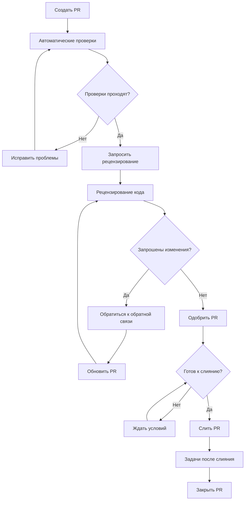
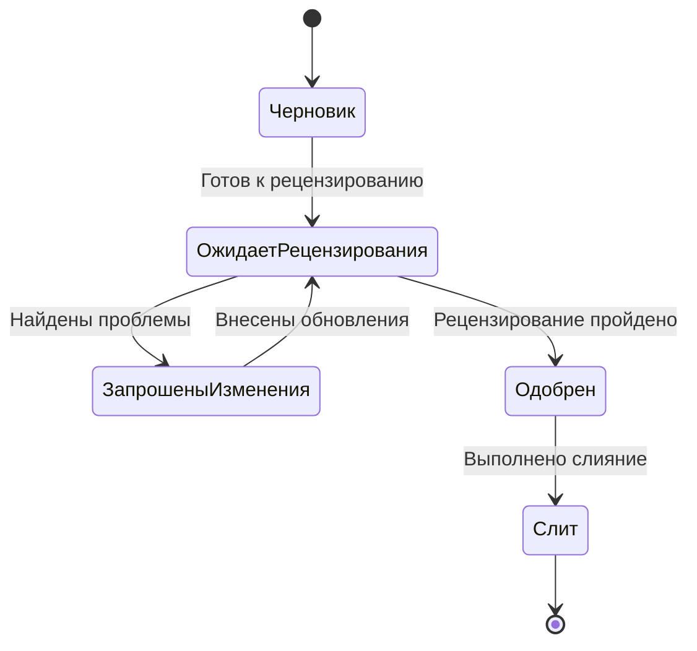

# Процесс Pull Request

## Обзор

Этот документ предоставляет подробные руководящие принципы для создания, рецензирования и управления pull requests в проекте CulicidaeLab. Следование этому процессу обеспечивает качество кода, поддерживает стандарты проекта и способствует эффективному сотрудничеству.

## Содержание

- [Жизненный цикл Pull Request](#жизненный-цикл-pull-request)
- [Создание Pull Requests](#создание-pull-requests)
- [Процесс рецензирования](#процесс-рецензирования)
- [Рабочий процесс одобрения](#рабочий-процесс-одобрения)
- [Стратегии слияния](#стратегии-слияния)
- [Процесс после слияния](#процесс-после-слияния)
- [Лучшие практики](#лучшие-практики)
- [Устранение неполадок](#устранение-неполадок)

## Жизненный цикл Pull Request

### Этапы жизненного цикла



### Описания этапов

1. **Черновик**: Работа в процессе, не готова к рецензированию
2. **Готов к рецензированию**: Завершен и готов к рецензированию командой
3. **В рецензировании**: Активно рецензируется членами команды
4. **Запрошены изменения**: Предоставлена обратная связь, ожидаются обновления
5. **Одобрен**: Одобрен необходимыми рецензентами
6. **Готов к слиянию**: Все условия для слияния выполнены
7. **Слит**: Успешно слит в целевую ветку
8. **Закрыт**: Жизненный цикл PR завершен

## Создание Pull Requests

### Чек-лист перед созданием

Перед созданием pull request убедитесь:

- [ ] Функция/исправление завершены и протестированы
- [ ] Код следует руководящим принципам стиля проекта
- [ ] Все тесты проходят локально
- [ ] Документация обновлена
- [ ] Сообщения коммитов следуют соглашениям
- [ ] Ветка актуальна с целевой веткой

### Шаги создания PR

#### 1. Подготовьте вашу ветку

```bash
# Убедитесь, что ветка актуальна
git checkout main
git pull origin main
git checkout feature/your-feature
git rebase main  # или git merge main

# Запустите финальные проверки
flutter analyze
flutter test
flutter format .
```

#### 2. Создайте Pull Request

1. **Перейдите в репозиторий**: Идите в репозиторий GitHub
2. **Compare & Pull Request**: Нажмите кнопку для вашей ветки
3. **Заполните шаблон PR**: Заполните все разделы тщательно
4. **Добавьте метки**: Примените соответствующие метки
5. **Назначьте рецензентов**: Добавьте соответствующих членов команды
6. **Свяжите задачи**: Ссылайтесь на связанные задачи

#### 3. Заполнение шаблона PR

**Обязательные разделы:**
- **Описание**: Четкое изложение изменений
- **Тип изменения**: Выберите соответствующую категорию
- **Тестирование**: Опишите выполненное тестирование
- **Документация**: Перечислите обновления документации
- **Критические изменения**: Отметьте любые критические изменения
- **Скриншоты**: Включите для изменений UI

### Руководящие принципы заголовка PR

Следуйте формату conventional commit:

```
type(scope): description

Примеры:
feat(gallery): add species filtering functionality
fix(classification): resolve model loading timeout
docs(api): update classification service documentation
refactor(services): improve error handling consistency
```

### Лучшие практики описания PR

#### Структура
1. **Краткое изложение**: Краткий обзор изменений
2. **Мотивация**: Почему изменение необходимо
3. **Реализация**: Как это было реализовано
4. **Тестирование**: Как это было протестировано
5. **Влияние**: Какие области затронуты

#### Пример описания
```markdown
## Краткое изложение
Добавляет функциональность фильтрации видов в галерею комаров, позволяя пользователям фильтровать по семейству, роду и уровню опасности.

## Мотивация
Пользователи запросили возможность быстро находить конкретные типы комаров без прокрутки всей галереи. Это улучшает пользовательский опыт и делает приложение более полезным для образовательных целей.

## Реализация
- Добавлен FilterWidget с выпадающими селекторами
- Реализована логика фильтрации в MosquitoGalleryViewModel
- Добавлено управление состоянием фильтра с Provider
- Обновлен UI галереи для показа активных фильтров

## Тестирование
- Модульные тесты для логики фильтрации
- Тесты виджетов для FilterWidget
- Ручное тестирование на Android и iOS
- Протестировано с различными комбинациями фильтров

## Влияние
- Затрагивает экран галереи комаров
- Нет критических изменений
- Улучшает производительность за счет уменьшения отрендеренных элементов
```

## Процесс рецензирования

### Назначение рецензирования

#### Автоматическое назначение
- **CODEOWNERS**: Автоматически назначает владельцев кода
- **Назначение команды**: По кругу для членов команды
- **Эксперты области**: На основе измененных файлов

#### Ручное назначение
- **Сложные изменения**: Старшие разработчики
- **Изменения архитектуры**: Технические лидеры
- **Изменения безопасности**: Рецензенты, сфокусированные на безопасности
- **Изменения UI**: Специалисты UX/UI

### Типы рецензирования

#### 1. Рецензирование кода
**Области фокуса:**
- Качество и стиль кода
- Корректность логики
- Последствия для производительности
- Соображения безопасности
- Поддерживаемость

**Чек-лист рецензирования:**
- [ ] Код читаемый и хорошо структурированный
- [ ] Следует соглашениям проекта
- [ ] Нет очевидных ошибок или проблем
- [ ] Соответствующая обработка ошибок
- [ ] Нет уязвимостей безопасности

#### 2. Рецензирование дизайна
**Области фокуса:**
- Соответствие архитектуре
- Использование паттернов дизайна
- Дизайн API
- Изменения схемы базы данных
- Точки интеграции

**Чек-лист рецензирования:**
- [ ] Следует паттерну MVVM
- [ ] Правильное разделение ответственности
- [ ] Согласуется с существующей архитектурой
- [ ] Масштабируемый и поддерживаемый дизайн

#### 3. Рецензирование тестирования
**Области фокуса:**
- Покрытие тестами
- Качество тестов
- Поддерживаемость тестов
- Покрытие граничных случаев
- Тестирование производительности

**Чек-лист рецензирования:**
- [ ] Адекватное покрытие тестами
- [ ] Тесты осмысленные
- [ ] Граничные случаи покрыты
- [ ] Тесты поддерживаемые
- [ ] Включены тесты производительности (при необходимости)

### Руководящие принципы рецензирования

#### Для рецензентов

**Принципы рецензирования:**
1. **Будьте конструктивными**: Предоставляйте полезную, действенную обратную связь
2. **Будьте конкретными**: Указывайте на точные строки и объясняйте проблемы
3. **Будьте своевременными**: Завершайте рецензии в течение 24-48 часов
4. **Будьте тщательными**: Проверяйте функциональность, а не только стиль кода
5. **Будьте уважительными**: Поддерживайте профессиональный тон

**Процесс рецензирования:**
1. **Понимайте контекст**: Читайте описание PR и связанные задачи
2. **Проверяйте статус CI**: Убедитесь, что автоматические проверки проходят
3. **Рецензируйте код**: Изучайте изменения систематически
4. **Тестируйте функциональность**: Проверяйте, что изменения работают как ожидается
5. **Предоставляйте обратную связь**: Используйте функции рецензирования GitHub

**Типы обратной связи:**
- **Комментарий**: Общие наблюдения или вопросы
- **Предложение**: Конкретные улучшения кода
- **Запрос изменений**: Проблемы, которые должны быть решены
- **Одобрение**: Код соответствует стандартам и требованиям

#### Для авторов

**Ответ на рецензии:**
1. **Читайте внимательно**: Понимайте всю обратную связь
2. **Задавайте вопросы**: Уточняйте неясную обратную связь
3. **Обращайтесь ко всем пунктам**: Отвечайте на каждый комментарий
4. **Вносите изменения**: Реализуйте запрошенные улучшения
5. **Обновляйте тесты**: Убедитесь, что тесты отражают изменения
6. **Повторно запрашивайте рецензирование**: После обращения к обратной связи

**Руководящие принципы ответа:**
- **Будьте восприимчивыми**: Принимайте обратную связь позитивно
- **Будьте отзывчивыми**: Обращайтесь к обратной связи оперативно
- **Будьте тщательными**: Не оставляйте комментарии неразрешенными
- **Будьте коммуникативными**: Объясняйте ваше обоснование

### Критерии рецензирования

#### Критерии одобрения
- [ ] Качество кода соответствует стандартам
- [ ] Функциональность работает как ожидается
- [ ] Тесты адекватные и проходящие
- [ ] Документация обновлена
- [ ] Нет проблем безопасности
- [ ] Производительность приемлемая
- [ ] Следует соглашениям проекта

#### Критерии запроса изменений
- [ ] Проблемы качества кода
- [ ] Проблемы функциональности
- [ ] Недостаточное тестирование
- [ ] Уязвимости безопасности
- [ ] Проблемы производительности
- [ ] Отсутствующая документация
- [ ] Нарушения стиля

## Рабочий процесс одобрения

### Требования к одобрению

#### Стандартные PR
- **Минимум рецензентов**: 1 одобренное рецензирование
- **Одобрение владельца кода**: Требуется для защищенных областей
- **Проверки CI**: Все автоматические проверки должны пройти
- **Конфликты**: Конфликты слияния не разрешены

#### Критические PR
- **Минимум рецензентов**: 2 одобренных рецензирования
- **Одобрение старшего**: Как минимум один старший разработчик
- **Расширенное тестирование**: Требуется дополнительное тестирование
- **Документация**: Комплексные обновления документации

#### Hotfix PR
- **Быстрый трек**: Ускоренный процесс рецензирования
- **Минимум рецензентов**: 1 одобренное рецензирование (может быть после слияния)
- **Немедленное слияние**: Может сливаться с одним одобрением
- **Последующее**: Дополнительное рецензирование после слияния

### Процесс одобрения

#### 1. Первоначальное рецензирование
- Рецензент изучает код и предоставляет обратную связь
- Автор обращается к обратной связи и обновляет PR
- Процесс повторяется до удовлетворения рецензента

#### 2. Финальное одобрение
- Рецензент одобряет PR когда все критерии выполнены
- Статус PR изменяется на "Одобрен"
- PR становится подходящим для слияния

#### 3. Готовность к слиянию
- Получены все необходимые одобрения
- Все проверки CI проходят
- Нет конфликтов слияния
- Ветка актуальна

### Управление статусом рецензирования

#### Индикаторы статуса
- **🔴 Запрошены изменения**: Проблемы должны быть решены
- **🟡 Ожидает рецензирования**: Ожидает действия рецензента
- **🟢 Одобрен**: Готов к слиянию
- **⚪ Черновик**: Работа в процессе

#### Переходы статуса


## Стратегии слияния

### Опции слияния

#### 1. Merge Commit
**Когда использовать:**
- Feature ветки с несколькими коммитами
- Хотите сохранить историю ветки
- Сложные изменения, требующие контекста

**Преимущества:**
- Сохраняет полную историю
- Четкие границы функций
- Легко откатить всю функцию

**Недостатки:**
- Создает merge коммиты
- Более сложный граф истории

#### 2. Squash and Merge
**Когда использовать:**
- Несколько маленьких коммитов
- Хотите чистую линейную историю
- Одно логическое изменение

**Преимущества:**
- Чистая, линейная история
- Один коммит на функцию
- Легче читать историю

**Недостатки:**
- Теряет историю отдельных коммитов
- Сложнее отслеживать инкрементальные изменения

#### 3. Rebase and Merge
**Когда использовать:**
- Хорошо структурированная история коммитов
- Хотите сохранить отдельные коммиты
- Предпочитается линейная история

**Преимущества:**
- Линейная история
- Сохраняет отдельные коммиты
- Нет merge коммитов

**Недостатки:**
- Требует чистой истории коммитов
- Может сбивать с толку новичков

### Матрица решений слияния

| Сценарий | Рекомендуемая стратегия | Причина |
|----------|------------------------|---------|
| Один коммит | Rebase and Merge | Поддерживает чистую историю |
| Несколько чистых коммитов | Rebase and Merge | Сохраняет логическую прогрессию |
| Несколько грязных коммитов | Squash and Merge | Создает чистый единый коммит |
| Сложная функция | Merge Commit | Сохраняет контекст функции |
| Hotfix | Squash and Merge | Простое, чистое исправление |
| Документация | Squash and Merge | Обычно одно логическое изменение |

### Чек-лист перед слиянием

- [ ] Получены все необходимые одобрения
- [ ] Все проверки CI проходят
- [ ] Нет конфликтов слияния
- [ ] Ветка актуальна с целевой
- [ ] Описание PR полное
- [ ] Связанные задачи привязаны
- [ ] Критические изменения документированы
- [ ] Предоставлено руководство по миграции (при необходимости)

## Процесс после слияния

### Немедленные действия

#### 1. Очистка ветки
```bash
# Удалить feature ветку (обычно автоматически)
git branch -d feature/your-feature
git push origin --delete feature/your-feature
```

#### 2. Управление задачами
- Закрыть связанные задачи
- Обновить статус задачи
- Привязать к слитому PR
- Обновить доски проекта

#### 3. Обновления документации
- Обновить changelog
- Обновить номера версий (при необходимости)
- Опубликовать изменения документации
- Уведомить заинтересованные стороны

### Последующие задачи

#### 1. Мониторинг
- Следить за сбоями CI на main ветке
- Мониторить метрики приложения
- Проверять проблемы, сообщенные пользователями
- Проверять успех развертывания

#### 2. Коммуникация
- Уведомить команду о значительных изменениях
- Обновить статус проекта
- Сообщить заинтересованным сторонам
- Обновить заметки о релизе

#### 3. Очистка
- Архивировать связанные ветки
- Обновить локальные репозитории
- Очистить временные ресурсы
- Обновить среду разработки

## Лучшие практики

### Для авторов

#### Создание PR
1. **Держите PR маленькими**: Легче рецензировать и сливать
2. **Единая ответственность**: Одна функция/исправление на PR
3. **Четкое описание**: Объясните что, почему и как
4. **Включите тесты**: Обеспечьте адекватное покрытие тестами
5. **Обновите документацию**: Держите документы актуальными

#### Во время рецензирования
1. **Отвечайте оперативно**: Обращайтесь к обратной связи быстро
2. **Будьте открытыми**: Принимайте конструктивную критику
3. **Задавайте вопросы**: Уточняйте неясную обратную связь
4. **Тестируйте изменения**: Проверяйте, что исправления работают правильно
5. **Обновляйте тщательно**: Обращайтесь ко всем пунктам обратной связи

### Для рецензентов

#### Качество рецензирования
1. **Будьте тщательными**: Проверяйте функциональность, а не только стиль
2. **Будьте конструктивными**: Предоставляйте полезные предложения
3. **Будьте своевременными**: Завершайте рецензии оперативно
4. **Будьте конкретными**: Указывайте на точные проблемы
5. **Будьте уважительными**: Поддерживайте профессиональный тон

#### Процесс рецензирования
1. **Понимайте контекст**: Полностью читайте описание PR
2. **Проверяйте CI**: Убедитесь, что автоматические проверки проходят
3. **Тестируйте локально**: Проверяйте, что изменения работают
4. **Рассматривайте влияние**: Думайте о более широких последствиях
5. **Предоставляйте примеры**: Показывайте лучшие альтернативы

### Общие руководящие принципы

#### Коммуникация
- Используйте четкий, профессиональный язык
- Объясняйте обоснование предложений
- Задавайте вопросы при неуверенности
- Признавайте хорошую работу
- Будьте терпеливыми с процессом обучения

#### Стандарты качества
- Поддерживайте постоянный стиль кода
- Обеспечивайте адекватное покрытие тестами
- Проверяйте точность документации
- Проверяйте проблемы безопасности
- Рассматривайте влияние на производительность

## Устранение неполадок

### Распространенные проблемы

#### 1. Конфликты слияния
**Проблема**: Ветка конфликтует с целевой веткой
**Решение:**
```bash
git checkout feature/your-feature
git rebase main
# Разрешить конфликты
git add .
git rebase --continue
git push --force-with-lease
```

#### 2. Неудачные проверки CI
**Проблема**: Автоматические проверки не проходят
**Решение:**
- Проверьте логи CI на конкретные ошибки
- Исправьте проблемы локально
- Запустите тесты перед push
- Убедитесь, что код следует руководящим принципам стиля

#### 3. Задержки рецензирования
**Проблема**: PR не рецензируются оперативно
**Решение:**
- Пингуйте рецензентов через 48 часов
- Запрашивайте конкретных рецензентов
- Разбивайте большие PR на меньшие
- Предоставляйте четкий контекст в описании

#### 4. Проблемы одобрения
**Проблема**: Не можете получить необходимые одобрения
**Решение:**
- Тщательно обращайтесь ко всей обратной связи
- Объясняйте обоснование решений
- Запрашивайте уточнение требований
- Эскалируйте к лидеру команды при необходимости

### Процедуры экстренных случаев

#### Процесс Hotfix
1. **Создать ветку Hotfix**: Из main ветки
2. **Внести минимальные изменения**: Только исправить критическую проблему
3. **Быстрое рецензирование**: Одобрение одного рецензента
4. **Немедленное слияние**: Слить как только одобрено
5. **Последующее рецензирование**: Дополнительное рецензирование после слияния

#### Процесс отката
1. **Определить проблему**: Подтвердить проблему с недавним слиянием
2. **Создать Revert PR**: Использовать функцию revert GitHub
3. **Быстрое рецензирование**: Ускоренный процесс одобрения
4. **Немедленное слияние**: Восстановить предыдущее состояние
5. **Анализ первопричины**: Исследовать и предотвратить повторение

## Заключение

Следование этому процессу pull request обеспечивает высокое качество кода, эффективное сотрудничество и плавную разработку проекта. Все члены команды должны ознакомиться с этими руководящими принципами и применять их последовательно.

По вопросам о процессе PR или предложениям по улучшениям, пожалуйста, создайте задачу или начните обсуждение в репозитории проекта.

---

**Помните**: Цель — поддерживать качество кода, обеспечивая эффективную разработку. Процесс должен способствовать сотрудничеству, а не препятствовать ему.