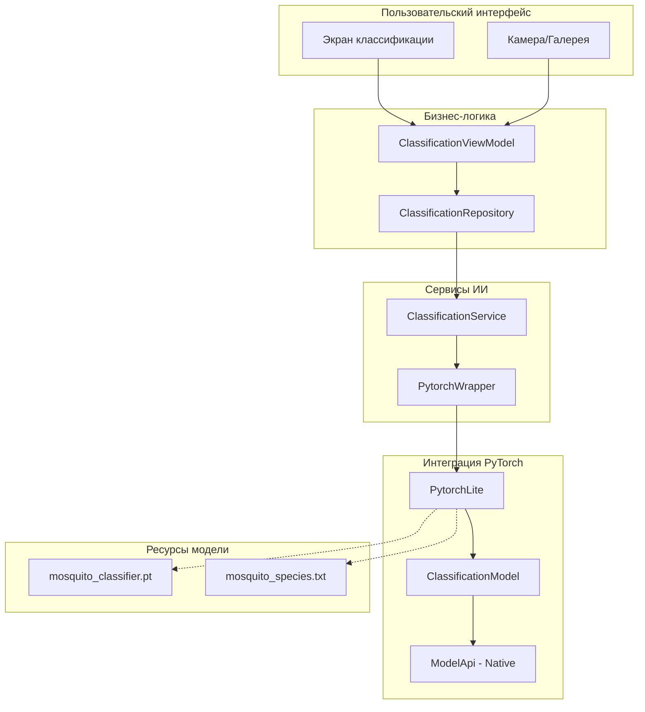
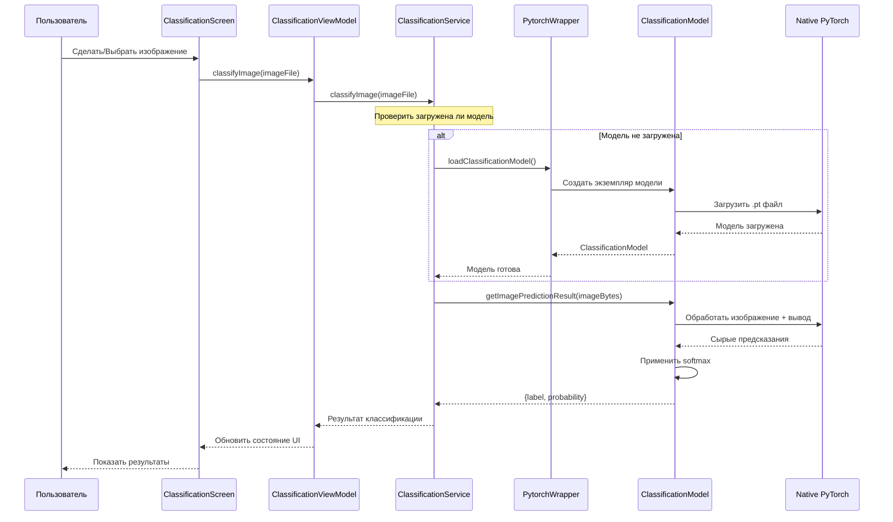

# Руководство по интеграции модели ИИ

## Обзор

CulicidaeLab интегрирует модели PyTorch Lite для классификации видов комаров на устройстве. Это руководство охватывает полный конвейер ИИ, от загрузки модели до вывода, включая детали архитектуры, соображения производительности и устранение неполадок.

## Обзор архитектуры

### Компоненты конвейера ИИ



### Поток данных



## Компоненты интеграции модели

### 1. PytorchWrapper

Класс `PytorchWrapper` предоставляет тестируемый интерфейс для операций PyTorch Lite:

```dart
class PytorchWrapper {
  /// Загружает модель классификации из ресурсов
  Future<ClassificationModel> loadClassificationModel(
    String pathImageModel,
    int imageWidth,
    int imageHeight, {
    String? labelPath,
  }) {
    return PytorchLite.loadClassificationModel(
      pathImageModel,
      imageWidth,
      imageHeight,
      labelPath: labelPath,
    );
  }
}
```

**Ключевые особенности:**
- **Тестируемость**: Позволяет мокирование для модульных тестов
- **Внедрение зависимостей**: Поддерживает паттерн service locator
- **Будущая расширяемость**: Предоставляет хуки для логирования и кэширования

### 2. ClassificationService

Основной сервис, оркестрирующий операции ИИ:

```dart
class ClassificationService {
  final PytorchWrapper _pytorchWrapper;
  ClassificationModel? _model;
  
  /// Загрузить модель классификации комаров
  Future<void> loadModel() async {
    String pathImageModel = "assets/models/mosquito_classifier.pt";
    try {
      _model = await _pytorchWrapper.loadClassificationModel(
        pathImageModel, 224, 224,
        labelPath: "assets/labels/mosquito_species.txt"
      );
    } on PlatformException {
      throw Exception("Загрузка модели не удалась - поддерживается только для Android/iOS");
    }
  }
  
  /// Классифицировать изображение комара
  Future<Map<String, dynamic>> classifyImage(File imageFile) async {
    if (_model == null) {
      throw Exception("Модель не загружена - сначала вызовите loadModel()");
    }
    
    final imageBytes = await imageFile.readAsBytes();
    final result = await _model!.getImagePredictionResult(imageBytes);
    
    return {
      'scientificName': result['label'].trim(),
      'confidence': result['probability'],
    };
  }
}
```

**Ответственности:**
- Управление жизненным циклом модели
- Координация предобработки изображений
- Обработка ошибок и валидация
- Мониторинг производительности

### 3. ClassificationModel

Обертка модели PyTorch Lite, предоставляющая возможности вывода:

```dart
class ClassificationModel {
  final int _index;
  final List<String> labels;
  
  /// Получить предсказание с оценкой достоверности
  Future<Map<String, dynamic>> getImagePredictionResult(
    Uint8List imageAsBytes, {
    List<double> mean = TORCHVISION_NORM_MEAN_RGB,
    List<double> std = TORCHVISION_NORM_STD_RGB,
  }) async {
    final List<double?> prediction = await ModelApi()
        .getImagePredictionList(_index, imageAsBytes, null, null, null, mean, std);
    
    // Найти максимальное предсказание
    int maxScoreIndex = 0;
    for (int i = 1; i < prediction.length; i++) {
      if (prediction[i]! > prediction[maxScoreIndex]!) {
        maxScoreIndex = i;
      }
    }
    
    // Применить softmax
    double sumExp = 0.0;
    for (var element in prediction) {
      sumExp += math.exp(element!);
    }
    
    final probabilities = prediction
        .map((element) => math.exp(element!) / sumExp)
        .toList();
    
    return {
      "label": labels[maxScoreIndex],
      "probability": probabilities[maxScoreIndex]
    };
  }
}
```

## Конфигурация модели

### Спецификации модели

#### Детали текущей модели
- **Файл**: `assets/models/mosquito_classifier.pt`
- **Размер входа**: 224x224 пикселей
- **Цветовое пространство**: RGB
- **Нормализация**: Стандарт ImageNet (mean: [0.485, 0.456, 0.406], std: [0.229, 0.224, 0.225])
- **Выход**: Вероятности softmax для классов видов комаров

#### Конфигурация меток
- **Файл**: `assets/labels/mosquito_species.txt`
- **Формат**: Одно название вида на строку
- **Пример**:
  ```
  Aedes aegypti
  Aedes albopictus
  Anopheles gambiae
  Culex pipiens
  ```

### Организация ресурсов

```
assets/
├── models/
│   └── mosquito_classifier.pt      # Файл модели PyTorch Lite
└── labels/
    └── mosquito_species.txt        # Сопоставления меток видов
```

## Конвейер обработки изображений

### 1. Обработка входных изображений

```dart
// Из камеры или галереи
final imageFile = File('/path/to/image.jpg');
final imageBytes = await imageFile.readAsBytes();
```

**Поддерживаемые форматы:**
- JPEG (.jpg, .jpeg)
- PNG (.png)
- BMP (.bmp)
- WebP (.webp)

### 2. Предобработка

Плагин PyTorch Lite обрабатывает:
- **Изменение размера**: Автоматическое изменение размера до 224x224 пикселей
- **Нормализация**: Нормализация ImageNet mean/std
- **Цветовое пространство**: Преобразование RGB при необходимости
- **Преобразование тензора**: Преобразование в формат входа модели

### 3. Вывод модели

```dart
// Нативный вывод через ModelApi
final List<double?> rawPrediction = await ModelApi()
    .getImagePredictionList(modelIndex, imageBytes, ...);
```

### 4. Постобработка

```dart
// Применить softmax для получения вероятностей
double sumExp = 0.0;
for (var logit in rawPrediction) {
  sumExp += math.exp(logit!);
}

final probabilities = rawPrediction
    .map((logit) => math.exp(logit!) / sumExp)
    .toList();

// Получить лучшее предсказание
int maxIndex = probabilities.indexOf(probabilities.reduce(math.max));
String species = labels[maxIndex];
double confidence = probabilities[maxIndex];
```

## Оптимизация производительности

### Оптимизация загрузки модели

```dart
class ClassificationService {
  static ClassificationService? _instance;
  ClassificationModel? _model;
  
  // Паттерн Singleton для переиспользования модели
  static ClassificationService get instance {
    _instance ??= ClassificationService(pytorchWrapper: PytorchWrapper());
    return _instance!;
  }
  
  // Загрузить модель один раз и кэшировать
  Future<void> ensureModelLoaded() async {
    if (_model == null) {
      await loadModel();
    }
  }
}
```

### Управление памятью

```dart
// Быстро освобождать большие данные изображений
Future<Map<String, dynamic>> classifyImage(File imageFile) async {
  Uint8List? imageBytes;
  try {
    imageBytes = await imageFile.readAsBytes();
    final result = await _model!.getImagePredictionResult(imageBytes);
    return result;
  } finally {
    imageBytes = null; // Помочь GC
  }
}
```

### Оптимизация вывода

- **Пакетная обработка**: Используйте пакетные методы для нескольких изображений
- **Размер изображения**: Оптимизируйте размер входного изображения перед обработкой
- **Кэширование модели**: Держите модель загруженной в памяти между предсказаниями
- **Фоновая обработка**: Запускайте вывод на фоновых изолятах для тяжелых нагрузок

## Обработка ошибок

### Распространенные сценарии ошибок

#### 1. Поддержка платформы
```dart
try {
  await classificationService.loadModel();
} on PlatformException catch (e) {
  // Обработать неподдерживаемую платформу (Web, Desktop)
  throw ClassificationException(
    'Классификация ИИ не поддерживается на этой платформе',
    code: 'PLATFORM_UNSUPPORTED'
  );
}
```

#### 2. Сбои загрузки модели
```dart
try {
  _model = await _pytorchWrapper.loadClassificationModel(...);
} catch (e) {
  if (e.toString().contains('file not found')) {
    throw ClassificationException(
      'Файл модели не найден в ресурсах',
      code: 'MODEL_NOT_FOUND'
    );
  } else if (e.toString().contains('memory')) {
    throw ClassificationException(
      'Недостаточно памяти для загрузки модели',
      code: 'INSUFFICIENT_MEMORY'
    );
  }
  rethrow;
}
```

#### 3. Ошибки вывода
```dart
Future<Map<String, dynamic>> classifyImage(File imageFile) async {
  try {
    if (!imageFile.existsSync()) {
      throw ClassificationException('Файл изображения не найден');
    }
    
    final imageBytes = await imageFile.readAsBytes();
    if (imageBytes.isEmpty) {
      throw ClassificationException('Пустой файл изображения');
    }
    
    return await _model!.getImagePredictionResult(imageBytes);
  } catch (e) {
    if (e is ClassificationException) rethrow;
    throw ClassificationException('Классификация не удалась: $e');
  }
}
```

### Стратегии восстановления после ошибок

```dart
class ClassificationService {
  int _retryCount = 0;
  static const int maxRetries = 3;
  
  Future<Map<String, dynamic>> classifyImageWithRetry(File imageFile) async {
    for (int attempt = 0; attempt <= maxRetries; attempt++) {
      try {
        return await classifyImage(imageFile);
      } catch (e) {
        if (attempt == maxRetries) rethrow;
        
        // Экспоненциальная задержка
        await Future.delayed(Duration(milliseconds: 100 * (1 << attempt)));
        
        // Перезагрузить модель при необходимости
        if (e.toString().contains('model')) {
          _model = null;
          await loadModel();
        }
      }
    }
    throw ClassificationException('Превышено максимальное количество попыток');
  }
}
```

## Тестирование интеграции ИИ

### Модульное тестирование с моками

```dart
class MockPytorchWrapper extends Mock implements PytorchWrapper {}
class MockClassificationModel extends Mock implements ClassificationModel {}

void main() {
  group('ClassificationService', () {
    late ClassificationService service;
    late MockPytorchWrapper mockWrapper;
    late MockClassificationModel mockModel;
    
    setUp(() {
      mockWrapper = MockPytorchWrapper();
      mockModel = MockClassificationModel();
      service = ClassificationService(pytorchWrapper: mockWrapper);
    });
    
    test('должен успешно загрузить модель', () async {
      // Arrange
      when(mockWrapper.loadClassificationModel(any, any, any, labelPath: any))
          .thenAnswer((_) async => mockModel);
      
      // Act
      await service.loadModel();
      
      // Assert
      expect(service.isModelLoaded, isTrue);
      verify(mockWrapper.loadClassificationModel(
        'assets/models/mosquito_classifier.pt',
        224,
        224,
        labelPath: 'assets/labels/mosquito_species.txt',
      )).called(1);
    });
    
    test('должен классифицировать изображение и вернуть результат', () async {
      // Arrange
      when(mockWrapper.loadClassificationModel(any, any, any, labelPath: any))
          .thenAnswer((_) async => mockModel);
      when(mockModel.getImagePredictionResult(any))
          .thenAnswer((_) async => {
            'label': 'Aedes aegypti',
            'probability': 0.85
          });
      
      await service.loadModel();
      final imageFile = File('test_image.jpg');
      
      // Act
      final result = await service.classifyImage(imageFile);
      
      // Assert
      expect(result['scientificName'], equals('Aedes aegypti'));
      expect(result['confidence'], equals(0.85));
    });
  });
}
```

### Интеграционное тестирование

```dart
void main() {
  group('Интеграционные тесты модели ИИ', () {
    late ClassificationService service;
    
    setUpAll(() async {
      service = ClassificationService(pytorchWrapper: PytorchWrapper());
      await service.loadModel();
    });
    
    testWidgets('должен классифицировать реальное изображение комара', (tester) async {
      // Загрузить тестовое изображение из ресурсов
      final ByteData imageData = await rootBundle.load('test_assets/aedes_aegypti.jpg');
      final File tempFile = File('${Directory.systemTemp.path}/test_image.jpg');
      await tempFile.writeAsBytes(imageData.buffer.asUint8List());
      
      // Классифицировать изображение
      final result = await service.classifyImage(tempFile);
      
      // Проверить результаты
      expect(result['scientificName'], isA<String>());
      expect(result['confidence'], isA<double>());
      expect(result['confidence'], greaterThan(0.0));
      expect(result['confidence'], lessThanOrEqualTo(1.0));
      
      // Очистка
      await tempFile.delete();
    });
  });
}
```

## Развертывание и обновления модели

### Версионирование модели

```dart
class ModelConfig {
  static const String currentVersion = 'v1.2.0';
  static const String modelPath = 'assets/models/mosquito_classifier_v1_2_0.pt';
  static const String labelsPath = 'assets/labels/mosquito_species_v1_2_0.txt';
  
  // Метаданные модели
  static const Map<String, dynamic> modelInfo = {
    'version': currentVersion,
    'inputSize': [224, 224],
    'numClasses': 12,
    'accuracy': 0.94,
    'trainedOn': '2024-01-15',
  };
}
```

### Динамическая загрузка модели

```dart
class ModelManager {
  static Future<String> getModelPath() async {
    // Проверить обновленную модель в директории документов
    final documentsDir = await getApplicationDocumentsDirectory();
    final updatedModelPath = '${documentsDir.path}/models/latest_model.pt';
    
    if (await File(updatedModelPath).exists()) {
      return updatedModelPath;
    }
    
    // Откат к встроенной модели
    return ModelConfig.modelPath;
  }
  
  static Future<void> downloadModelUpdate(String downloadUrl) async {
    // Реализация для загрузки обновлений модели
    // Включить проверку контрольной суммы и атомарную замену
  }
}
```

## Мониторинг производительности

### Метрики вывода

```dart
class ClassificationMetrics {
  static final Stopwatch _inferenceTimer = Stopwatch();
  static final List<Duration> _inferenceTimes = [];
  
  static void startInference() {
    _inferenceTimer.reset();
    _inferenceTimer.start();
  }
  
  static void endInference() {
    _inferenceTimer.stop();
    _inferenceTimes.add(_inferenceTimer.elapsed);
    
    // Держать только последние 100 измерений
    if (_inferenceTimes.length > 100) {
      _inferenceTimes.removeAt(0);
    }
  }
  
  static Duration get averageInferenceTime {
    if (_inferenceTimes.isEmpty) return Duration.zero;
    
    final totalMs = _inferenceTimes
        .map((d) => d.inMilliseconds)
        .reduce((a, b) => a + b);
    
    return Duration(milliseconds: totalMs ~/ _inferenceTimes.length);
  }
}
```

### Отслеживание использования памяти

```dart
class MemoryMonitor {
  static Future<void> logMemoryUsage(String operation) async {
    final info = await DeviceInfoPlugin().androidInfo;
    // Логировать использование памяти для анализа производительности
    print('Использование памяти во время $operation: ${info.totalMemory}');
  }
}
```

## Руководство по устранению неполадок

### Распространенные проблемы

#### 1. Сбой загрузки модели
**Симптомы**: Исключение во время `loadModel()`
**Причины**:
- Отсутствующий файл модели в ресурсах
- Поврежденный файл модели
- Недостаточно памяти
- Неподдерживаемая платформа

**Решения**:
```dart
// Проверить существование ресурса
final ByteData modelData = await rootBundle.load('assets/models/mosquito_classifier.pt');
print('Размер модели: ${modelData.lengthInBytes} байт');

// Проверить доступную память
final info = await DeviceInfoPlugin().androidInfo;
print('Доступная память: ${info.totalMemory}');
```

#### 2. Плохая точность классификации
**Симптомы**: Низкие оценки достоверности или неправильные предсказания
**Причины**:
- Плохое качество изображения
- Неправильная предобработка
- Несоответствие модели и данных

**Решения**:
```dart
// Валидировать качество изображения
Future<bool> validateImageQuality(File imageFile) async {
  final image = img.decodeImage(await imageFile.readAsBytes());
  if (image == null) return false;
  
  // Проверить минимальное разрешение
  if (image.width < 224 || image.height < 224) return false;
  
  // Проверить размытость (упрощенно)
  // Реализовать алгоритм обнаружения размытости
  
  return true;
}
```

#### 3. Медленная производительность вывода
**Симптомы**: Долгое время классификации
**Причины**:
- Большие входные изображения
- Нехватка памяти
- Троттлинг CPU

**Решения**:
```dart
// Оптимизировать размер изображения
Future<File> optimizeImageForInference(File originalImage) async {
  final image = img.decodeImage(await originalImage.readAsBytes());
  if (image == null) throw Exception('Неверное изображение');
  
  // Изменить размер если слишком большое
  final resized = img.copyResize(image, width: 512, height: 512);
  
  // Сжать
  final compressed = img.encodeJpg(resized, quality: 85);
  
  final optimizedFile = File('${originalImage.path}_optimized.jpg');
  await optimizedFile.writeAsBytes(compressed);
  
  return optimizedFile;
}
```

### Функции режима отладки

```dart
class ClassificationService {
  static const bool debugMode = kDebugMode;
  
  Future<Map<String, dynamic>> classifyImage(File imageFile) async {
    if (debugMode) {
      print('Классификация изображения: ${imageFile.path}');
      print('Размер изображения: ${await imageFile.length()} байт');
    }
    
    final stopwatch = Stopwatch()..start();
    final result = await _performClassification(imageFile);
    stopwatch.stop();
    
    if (debugMode) {
      print('Классификация заняла: ${stopwatch.elapsedMilliseconds}мс');
      print('Результат: ${result['scientificName']} (${result['confidence']})');
    }
    
    return result;
  }
}
```

## Будущие улучшения

### Запланированные улучшения

1. **Квантизация модели**: Уменьшить размер модели и улучшить скорость вывода
2. **Поддержка нескольких моделей**: Поддержка различных архитектур моделей
3. **Интеграция Edge TPU**: Аппаратное ускорение на поддерживаемых устройствах
4. **Федеративное обучение**: Вклад в улучшение модели с сохранением конфиденциальности
5. **Классификация в реальном времени**: Возможности классификации видеопотока

### Точки расширения

```dart
abstract class ClassificationProvider {
  Future<ClassificationResult> classify(File imageFile);
  bool get isAvailable;
  String get providerName;
}

class PyTorchClassificationProvider implements ClassificationProvider {
  // Текущая реализация
}

class TensorFlowLiteProvider implements ClassificationProvider {
  // Альтернативная реализация
}

class CloudMLProvider implements ClassificationProvider {
  // Облачная классификация
}
```

## Заключение

Интеграция модели ИИ в CulicidaeLab обеспечивает надежную классификацию видов комаров на устройстве через PyTorch Lite. Архитектура поддерживает тестирование, мониторинг производительности и будущие улучшения, сохраняя надежность и качество пользовательского опыта.

Ключевые преимущества:
- **Конфиденциальность**: Обработка на устройстве сохраняет пользовательские данные локально
- **Производительность**: Оптимизировано для мобильного вывода
- **Надежность**: Комплексная обработка ошибок и восстановление
- **Поддерживаемость**: Чистая архитектура с внедрением зависимостей
- **Тестируемость**: Мокируемые интерфейсы для комплексного тестирования

Для дополнительной поддержки или вопросов об интеграции модели ИИ обращайтесь к документации PyTorch Mobile или создайте задачу в репозитории проекта.