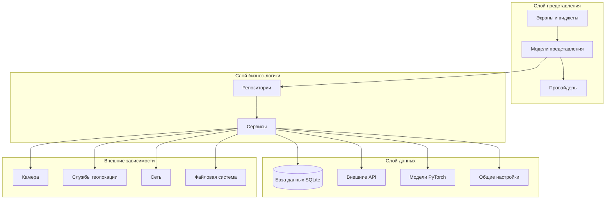
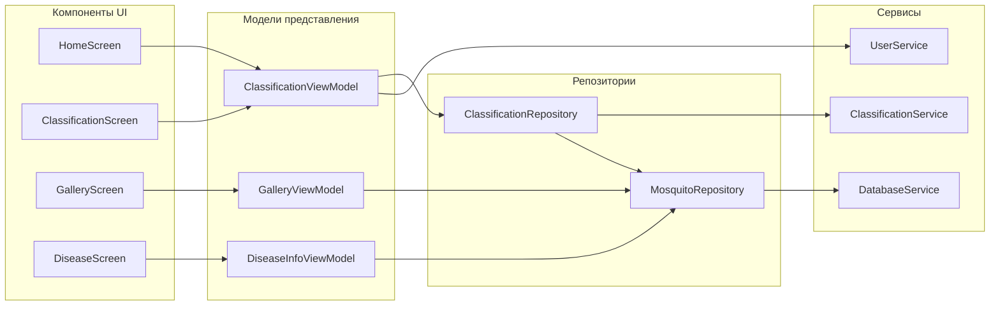
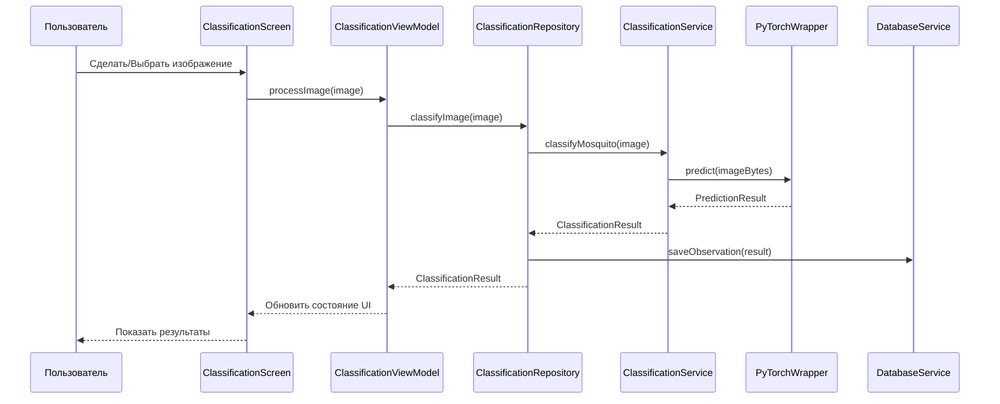
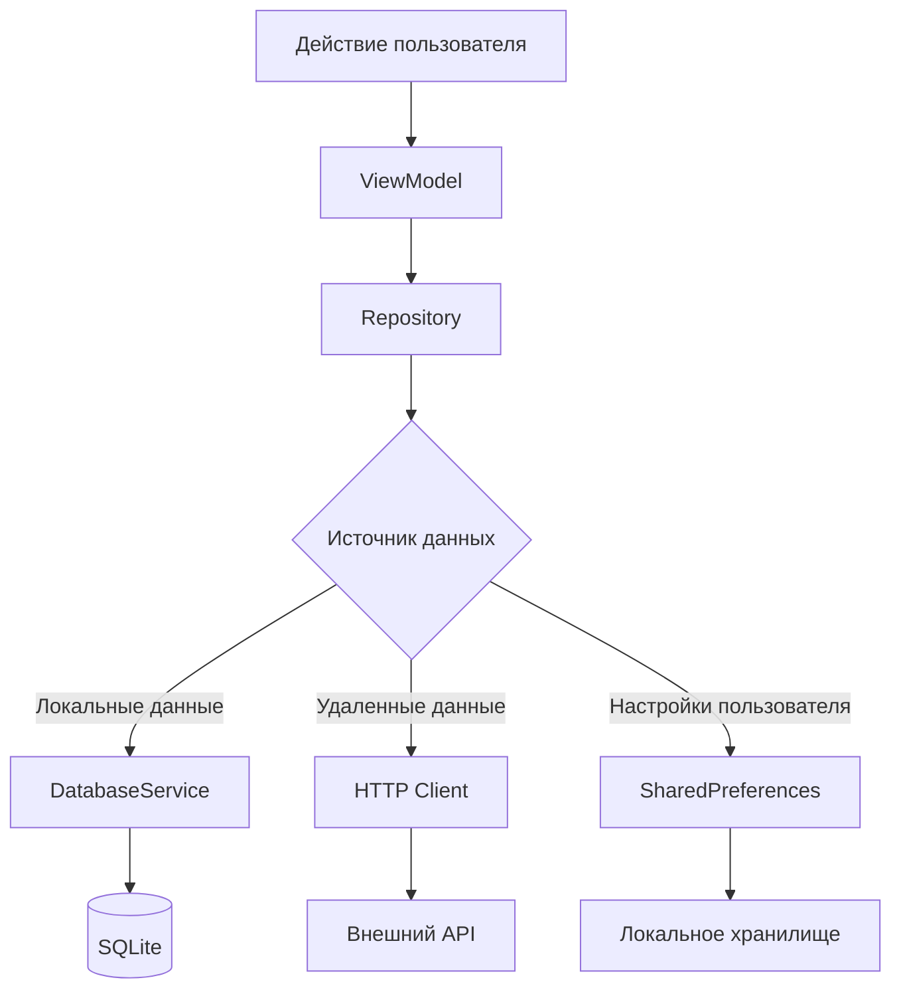
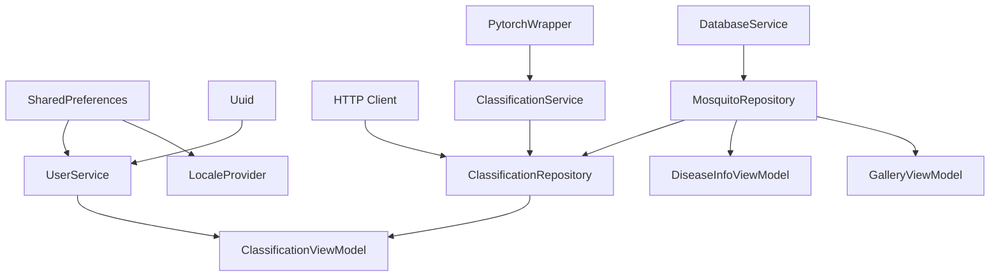
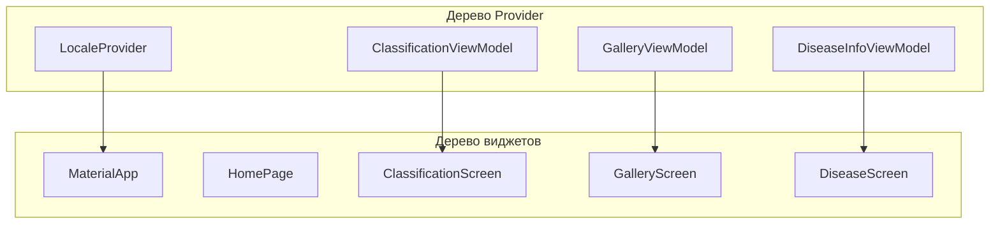
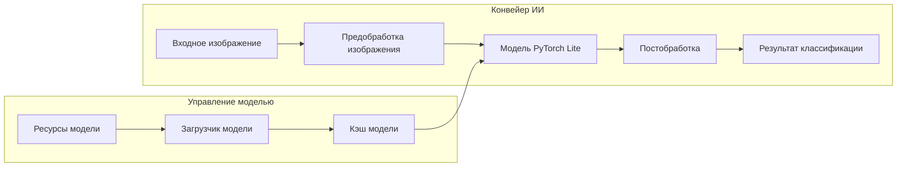
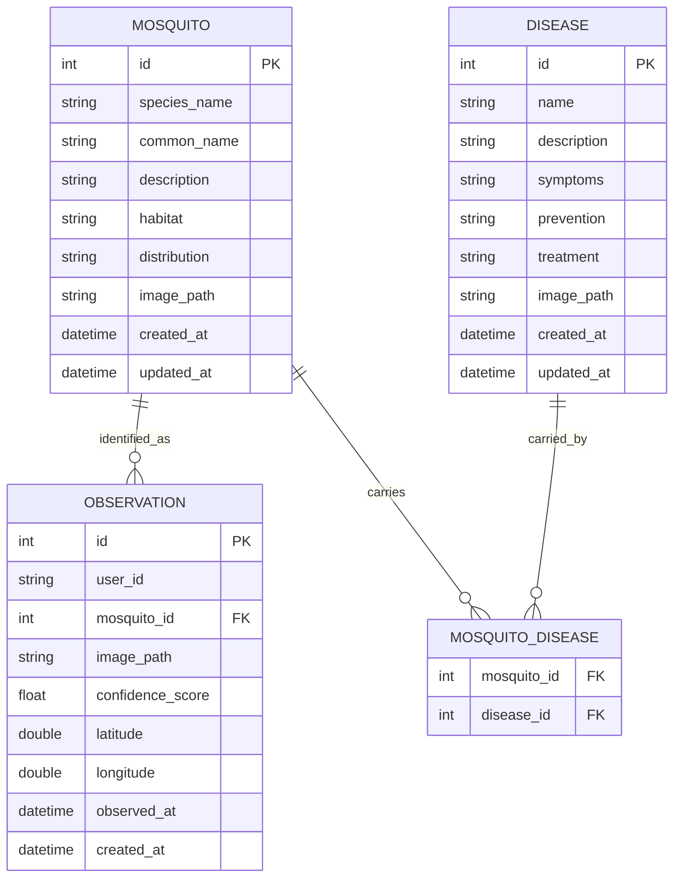
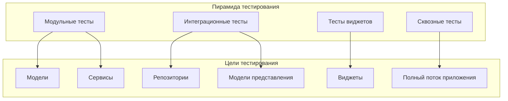

# Обзор архитектуры CulicidaeLab

## Введение

CulicidaeLab — это мобильное приложение Flutter, предназначенное для идентификации видов комаров и распространения информации о заболеваниях. Приложение использует классификацию изображений на основе ИИ с использованием моделей PyTorch Lite для идентификации видов комаров по фотографиям, сделанным пользователями, и предоставляет комплексную информацию о заболеваниях, переносимых комарами.

## Высокоуровневая архитектура

Приложение следует паттерну слоистой архитектуры с четким разделением ответственности:

## Реализация паттерна MVVM

CulicidaeLab реализует архитектурный паттерн Model-View-ViewModel (MVVM) с Provider для управления состоянием:

### Слой представления
- **Экраны**: Основные компоненты UI, представляющие различные страницы приложения
- **Виджеты**: Переиспользуемые компоненты UI и пользовательские виджеты
- **Навигация**: Управление маршрутами и переходами между экранами

### Слой модели представления
- **ClassificationViewModel**: Управляет рабочим процессом классификации комаров
- **DiseaseInfoViewModel**: Обрабатывает отображение информации о заболеваниях
- **MosquitoGalleryViewModel**: Контролирует функциональность просмотра галереи

### Слой модели
- **Модели данных**: Представляют основные сущности (Mosquito, Disease, Observation)
- **Репозитории**: Абстрагируют доступ к данным и бизнес-логику
- **Сервисы**: Обрабатывают специфическую функциональность (ИИ, База данных, Сеть)

## Отношения компонентов

### Основные компоненты

## Архитектура потока данных

### Рабочий процесс классификации

### Поток сохранения данных

## Внедрение зависимостей

Приложение использует GetIt для внедрения зависимостей, настроенного в `lib/locator.dart`:

### Порядок регистрации сервисов

1. **Внешние пакеты**: SharedPreferences, HTTP Client, UUID
2. **Основные сервисы**: Database, PyTorch, User, Classification
3. **Репозитории**: Слой доступа к данным
4. **Модели представления**: Слой бизнес-логики
5. **Провайдеры**: Управление состоянием

### Граф зависимостей

## Управление состоянием с Provider

### Архитектура Provider

### Паттерн потока состояния

1. **Взаимодействие пользователя**: Пользователь выполняет действие в UI
2. **Обновление ViewModel**: ViewModel обрабатывает действие и обновляет состояние
3. **Уведомление Provider**: ViewModel уведомляет слушателей через ChangeNotifier
4. **Перестроение UI**: Consumer виджеты перестраиваются с новым состоянием
5. **Взаимодействие с Repository**: ViewModel вызывает методы репозитория для операций с данными

## Интеграция модели ИИ

### Интеграция PyTorch Lite

### Архитектура сервиса классификации

- **Предобработка изображений**: Изменение размера, нормализация и форматирование изображений для входа модели
- **Вывод модели**: Выполнение предсказания модели PyTorch Lite
- **Обработка результатов**: Парсинг выхода модели и сопоставление с видами комаров
- **Оценка достоверности**: Оценка достоверности предсказания и обработка результатов с низкой достоверностью

## Архитектура базы данных

### Схема SQLite

### Паттерн доступа к данным

- **Паттерн Repository**: Абстрагирование доступа к данным через интерфейсы репозиториев
- **Сервисный слой**: Бизнес-логика отделена от доступа к данным
- **Классы моделей**: Строго типизированные модели данных с валидацией
- **Поддержка миграций**: Версионирование схемы базы данных и обработка миграций

## Архитектура безопасности

### Защита данных

- **Локальное хранилище**: База данных SQLite с шифрованием чувствительных данных
- **Конфиденциальность пользователя**: Анонимная идентификация пользователя с UUID
- **Безопасность изображений**: Локальное хранение изображений с безопасными путями к файлам
- **Сетевая безопасность**: HTTPS для всех внешних API коммуникаций

### Управление разрешениями

- **Доступ к камере**: Требуется для функциональности захвата изображений
- **Службы геолокации**: Опционально для геотегирования наблюдений
- **Доступ к хранилищу**: Требуется для обработки и кэширования изображений
- **Доступ к сети**: Требуется для интеграции внешних API

## Соображения производительности

### Управление памятью

- **Обработка изображений**: Эффективная загрузка и освобождение изображений
- **Кэширование модели**: Модель PyTorch загружается один раз и кэшируется
- **Соединения с базой данных**: Пулинг соединений и правильное освобождение
- **Жизненный цикл виджетов**: Правильное освобождение контроллеров и слушателей

### Стратегии оптимизации

- **Ленивая загрузка**: Сервисы и модели загружаются по требованию
- **Кэширование изображений**: Кэшированные сетевые изображения для офлайн доступа
- **Индексирование базы данных**: Оптимизированные запросы с правильным индексированием
- **Фоновая обработка**: Тяжелые операции перенесены в фоновые потоки

## Архитектура тестирования

### Слои тестирования

### Стратегия тестирования

- **Модульные тесты**: Тестирование отдельных компонентов в изоляции
- **Интеграционные тесты**: Тестирование взаимодействий компонентов и потока данных
- **Тесты виджетов**: Тестирование компонентов UI и взаимодействий пользователя
- **Сквозные тесты**: Тестирование полных пользовательских рабочих процессов

## Архитектура развертывания

### Конфигурация сборки

- **Разработка**: Отладочные сборки с инструментами разработки
- **Промежуточная**: Релизные сборки с промежуточными API эндпоинтами
- **Продакшн**: Оптимизированные релизные сборки с продакшн конфигурацией

### Платформо-специфические соображения

- **Android**: Конфигурация сборки Gradle и разрешения
- **iOS**: Настройки проекта Xcode и конфигурация Info.plist
- **Управление ресурсами**: Платформо-специфическая оптимизация ресурсов

## Точки расширения

### Области кастомизации

- **Новые модели классификации**: Архитектура плагинов для дополнительных моделей ИИ
- **Источники данных**: Расширяемый паттерн репозитория для новых источников данных
- **Темы UI**: Настраиваемая система тем
- **Локализация**: Поддержка дополнительных языков и регионов

### Возможности интеграции

- **Внешние API**: Фреймворк интеграции RESTful API
- **Сторонние сервисы**: Система плагинов для интеграции внешних сервисов
- **Экспорт данных**: Настраиваемые форматы экспорта данных и назначения
- **Аналитика**: Подключаемые системы аналитики и мониторинга

## Заключение

Архитектура CulicidaeLab обеспечивает прочную основу для масштабируемого, поддерживаемого и расширяемого мобильного приложения. Четкое разделение ответственности, внедрение зависимостей и паттерн MVVM обеспечивают организованность и тестируемость кодовой базы по мере роста сложности и функций приложения.