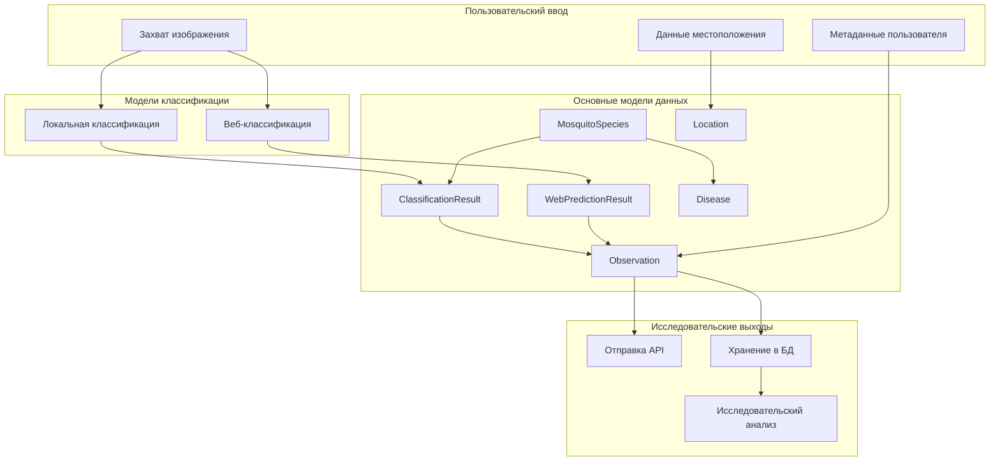
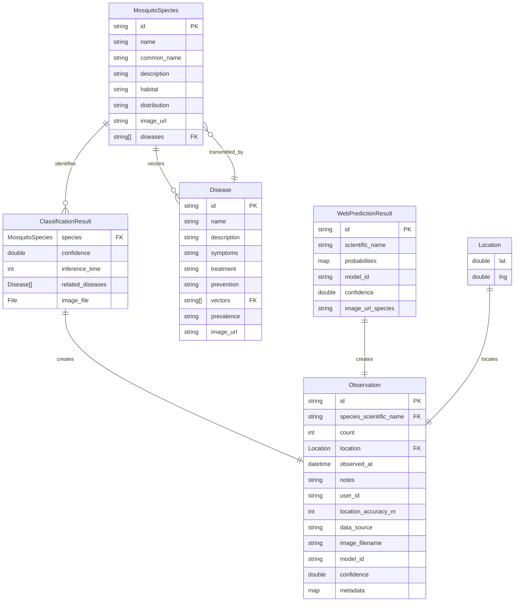

# Модели данных CulicidaeLab для исследовательских приложений

## Обзор

Мобильное приложение CulicidaeLab использует комплексный набор моделей данных, предназначенных для поддержки наблюдения за комарами, идентификации видов и исследований переносчиков заболеваний. Этот документ предоставляет подробную техническую документацию всех структур данных, их взаимосвязей и паттернов использования для исследователей и разработчиков, работающих с экосистемой CulicidaeLab.

## Архитектура моделей

### Основной поток данных



## Модель Location

### Структура

Модель `Location` представляет географические координаты, используя систему координат WGS84 (EPSG:4326).

```dart
class Location {
  final double lat;    // Широта: -90.0 до 90.0
  final double lng;    // Долгота: -180.0 до 180.0
}
```

### JSON схема

```json
{
  "type": "object",
  "properties": {
    "lat": {
      "type": "number",
      "minimum": -90.0,
      "maximum": 90.0,
      "description": "Широта в десятичных градусах"
    },
    "lng": {
      "type": "number", 
      "minimum": -180.0,
      "maximum": 180.0,
      "description": "Долгота в десятичных градусах"
    }
  },
  "required": ["lat", "lng"]
}
```

### Исследовательские применения

**Пространственный анализ:**
```dart
// Вычисление расстояния между наблюдениями
final distance = location1.distanceTo(location2); // Возвращает км

// Пример пространственной кластеризации
List<Observation> findNearbyObservations(
  Location center, 
  double radiusKm,
  List<Observation> observations
) {
  return observations.where((obs) => 
    obs.location.distanceTo(center) <= radiusKm
  ).toList();
}
```

**Валидация координат:**
- Автоматическая валидация обеспечивает нахождение координат в допустимых диапазонах
- Точность поддерживается до 6 десятичных знаков (~0.1м точность)
- Совместимость со стандартными ГИС системами и картографическими библиотеками

## Модель MosquitoSpecies

### Структура

Комплексная модель информации о видах, поддерживающая таксономическую классификацию и экологические данные.

```dart
class MosquitoSpecies {
  final String id;              // Уникальный идентификатор (snake_case)
  final String name;            // Научное название (биномиальное)
  final String commonName;      // Человекочитаемое название
  final String description;     // Подробная информация о виде
  final String habitat;         // Предпочтения среды обитания
  final String distribution;    // Географическое распространение
  final String imageUrl;        // Путь/URL эталонного изображения
  final List<String> diseases;  // Связанные ID заболеваний
}
```#
## JSON схема

```json
{
  "type": "object",
  "properties": {
    "id": {
      "type": "string",
      "pattern": "^[a-z_]+$",
      "description": "Уникальный идентификатор вида в snake_case"
    },
    "name": {
      "type": "string",
      "description": "Научное название по биномиальной номенклатуре"
    },
    "common_name": {
      "type": "string",
      "description": "Общепринятое название(я) вида"
    },
    "description": {
      "type": "string",
      "description": "Подробное описание вида и характеристики"
    },
    "habitat": {
      "type": "string",
      "description": "Предпочитаемые места обитания и размножения"
    },
    "distribution": {
      "type": "string", 
      "description": "Географическое распространение и ареал"
    },
    "image_url": {
      "type": "string",
      "description": "Путь или URL к эталонному изображению вида"
    },
    "diseases": {
      "type": "array",
      "items": {"type": "string"},
      "description": "Список ID заболеваний, которые может передавать этот вид"
    }
  },
  "required": ["id", "name", "common_name", "description", "habitat", "distribution", "image_url", "diseases"]
}
```

### Исследовательские применения

**Таксономический анализ:**
```dart
// Иерархия классификации видов
final genusSpecies = species.name.split(' ');
final genus = genusSpecies[0];
final specificEpithet = genusSpecies[1];

// Анализ векторной компетентности
final vectorSpecies = allSpecies.where((s) => 
  s.diseases.contains('dengue')
).toList();
```

**Экологическое моделирование:**
- Анализ предпочтений среды обитания для моделирования распространения
- Оценка климатической пригодности с использованием данных о распространении
- Картирование взаимосвязей переносчик-заболевание

## Модель Disease

### Структура

Комплексная модель информации о заболеваниях для исследований трансмиссивных болезней.

```dart
class Disease {
  final String id;              // Уникальный идентификатор заболевания
  final String name;            // Общепринятое название заболевания
  final String description;     // Подробная информация о заболевании
  final String symptoms;        // Клинические проявления
  final String treatment;       // Подходы к лечению
  final String prevention;      // Стратегии профилактики
  final List<String> vectors;   // ID видов переносчиков
  final String prevalence;      // Географическая распространенность
  final String imageUrl;        // Изображение, связанное с заболеванием
}
```

### JSON схема

```json
{
  "type": "object",
  "properties": {
    "id": {
      "type": "string",
      "pattern": "^[a-z_]+$",
      "description": "Уникальный идентификатор заболевания"
    },
    "name": {
      "type": "string",
      "description": "Общепринятое название заболевания"
    },
    "description": {
      "type": "string",
      "description": "Комплексное описание заболевания"
    },
    "symptoms": {
      "type": "string",
      "description": "Клинические симптомы и проявления"
    },
    "treatment": {
      "type": "string",
      "description": "Подходы к лечению и управлению"
    },
    "prevention": {
      "type": "string",
      "description": "Методы и стратегии профилактики"
    },
    "vectors": {
      "type": "array",
      "items": {"type": "string"},
      "description": "Список ID видов переносчиков"
    },
    "prevalence": {
      "type": "string",
      "description": "Географическая распространенность и распределение"
    },
    "image_url": {
      "type": "string",
      "description": "Путь или URL к изображению, связанному с заболеванием"
    }
  },
  "required": ["id", "name", "description", "symptoms", "treatment", "prevention", "vectors", "prevalence", "image_url"]
}
```

### Исследовательские применения

**Эпидемиологический анализ:**
```dart
// Анализ сети переносчик-заболевание
Map<String, List<String>> buildVectorDiseaseNetwork(
  List<Disease> diseases
) {
  final network = <String, List<String>>{};
  for (final disease in diseases) {
    for (final vector in disease.vectors) {
      network.putIfAbsent(vector, () => []).add(disease.id);
    }
  }
  return network;
}

// Оценка риска заболевания
bool isHighRiskVector(String speciesId, List<Disease> diseases) {
  final transmittedDiseases = diseases.where((d) => 
    d.isTransmittedBy(speciesId)
  ).toList();
  return transmittedDiseases.length >= 2; // Переносчик множественных заболеваний
}
```

## Модель ClassificationResult

### Структура

Результаты локальной классификации на устройстве с комплексными метаданными.

```dart
class ClassificationResult {
  final MosquitoSpecies species;        // Идентифицированный вид
  final double confidence;              // Оценка достоверности (0.0-1.0)
  final int inferenceTime;             // Время обработки (мс)
  final List<Disease> relatedDiseases; // Связанные заболевания
  final File imageFile;                // Исходное изображение
}
```

### Исследовательские применения

**Анализ производительности модели:**
```dart
// Вычисление метрик производительности
class ClassificationMetrics {
  static double calculateAccuracy(List<ClassificationResult> results, 
                                 List<String> groundTruth) {
    int correct = 0;
    for (int i = 0; i < results.length; i++) {
      if (results[i].species.name == groundTruth[i]) correct++;
    }
    return correct / results.length;
  }
  
  static Map<String, double> calculateConfidenceDistribution(
    List<ClassificationResult> results
  ) {
    final distribution = <String, double>{};
    for (final result in results) {
      final level = result.confidenceLevel;
      distribution[level] = (distribution[level] ?? 0) + 1;
    }
    return distribution.map((k, v) => MapEntry(k, v / results.length));
  }
}
```

**Производительность вывода:**
```dart
// Анализ времени обработки
class PerformanceAnalyzer {
  static Map<String, dynamic> analyzeInferenceTime(
    List<ClassificationResult> results
  ) {
    final times = results.map((r) => r.inferenceTime).toList();
    times.sort();
    
    return {
      'mean': times.reduce((a, b) => a + b) / times.length,
      'median': times[times.length ~/ 2],
      'min': times.first,
      'max': times.last,
      'p95': times[(times.length * 0.95).floor()],
    };
  }
}
```

## Модель WebPredictionResult

### Структура

Результаты серверной классификации с полными распределениями вероятностей.

```dart
class WebPredictionResult {
  final String id;                          // Уникальный ID предсказания
  final String scientificName;              // Топ предсказанный вид
  final Map<String, double> probabilities;  // Полное распределение вероятностей
  final String modelId;                     // Идентификатор серверной модели
  final double confidence;                  // Достоверность топ предсказания
  final String? imageUrlSpecies;            // URL эталонного изображения вида
}
```

### JSON схема

```json
{
  "type": "object",
  "properties": {
    "id": {
      "type": "string",
      "description": "Уникальный идентификатор предсказания"
    },
    "scientific_name": {
      "type": "string",
      "description": "Научное название топ предсказанного вида"
    },
    "probabilities": {
      "type": "object",
      "patternProperties": {
        "^[A-Z][a-z]+ [a-z]+$": {
          "type": "number",
          "minimum": 0.0,
          "maximum": 1.0
        }
      },
      "description": "Распределение вероятностей видов"
    },
    "model_id": {
      "type": "string",
      "description": "Идентификатор серверной модели"
    },
    "confidence": {
      "type": "number",
      "minimum": 0.0,
      "maximum": 1.0,
      "description": "Оценка достоверности топ предсказания"
    },
    "image_url_species": {
      "type": "string",
      "description": "Опциональный URL эталонного изображения вида"
    }
  },
  "required": ["id", "scientific_name", "probabilities", "model_id", "confidence"]
}
```

### Исследовательские применения

**Сравнение моделей:**
```dart
// Сравнение локальных и веб предсказаний
class ModelComparison {
  static double calculateAgreement(
    List<ClassificationResult> localResults,
    List<WebPredictionResult> webResults
  ) {
    int agreements = 0;
    for (int i = 0; i < localResults.length; i++) {
      if (localResults[i].species.name == webResults[i].scientificName) {
        agreements++;
      }
    }
    return agreements / localResults.length;
  }
  
  static Map<String, double> analyzeConfidenceCorrelation(
    List<ClassificationResult> localResults,
    List<WebPredictionResult> webResults
  ) {
    // Вычисление коэффициента корреляции Пирсона
    final localConf = localResults.map((r) => r.confidence).toList();
    final webConf = webResults.map((r) => r.confidence).toList();
    
    // Реализация вычисления корреляции
    return {'correlation': calculatePearsonCorrelation(localConf, webConf)};
  }
}
```

**Анализ неопределенности:**
```dart
// Анализ неопределенности предсказания
class UncertaintyAnalyzer {
  static double calculateEntropy(Map<String, double> probabilities) {
    double entropy = 0.0;
    for (final prob in probabilities.values) {
      if (prob > 0) {
        entropy -= prob * (prob.log() / 2.302585); // логарифм по основанию 10
      }
    }
    return entropy;
  }
  
  static bool isAmbiguousPrediction(WebPredictionResult result) {
    return result.hasCloseAlternatives || 
           calculateEntropy(result.probabilities) > 0.5;
  }
}
```## Модель Ob
servation

### Структура

Комплексная запись наблюдения для исследовательских и надзорных применений.

```dart
class Observation {
  final String id;                      // Уникальный ID наблюдения
  final String speciesScientificName;  // Идентифицированный вид
  final int count;                      // Количество экземпляров
  final Location location;              // Географические координаты
  final DateTime observedAt;            // Временная метка наблюдения
  final String? notes;                  // Заметки пользователя
  final String? userId;                 // Идентификатор наблюдателя
  final int? locationAccuracyM;         // Точность GPS (метры)
  final String? dataSource;             // Идентификатор источника данных
  final String? imageFilename;          // Связанный файл изображения
  final String? modelId;                // ID модели классификации
  final double? confidence;             // Достоверность классификации
  final Map<String, dynamic>? metadata; // Дополнительные метаданные
}
```

### JSON схема

```json
{
  "type": "object",
  "properties": {
    "id": {
      "type": "string",
      "description": "Уникальный идентификатор наблюдения"
    },
    "species_scientific_name": {
      "type": "string",
      "description": "Научное название наблюдаемого вида"
    },
    "count": {
      "type": "integer",
      "minimum": 1,
      "description": "Количество наблюдаемых экземпляров"
    },
    "location": {
      "$ref": "#/definitions/Location",
      "description": "Географическое местоположение наблюдения"
    },
    "observed_at": {
      "type": "string",
      "format": "date-time",
      "description": "Временная метка наблюдения в формате ISO 8601"
    },
    "notes": {
      "type": "string",
      "description": "Опциональные заметки наблюдателя"
    },
    "user_id": {
      "type": "string",
      "description": "Идентификатор наблюдателя"
    },
    "location_accuracy_m": {
      "type": "integer",
      "minimum": 0,
      "description": "Точность GPS в метрах"
    },
    "data_source": {
      "type": "string",
      "enum": ["mobile_app", "web_app", "citizen_science", "research", "surveillance"],
      "description": "Источник данных наблюдения"
    },
    "image_filename": {
      "type": "string",
      "description": "Связанное имя файла изображения"
    },
    "model_id": {
      "type": "string",
      "description": "Идентификатор модели классификации"
    },
    "confidence": {
      "type": "number",
      "minimum": 0.0,
      "maximum": 1.0,
      "description": "Оценка достоверности классификации"
    },
    "metadata": {
      "type": "object",
      "description": "Дополнительные структурированные метаданные"
    }
  },
  "required": ["id", "species_scientific_name", "count", "location", "observed_at"]
}
```

### Исследовательские применения

**Анализ надзора:**
```dart
// Временной анализ
class TemporalAnalyzer {
  static Map<int, int> getMonthlyDistribution(List<Observation> observations) {
    final distribution = <int, int>{};
    for (final obs in observations) {
      final month = obs.observedAt.month;
      distribution[month] = (distribution[month] ?? 0) + 1;
    }
    return distribution;
  }
  
  static List<Observation> getObservationsInDateRange(
    List<Observation> observations,
    DateTime start,
    DateTime end
  ) {
    return observations.where((obs) =>
      obs.observedAt.isAfter(start) && obs.observedAt.isBefore(end)
    ).toList();
  }
}
```

**Пространственный анализ:**
```dart
// Пространственная кластеризация и анализ горячих точек
class SpatialAnalyzer {
  static Map<String, List<Observation>> clusterBySpecies(
    List<Observation> observations
  ) {
    final clusters = <String, List<Observation>>{};
    for (final obs in observations) {
      clusters.putIfAbsent(obs.speciesScientificName, () => []).add(obs);
    }
    return clusters;
  }
  
  static List<Location> identifyHotspots(
    List<Observation> observations,
    double radiusKm,
    int minObservations
  ) {
    final hotspots = <Location>[];
    final processed = <String>{};
    
    for (final obs in observations) {
      final key = '${obs.location.lat}_${obs.location.lng}';
      if (processed.contains(key)) continue;
      
      final nearby = observations.where((other) =>
        obs.location.distanceTo(other.location) <= radiusKm
      ).toList();
      
      if (nearby.length >= minObservations) {
        hotspots.add(obs.location);
        for (final nearbyObs in nearby) {
          processed.add('${nearbyObs.location.lat}_${nearbyObs.location.lng}');
        }
      }
    }
    
    return hotspots;
  }
}
```

**Оценка качества данных:**
```dart
// Метрики качества и фильтрация
class QualityAssessment {
  static Map<String, dynamic> assessDataQuality(List<Observation> observations) {
    final total = observations.length;
    final highQuality = observations.where((obs) => obs.isHighQuality).length;
    final aiIdentified = observations.where((obs) => obs.isAiIdentified).length;
    final withLocation = observations.where((obs) => 
      obs.locationAccuracyM != null && obs.locationAccuracyM! <= 100
    ).length;
    
    return {
      'total_observations': total,
      'high_quality_percentage': (highQuality / total * 100).toStringAsFixed(1),
      'ai_identified_percentage': (aiIdentified / total * 100).toStringAsFixed(1),
      'accurate_location_percentage': (withLocation / total * 100).toStringAsFixed(1),
    };
  }
  
  static List<Observation> filterHighQuality(List<Observation> observations) {
    return observations.where((obs) => 
      obs.isHighQuality &&
      obs.locationAccuracyM != null &&
      obs.locationAccuracyM! <= 50 && // Высокая точность GPS
      obs.confidence != null &&
      obs.confidence! >= 0.8 // Высокая достоверность классификации
    ).toList();
  }
}
```

## Взаимосвязи данных

### Диаграмма отношений сущностей



### Паттерны взаимосвязей

**Взаимосвязи вид-заболевание:**
```dart
// Отношение многие-ко-многим через переносчиков заболеваний
class SpeciesDiseaseAnalyzer {
  static Map<String, List<String>> getSpeciesDiseaseMap(
    List<MosquitoSpecies> species,
    List<Disease> diseases
  ) {
    final map = <String, List<String>>{};
    
    for (final sp in species) {
      final speciesDiseases = diseases
          .where((d) => d.vectors.contains(sp.id))
          .map((d) => d.id)
          .toList();
      map[sp.id] = speciesDiseases;
    }
    
    return map;
  }
}
```

**Конвейер классификация-наблюдение:**
```dart
// Преобразование результатов классификации в наблюдения
class ObservationFactory {
  static Observation fromClassificationResult(
    ClassificationResult result,
    Location location,
    String userId,
    {String? notes}
  ) {
    return Observation(
      id: 'obs_${DateTime.now().millisecondsSinceEpoch}',
      speciesScientificName: result.species.name,
      count: 1,
      location: location,
      observedAt: DateTime.now(),
      notes: notes,
      userId: userId,
      dataSource: 'mobile_app',
      modelId: 'local_pytorch_lite',
      confidence: result.confidence,
      metadata: {
        'inference_time_ms': result.inferenceTime,
        'related_diseases': result.relatedDiseases.map((d) => d.id).toList(),
      },
    );
  }
  
  static Observation fromWebPredictionResult(
    WebPredictionResult result,
    Location location,
    String userId,
    {String? notes}
  ) {
    return Observation(
      id: 'obs_${DateTime.now().millisecondsSinceEpoch}',
      speciesScientificName: result.scientificName,
      count: 1,
      location: location,
      observedAt: DateTime.now(),
      notes: notes,
      userId: userId,
      dataSource: 'mobile_app',
      modelId: result.modelId,
      confidence: result.confidence,
      metadata: {
        'prediction_id': result.id,
        'probabilities': result.probabilities,
        'has_close_alternatives': result.hasCloseAlternatives,
      },
    );
  }
}
```## Эк
спорт и интеграция данных

### Формат экспорта CSV

Для анализа исследовательских данных наблюдения могут быть экспортированы в формате CSV:

```dart
class DataExporter {
  static String exportObservationsToCSV(List<Observation> observations) {
    final buffer = StringBuffer();
    
    // Заголовок
    buffer.writeln([
      'id',
      'species_scientific_name',
      'count',
      'latitude',
      'longitude',
      'observed_at',
      'notes',
      'user_id',
      'location_accuracy_m',
      'data_source',
      'image_filename',
      'model_id',
      'confidence',
      'metadata_json'
    ].join(','));
    
    // Строки данных
    for (final obs in observations) {
      buffer.writeln([
        obs.id,
        '"${obs.speciesScientificName}"',
        obs.count,
        obs.location.lat,
        obs.location.lng,
        obs.observedAt.toIso8601String(),
        obs.notes != null ? '"${obs.notes!.replaceAll('"', '""')}"' : '',
        obs.userId ?? '',
        obs.locationAccuracyM ?? '',
        obs.dataSource ?? '',
        obs.imageFilename ?? '',
        obs.modelId ?? '',
        obs.confidence ?? '',
        obs.metadata != null ? '"${jsonEncode(obs.metadata!)}"' : ''
      ].join(','));
    }
    
    return buffer.toString();
  }
}
```

### Экспорт GeoJSON

Для пространственного анализа и интеграции с ГИС:

```dart
class GeoJSONExporter {
  static Map<String, dynamic> exportObservationsToGeoJSON(
    List<Observation> observations
  ) {
    return {
      'type': 'FeatureCollection',
      'features': observations.map((obs) => {
        'type': 'Feature',
        'geometry': {
          'type': 'Point',
          'coordinates': [obs.location.lng, obs.location.lat]
        },
        'properties': {
          'id': obs.id,
          'species_scientific_name': obs.speciesScientificName,
          'count': obs.count,
          'observed_at': obs.observedAt.toIso8601String(),
          'confidence': obs.confidence,
          'data_source': obs.dataSource,
          'location_accuracy_m': obs.locationAccuracyM,
          'notes': obs.notes,
        }
      }).toList()
    };
  }
}
```

## Валидация данных и контроль качества

### Правила валидации

```dart
class DataValidator {
  static List<String> validateObservation(Observation observation) {
    final errors = <String>[];
    
    // Валидация обязательных полей
    if (observation.id.isEmpty) {
      errors.add('ID наблюдения обязательно');
    }
    
    if (observation.speciesScientificName.isEmpty) {
      errors.add('Научное название вида обязательно');
    }
    
    if (observation.count <= 0) {
      errors.add('Количество должно быть положительным');
    }
    
    // Валидация местоположения
    if (observation.location.lat < -90 || observation.location.lat > 90) {
      errors.add('Неверная широта: ${observation.location.lat}');
    }
    
    if (observation.location.lng < -180 || observation.location.lng > 180) {
      errors.add('Неверная долгота: ${observation.location.lng}');
    }
    
    // Валидация достоверности
    if (observation.confidence != null) {
      if (observation.confidence! < 0.0 || observation.confidence! > 1.0) {
        errors.add('Достоверность должна быть между 0.0 и 1.0');
      }
    }
    
    // Валидация точности местоположения
    if (observation.locationAccuracyM != null) {
      if (observation.locationAccuracyM! < 0) {
        errors.add('Точность местоположения не может быть отрицательной');
      }
    }
    
    // Временная валидация
    if (observation.observedAt.isAfter(DateTime.now())) {
      errors.add('Дата наблюдения не может быть в будущем');
    }
    
    return errors;
  }
  
  static bool isValidSpeciesName(String scientificName) {
    // Базовая валидация биномиальной номенклатуры
    final parts = scientificName.split(' ');
    if (parts.length < 2) return false;
    
    // Род должен начинаться с заглавной буквы
    if (!RegExp(r'^[A-Z][a-z]+$').hasMatch(parts[0])) return false;
    
    // Видовой эпитет должен быть строчными буквами
    if (!RegExp(r'^[a-z]+$').hasMatch(parts[1])) return false;
    
    return true;
  }
}
```

## Соображения производительности

### Управление памятью

```dart
class DataManager {
  // Эффективная пакетная обработка для больших наборов данных
  static Future<void> processBatchObservations(
    List<Observation> observations,
    Function(Observation) processor,
    {int batchSize = 100}
  ) async {
    for (int i = 0; i < observations.length; i += batchSize) {
      final batch = observations.skip(i).take(batchSize);
      for (final obs in batch) {
        processor(obs);
      }
      // Позволить выполняться другим операциям
      await Future.delayed(Duration.zero);
    }
  }
  
  // Эффективная по памяти потоковая передача для больших экспортов
  static Stream<String> streamObservationsAsCSV(
    Stream<Observation> observations
  ) async* {
    // Выдать заголовок
    yield 'id,species_scientific_name,count,latitude,longitude,observed_at\n';
    
    // Потоковые строки данных
    await for (final obs in observations) {
      yield '${obs.id},"${obs.speciesScientificName}",${obs.count},'
            '${obs.location.lat},${obs.location.lng},'
            '${obs.observedAt.toIso8601String()}\n';
    }
  }
}
```

## Примеры интеграции

### Интеграция с исследовательской базой данных

```dart
// Пример интеграции с исследовательской базой данных
class ResearchDatabaseIntegration {
  static Future<void> syncObservationsToResearchDB(
    List<Observation> observations
  ) async {
    final validObservations = observations
        .where((obs) => DataValidator.validateObservation(obs).isEmpty)
        .toList();
    
    // Пакетная вставка для эффективности
    await DataManager.processBatchObservations(
      validObservations,
      (obs) async {
        await insertObservationToResearchDB(obs);
      },
      batchSize: 50
    );
  }
  
  static Future<void> insertObservationToResearchDB(Observation obs) async {
    // Реализация будет зависеть от конкретной системы базы данных
    // Это концептуальный пример
    final query = '''
      INSERT INTO mosquito_observations 
      (id, species, count, lat, lng, observed_at, confidence, data_source)
      VALUES (?, ?, ?, ?, ?, ?, ?, ?)
    ''';
    
    // Выполнить вставку в базу данных
    // await database.execute(query, [
    //   obs.id, obs.speciesScientificName, obs.count,
    //   obs.location.lat, obs.location.lng, obs.observedAt,
    //   obs.confidence, obs.dataSource
    // ]);
  }
}
```

### Интеграция со статистическим анализом

```dart
// Пример интеграции с R или Python для статистического анализа
class StatisticalAnalysis {
  static Map<String, dynamic> generateSpeciesStatistics(
    List<Observation> observations
  ) {
    final speciesGroups = <String, List<Observation>>{};
    
    // Группировка по видам
    for (final obs in observations) {
      speciesGroups.putIfAbsent(obs.speciesScientificName, () => []).add(obs);
    }
    
    final statistics = <String, dynamic>{};
    
    for (final entry in speciesGroups.entries) {
      final species = entry.key;
      final speciesObs = entry.value;
      
      statistics[species] = {
        'count': speciesObs.length,
        'average_confidence': speciesObs
            .where((obs) => obs.confidence != null)
            .map((obs) => obs.confidence!)
            .fold(0.0, (a, b) => a + b) / speciesObs.length,
        'temporal_distribution': _analyzeTemporalDistribution(speciesObs),
        'spatial_distribution': _analyzeSpatialDistribution(speciesObs),
        'data_quality_metrics': _calculateDataQuality(speciesObs),
      };
    }
    
    return statistics;
  }
  
  static Map<String, dynamic> _analyzeTemporalDistribution(List<Observation> observations) {
    final monthlyCount = <int, int>{};
    final hourlyCount = <int, int>{};
    
    for (final obs in observations) {
      final month = obs.observedAt.month;
      final hour = obs.observedAt.hour;
      
      monthlyCount[month] = (monthlyCount[month] ?? 0) + 1;
      hourlyCount[hour] = (hourlyCount[hour] ?? 0) + 1;
    }
    
    return {
      'monthly_distribution': monthlyCount,
      'hourly_distribution': hourlyCount,
      'peak_month': monthlyCount.entries.reduce((a, b) => a.value > b.value ? a : b).key,
      'peak_hour': hourlyCount.entries.reduce((a, b) => a.value > b.value ? a : b).key,
    };
  }
  
  static Map<String, dynamic> _analyzeSpatialDistribution(List<Observation> observations) {
    final latitudes = observations.map((obs) => obs.location.lat).toList();
    final longitudes = observations.map((obs) => obs.location.lng).toList();
    
    latitudes.sort();
    longitudes.sort();
    
    return {
      'latitude_range': {
        'min': latitudes.first,
        'max': latitudes.last,
        'median': latitudes[latitudes.length ~/ 2],
      },
      'longitude_range': {
        'min': longitudes.first,
        'max': longitudes.last,
        'median': longitudes[longitudes.length ~/ 2],
      },
      'geographic_spread_km': _calculateGeographicSpread(observations),
    };
  }
  
  static double _calculateGeographicSpread(List<Observation> observations) {
    if (observations.length < 2) return 0.0;
    
    double maxDistance = 0.0;
    for (int i = 0; i < observations.length; i++) {
      for (int j = i + 1; j < observations.length; j++) {
        final distance = observations[i].location.distanceTo(observations[j].location);
        if (distance > maxDistance) {
          maxDistance = distance;
        }
      }
    }
    
    return maxDistance;
  }
}
```

## Лучшие практики

### Неизменяемость данных

- Используйте `const` конструкторы где возможно
- Делайте все поля `final`
- Реализуйте методы `copyWith` для обновлений

```dart
class Observation {
  // Все поля final
  final String id;
  final String speciesScientificName;
  // ...
  
  const Observation({/* параметры */}); // const конструктор
  
  Observation copyWith({
    String? id,
    String? speciesScientificName,
    // ...
  }) {
    return Observation(
      id: id ?? this.id,
      speciesScientificName: speciesScientificName ?? this.speciesScientificName,
      // ...
    );
  }
}
```

### Обработка ошибок

- Валидируйте данные при создании модели
- Используйте типобезопасную десериализацию
- Предоставляйте значимые сообщения об ошибках

### Производительность

- Используйте ленивую загрузку для больших наборов данных
- Реализуйте пагинацию для списков
- Кэшируйте часто используемые данные

## Заключение

Модели данных CulicidaeLab обеспечивают прочную основу для исследовательских приложений, предлагая:

- **Типобезопасность**: Строгая типизация предотвращает ошибки времени выполнения
- **Валидацию**: Встроенные правила валидации обеспечивают качество данных
- **Сериализацию**: Бесшовная интеграция с API и хранилищем
- **Расширяемость**: Легко расширяемые для новых требований
- **Исследовательскую готовность**: Оптимизированы для научного анализа данных

Эти модели служат контрактом между различными слоями приложения и внешними системами, обеспечивая согласованность и надежность во всей экосистеме CulicidaeLab.