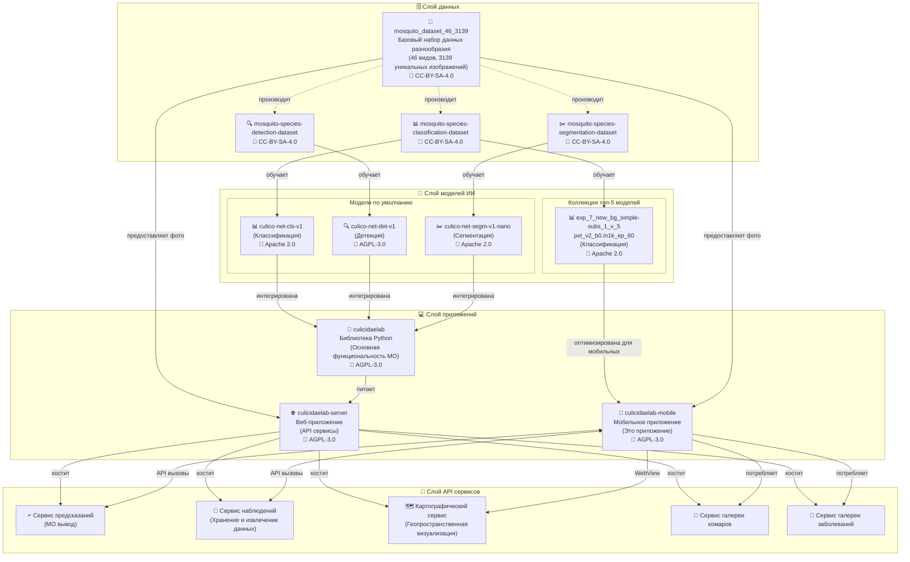
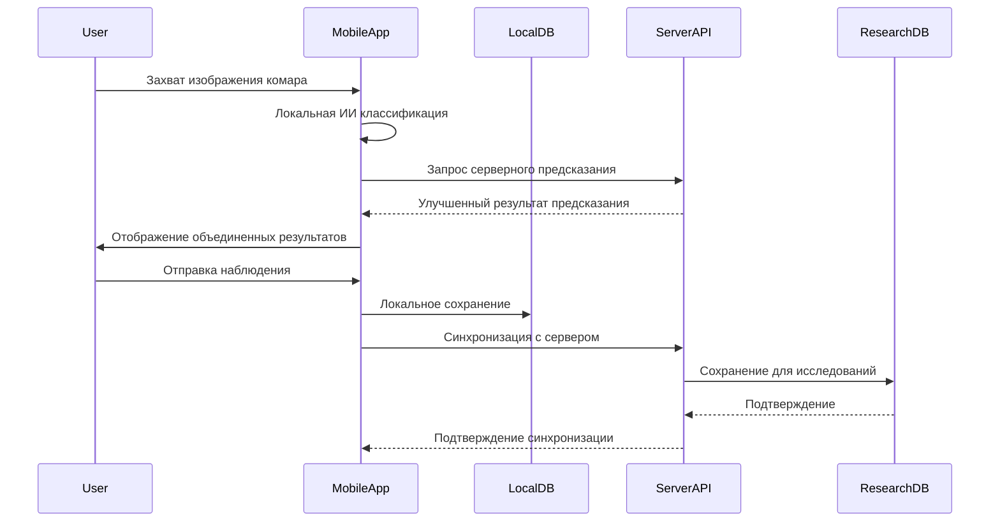

# Руководство по интеграции экосистемы CulicidaeLab

## Обзор

Мобильное приложение CulicidaeLab является частью комплексной экосистемы, предназначенной для исследования комаров, идентификации видов и надзора за трансмиссивными заболеваниями. Это руководство предоставляет подробную информацию о том, как мобильное приложение интегрируется с более широкой экосистемой CulicidaeLab и как исследователи и разработчики могут расширить его функциональность.

## Архитектура экосистемы

### Полный обзор системы

Экосистема CulicidaeLab состоит из четырех основных слоев, работающих вместе для обеспечения комплексных возможностей исследования комаров:



### Взаимосвязи компонентов

**Слой данных:**
- **Базовый набор данных**: 46 видов, 3139 уникальных изображений под CC-BY-SA-4.0
- **Специализированные наборы данных**: Производные для классификации, детекции и сегментации
- **Открытый доступ**: Все наборы данных доступны на Hugging Face

**Слой моделей ИИ:**
- **Производственные модели**: Модели по умолчанию, используемые экосистемой
- **Исследовательские модели**: Коллекция топ-5 с точностью >90% для 17 видов
- **Мобильная оптимизация**: Специализированные модели для мобильного развертывания

**Слой приложений:**
- **Библиотека Python**: Основная функциональность МО и исследовательские инструменты
- **Веб-сервер**: API сервисы и веб-интерфейс
- **Мобильное приложение**: Образовательный и полевой исследовательский инструмент

**Слой сервисов:**
- **Сервис предсказаний**: Идентификация видов в реальном времени
- **Сервис наблюдений**: Сбор и хранение данных
- **Картографический сервис**: Геопространственная визуализация
- **Сервисы галереи**: Доставка образовательного контента

## Точки интеграции мобильного приложения

### 1. Интеграция с серверным API

Мобильное приложение интегрируется с сервером CulicidaeLab через RESTful API:

```dart
// Основные конечные точки API
class CulicidaeLabAPI {
  static const String baseUrl = "https://culicidealab.ru";
  
  // Интеграция сервиса предсказаний
  static const String predictionEndpoint = "/api/predict";
  
  // Интеграция сервиса наблюдений  
  static const String observationsEndpoint = "/api/observations";
  
  // Интеграция картографического сервиса
  static const String mapEndpoint = "/map";
  
  // Интеграция сервиса галереи
  static const String speciesGalleryEndpoint = "/api/species";
  static const String diseasesGalleryEndpoint = "/api/diseases";
}
```

### 2. Синхронизация данных

**Поток данных наблюдений:**


### 3. Интеграция моделей

**Гибридный подход к классификации:**
```dart
class HybridClassificationService {
  final ClassificationService _localService;
  final ClassificationRepository _repository;
  
  Future<ClassificationResult> classifyImage(File imageFile) async {
    // Локальная классификация для немедленных результатов
    final localResult = await _localService.classifyImage(imageFile);
    
    // Серверная классификация для повышенной точности
    try {
      final webResult = await _repository.getWebPrediction(imageFile);
      
      // Объединение результатов для комплексного анализа
      return _combineResults(localResult, webResult);
    } catch (e) {
      // Возврат к локальному результату, если сервер недоступен
      return localResult;
    }
  }
  
  ClassificationResult _combineResults(
    ClassificationResult local,
    WebPredictionResult web
  ) {
    // Реализация объединяет локальные и серверные предсказания
    // Предоставляет сравнение достоверности и альтернативные предложения
    return ClassificationResult(
      species: web.confidence > local.confidence ? 
               _getSpeciesFromWeb(web) : local.species,
      confidence: math.max(local.confidence, web.confidence),
      inferenceTime: local.inferenceTime,
      relatedDiseases: local.relatedDiseases,
      imageFile: local.imageFile,
      metadata: {
        'local_prediction': local.species.name,
        'local_confidence': local.confidence,
        'web_prediction': web.scientificName,
        'web_confidence': web.confidence,
        'prediction_agreement': local.species.name == web.scientificName,
      },
    );
  }
}
```## 
Расширение мобильного приложения

### 1. Архитектура плагинов

Мобильное приложение поддерживает расширения через архитектуру на основе плагинов:

```dart
// Интерфейс плагина для расширения функциональности
abstract class CulicidaeLabPlugin {
  String get name;
  String get version;
  List<String> get supportedFeatures;
  
  Future<void> initialize();
  Future<Map<String, dynamic>> processData(Map<String, dynamic> input);
  Future<void> cleanup();
}

// Пример: Плагин экологических данных
class EnvironmentalDataPlugin implements CulicidaeLabPlugin {
  @override
  String get name => 'Сборщик экологических данных';
  
  @override
  String get version => '1.0.0';
  
  @override
  List<String> get supportedFeatures => [
    'temperature_measurement',
    'humidity_measurement', 
    'weather_integration'
  ];
  
  @override
  Future<void> initialize() async {
    // Инициализация подключений к API погоды
    // Настройка интеграций датчиков
  }
  
  @override
  Future<Map<String, dynamic>> processData(Map<String, dynamic> input) async {
    final location = input['location'] as Location;
    
    return {
      'temperature': await _getTemperature(location),
      'humidity': await _getHumidity(location),
      'weather_conditions': await _getWeatherConditions(location),
      'timestamp': DateTime.now().toIso8601String(),
    };
  }
  
  Future<double> _getTemperature(Location location) async {
    // Реализация сбора данных о температуре
    return 25.0; // Пример значения
  }
  
  Future<double> _getHumidity(Location location) async {
    // Реализация сбора данных о влажности
    return 65.0; // Пример значения
  }
  
  Future<String> _getWeatherConditions(Location location) async {
    // Реализация определения погодных условий
    return 'partly_cloudy'; // Пример значения
  }
  
  @override
  Future<void> cleanup() async {
    // Очистка ресурсов
  }
}
```

### 2. Интеграция пользовательских моделей

**Добавление новых моделей классификации:**

```dart
// Интерфейс для пользовательских моделей классификации
abstract class ClassificationModel {
  String get modelId;
  String get modelVersion;
  List<String> get supportedSpecies;
  
  Future<void> loadModel();
  Future<ClassificationResult> classify(File imageFile);
  Future<void> unloadModel();
}

// Пример: Пользовательская модель TensorFlow Lite
class CustomTFLiteModel implements ClassificationModel {
  late Interpreter _interpreter;
  
  @override
  String get modelId => 'custom_tflite_v1';
  
  @override
  String get modelVersion => '1.0.0';
  
  @override
  List<String> get supportedSpecies => [
    'Aedes aegypti',
    'Aedes albopictus',
    'Culex pipiens',
    // ... дополнительные виды
  ];
  
  @override
  Future<void> loadModel() async {
    final modelFile = await _loadModelFile('assets/models/custom_model.tflite');
    _interpreter = Interpreter.fromFile(modelFile);
  }
  
  @override
  Future<ClassificationResult> classify(File imageFile) async {
    // Предобработка изображения
    final input = await _preprocessImage(imageFile);
    
    // Выполнение вывода
    final output = List.filled(supportedSpecies.length, 0.0);
    _interpreter.run(input, output);
    
    // Постобработка результатов
    return _postprocessResults(output, imageFile);
  }
  
  Future<List<List<List<List<double>>>>> _preprocessImage(File imageFile) async {
    // Реализация предобработки изображения
    // Изменение размера, нормализация, преобразование в формат тензора
    return []; // Заглушка
  }
  
  ClassificationResult _postprocessResults(
    List<double> output, 
    File imageFile
  ) {
    // Поиск предсказания с наивысшей достоверностью
    final maxIndex = output.indexOf(output.reduce(math.max));
    final confidence = output[maxIndex];
    final speciesName = supportedSpecies[maxIndex];
    
    // Создание объекта вида и связанных заболеваний
    final species = _createSpeciesFromName(speciesName);
    final diseases = _getRelatedDiseases(species);
    
    return ClassificationResult(
      species: species,
      confidence: confidence,
      inferenceTime: 0, // Измерить фактическое время вывода
      relatedDiseases: diseases,
      imageFile: imageFile,
    );
  }
  
  @override
  Future<void> unloadModel() async {
    _interpreter.close();
  }
}
```

### 3. Расширения экспорта данных

**Пользовательские форматы экспорта:**

```dart
// Интерфейс для плагинов экспорта данных
abstract class DataExporter {
  String get formatName;
  String get fileExtension;
  List<String> get supportedDataTypes;
  
  Future<String> exportObservations(List<Observation> observations);
  Future<String> exportClassificationResults(List<ClassificationResult> results);
  Future<String> exportSpeciesData(List<MosquitoSpecies> species);
}

// Пример: Экспортер для исследований
class ResearchDataExporter implements DataExporter {
  @override
  String get formatName => 'Формат исследовательского анализа';
  
  @override
  String get fileExtension => '.raf';
  
  @override
  List<String> get supportedDataTypes => [
    'observations',
    'classifications',
    'species_data',
    'environmental_data'
  ];
  
  @override
  Future<String> exportObservations(List<Observation> observations) async {
    final exportData = {
      'metadata': {
        'export_timestamp': DateTime.now().toIso8601String(),
        'format_version': '1.0',
        'total_observations': observations.length,
        'data_quality_summary': _generateQualitySummary(observations),
      },
      'observations': observations.map((obs) => {
        'id': obs.id,
        'species': obs.speciesScientificName,
        'location': {
          'lat': obs.location.lat,
          'lng': obs.location.lng,
          'accuracy_m': obs.locationAccuracyM,
        },
        'temporal': {
          'observed_at': obs.observedAt.toIso8601String(),
          'day_of_year': obs.observedAt.dayOfYear,
          'season': _getSeason(obs.observedAt),
        },
        'classification': {
          'confidence': obs.confidence,
          'model_id': obs.modelId,
          'data_source': obs.dataSource,
        },
        'context': {
          'notes': obs.notes,
          'metadata': obs.metadata,
        },
      }).toList(),
      'analysis': {
        'species_distribution': _analyzeSpeciesDistribution(observations),
        'temporal_patterns': _analyzeTemporalPatterns(observations),
        'spatial_clusters': _analyzeSpatialClusters(observations),
      },
    };
    
    return jsonEncode(exportData);
  }
  
  Map<String, dynamic> _generateQualitySummary(List<Observation> observations) {
    final highQuality = observations.where((obs) => obs.isHighQuality).length;
    final aiIdentified = observations.where((obs) => obs.isAiIdentified).length;
    
    return {
      'high_quality_percentage': (highQuality / observations.length * 100).round(),
      'ai_identified_percentage': (aiIdentified / observations.length * 100).round(),
      'average_location_accuracy': observations
          .where((obs) => obs.locationAccuracyM != null)
          .map((obs) => obs.locationAccuracyM!)
          .fold(0, (a, b) => a + b) / observations.length,
    };
  }
  
  String _getSeason(DateTime date) {
    final month = date.month;
    if (month >= 3 && month <= 5) return 'spring';
    if (month >= 6 && month <= 8) return 'summer';
    if (month >= 9 && month <= 11) return 'autumn';
    return 'winter';
  }
  
  @override
  Future<String> exportClassificationResults(List<ClassificationResult> results) async {
    // Реализация экспорта результатов классификации
    return jsonEncode(results.map((r) => r.toJson()).toList());
  }
  
  @override
  Future<String> exportSpeciesData(List<MosquitoSpecies> species) async {
    // Реализация экспорта данных о видах
    return jsonEncode(species.map((s) => s.toJson()).toList());
  }
}
```

## Рабочие процессы интеграции исследований

### 1. Интеграция гражданской науки

**Рабочий процесс сбора данных:**

```dart
class CitizenScienceWorkflow {
  static Future<void> submitCitizenScienceObservation({
    required ClassificationResult classificationResult,
    required Location location,
    required String participantId,
    String? notes,
    Map<String, dynamic>? environmentalData,
  }) async {
    // Создание комплексной записи наблюдения
    final observation = Observation(
      id: 'cs_${DateTime.now().millisecondsSinceEpoch}',
      speciesScientificName: classificationResult.species.name,
      count: 1,
      location: location,
      observedAt: DateTime.now(),
      notes: notes,
      userId: participantId,
      dataSource: 'citizen_science',
      modelId: 'mobile_hybrid_v1',
      confidence: classificationResult.confidence,
      metadata: {
        'participant_type': 'citizen_scientist',
        'app_version': await _getAppVersion(),
        'device_info': await _getDeviceInfo(),
        'environmental_data': environmentalData,
        'classification_metadata': {
          'local_confidence': classificationResult.confidence,
          'inference_time_ms': classificationResult.inferenceTime,
          'related_diseases': classificationResult.relatedDiseases.map((d) => d.id).toList(),
        },
      },
    );
    
    // Отправка в исследовательскую базу данных
    await _submitToResearchDatabase(observation);
    
    // Обновление статистики участника
    await _updateParticipantStats(participantId, observation);
    
    // Отправка подтверждения участнику
    await _sendParticipantConfirmation(participantId, observation);
  }
  
  static Future<void> _submitToResearchDatabase(Observation observation) async {
    // Реализация отправки в исследовательскую базу данных
    final repository = locator<ClassificationRepository>();
    await repository.submitObservation(finalPayload: observation.toJson());
  }
  
  static Future<void> _updateParticipantStats(String participantId, Observation observation) async {
    // Обновление статистики вклада участника
    final stats = await _getParticipantStats(participantId);
    stats['total_observations'] = (stats['total_observations'] ?? 0) + 1;
    stats['species_identified'] = _updateSpeciesList(stats['species_identified'], observation.speciesScientificName);
    stats['last_contribution'] = observation.observedAt.toIso8601String();
    
    await _saveParticipantStats(participantId, stats);
  }
}
```

### 2. Интеграция профессиональных исследований

**Рабочий процесс полевых исследований:**

```dart
class FieldResearchWorkflow {
  static Future<ResearchSession> startResearchSession({
    required String researcherId,
    required String projectId,
    required Location studyArea,
    required String methodology,
  }) async {
    final session = ResearchSession(
      id: 'rs_${DateTime.now().millisecondsSinceEpoch}',
      researcherId: researcherId,
      projectId: projectId,
      studyArea: studyArea,
      methodology: methodology,
      startTime: DateTime.now(),
      observations: [],
      environmentalConditions: await _collectEnvironmentalData(studyArea),
    );
    
    await _saveResearchSession(session);
    return session;
  }
  
  static Future<void> addObservationToSession({
    required String sessionId,
    required ClassificationResult classificationResult,
    required Location exactLocation,
    String? fieldNotes,
    Map<String, dynamic>? additionalData,
  }) async {
    final session = await _getResearchSession(sessionId);
    
    final observation = Observation(
      id: 'obs_${sessionId}_${session.observations.length + 1}',
      speciesScientificName: classificationResult.species.name,
      count: 1,
      location: exactLocation,
      observedAt: DateTime.now(),
      notes: fieldNotes,
      userId: session.researcherId,
      dataSource: 'field_research',
      modelId: 'mobile_research_v1',
      confidence: classificationResult.confidence,
      metadata: {
        'research_session_id': sessionId,
        'project_id': session.projectId,
        'methodology': session.methodology,
        'environmental_conditions': session.environmentalConditions,
        'additional_data': additionalData,
        'field_validation': {
          'expert_verified': false,
          'verification_notes': null,
          'verification_timestamp': null,
        },
      },
    );
    
    session.observations.add(observation);
    await _updateResearchSession(session);
    
    // Синхронизация с исследовательской БД в реальном времени
    await _syncObservationToResearchDB(observation);
  }
  
  static Future<ResearchReport> generateSessionReport(String sessionId) async {
    final session = await _getResearchSession(sessionId);
    
    return ResearchReport(
      sessionId: sessionId,
      summary: _generateSessionSummary(session),
      speciesAnalysis: _analyzeSpeciesDistribution(session.observations),
      spatialAnalysis: _analyzeSpatialPatterns(session.observations),
      temporalAnalysis: _analyzeTemporalPatterns(session.observations),
      qualityMetrics: _calculateDataQuality(session.observations),
      recommendations: _generateRecommendations(session),
    );
  }
}

class ResearchSession {
  final String id;
  final String researcherId;
  final String projectId;
  final Location studyArea;
  final String methodology;
  final DateTime startTime;
  final List<Observation> observations;
  final Map<String, dynamic> environmentalConditions;
  DateTime? endTime;
  
  ResearchSession({
    required this.id,
    required this.researcherId,
    required this.projectId,
    required this.studyArea,
    required this.methodology,
    required this.startTime,
    required this.observations,
    required this.environmentalConditions,
    this.endTime,
  });
}
```#
## 3. Интеграция общественного здравоохранения

**Интеграция системы надзора:**

```dart
class PublicHealthIntegration {
  static Future<void> submitSurveillanceData({
    required List<Observation> observations,
    required String healthDistrictId,
    required String surveillanceProgram,
  }) async {
    // Фильтрация эпидемиологически значимых видов
    final significantObservations = observations.where((obs) =>
      _isEpidemiologicallySignificant(obs.speciesScientificName)
    ).toList();
    
    if (significantObservations.isEmpty) return;
    
    // Создание отчета надзора
    final report = SurveillanceReport(
      id: 'sr_${DateTime.now().millisecondsSinceEpoch}',
      healthDistrictId: healthDistrictId,
      program: surveillanceProgram,
      reportingPeriod: _getCurrentReportingPeriod(),
      observations: significantObservations,
      riskAssessment: await _assessVectorRisk(significantObservations),
      recommendations: await _generateHealthRecommendations(significantObservations),
    );
    
    // Отправка в систему общественного здравоохранения
    await _submitToPublicHealthSystem(report);
    
    // Генерация предупреждений при необходимости
    await _checkForHealthAlerts(report);
  }
  
  static bool _isEpidemiologicallySignificant(String speciesName) {
    const significantSpecies = [
      'Aedes aegypti',
      'Aedes albopictus',
      'Anopheles gambiae',
      'Anopheles funestus',
      'Culex quinquefasciatus',
    ];
    return significantSpecies.contains(speciesName);
  }
  
  static Future<RiskAssessment> _assessVectorRisk(List<Observation> observations) async {
    // Реализация алгоритма оценки риска
    final speciesRisk = <String, double>{};
    final locationRisk = <Location, double>{};
    
    for (final obs in observations) {
      // Вычисление риска по видам
      speciesRisk[obs.speciesScientificName] = 
          (speciesRisk[obs.speciesScientificName] ?? 0.0) + 
          (obs.confidence ?? 0.5);
      
      // Вычисление риска по местоположению
      locationRisk[obs.location] = 
          (locationRisk[obs.location] ?? 0.0) + 1.0;
    }
    
    return RiskAssessment(
      overallRisk: _calculateOverallRisk(speciesRisk, locationRisk),
      speciesRisk: speciesRisk,
      locationRisk: locationRisk,
      recommendations: _generateRiskRecommendations(speciesRisk, locationRisk),
    );
  }
}

class SurveillanceReport {
  final String id;
  final String healthDistrictId;
  final String program;
  final DateRange reportingPeriod;
  final List<Observation> observations;
  final RiskAssessment riskAssessment;
  final List<String> recommendations;
  
  SurveillanceReport({
    required this.id,
    required this.healthDistrictId,
    required this.program,
    required this.reportingPeriod,
    required this.observations,
    required this.riskAssessment,
    required this.recommendations,
  });
}
```

## Интеграция внешних систем

### 1. Интеграция ГИС систем

**Обмен пространственными данными:**

```dart
class GISIntegration {
  static Future<void> exportToGIS({
    required List<Observation> observations,
    required String gisFormat, // 'shapefile', 'geojson', 'kml'
    String? projectionSystem,
  }) async {
    switch (gisFormat.toLowerCase()) {
      case 'geojson':
        await _exportToGeoJSON(observations);
        break;
      case 'shapefile':
        await _exportToShapefile(observations, projectionSystem);
        break;
      case 'kml':
        await _exportToKML(observations);
        break;
      default:
        throw ArgumentError('Неподдерживаемый формат ГИС: $gisFormat');
    }
  }
  
  static Future<void> _exportToGeoJSON(List<Observation> observations) async {
    final geoJson = {
      'type': 'FeatureCollection',
      'crs': {
        'type': 'name',
        'properties': {'name': 'EPSG:4326'}
      },
      'features': observations.map((obs) => {
        'type': 'Feature',
        'geometry': {
          'type': 'Point',
          'coordinates': [obs.location.lng, obs.location.lat]
        },
        'properties': {
          'observation_id': obs.id,
          'species_scientific_name': obs.speciesScientificName,
          'confidence': obs.confidence,
          'observed_at': obs.observedAt.toIso8601String(),
          'data_source': obs.dataSource,
          'location_accuracy_m': obs.locationAccuracyM,
          'notes': obs.notes,
        }
      }).toList()
    };
    
    final file = File('observations_export.geojson');
    await file.writeAsString(jsonEncode(geoJson));
  }
  
  static Future<List<Observation>> importFromGIS({
    required String filePath,
    required String gisFormat,
  }) async {
    switch (gisFormat.toLowerCase()) {
      case 'geojson':
        return await _importFromGeoJSON(filePath);
      case 'shapefile':
        return await _importFromShapefile(filePath);
      default:
        throw ArgumentError('Неподдерживаемый формат импорта: $gisFormat');
    }
  }
}
```

### 2. Интеграция баз данных

**Подключение к исследовательским базам данных:**

```dart
class DatabaseIntegration {
  static Future<void> syncWithResearchDatabase({
    required String databaseType, // 'postgresql', 'mysql', 'mongodb'
    required Map<String, String> connectionConfig,
    required List<Observation> observations,
  }) async {
    switch (databaseType.toLowerCase()) {
      case 'postgresql':
        await _syncWithPostgreSQL(connectionConfig, observations);
        break;
      case 'mysql':
        await _syncWithMySQL(connectionConfig, observations);
        break;
      case 'mongodb':
        await _syncWithMongoDB(connectionConfig, observations);
        break;
      default:
        throw ArgumentError('Неподдерживаемый тип базы данных: $databaseType');
    }
  }
  
  static Future<void> _syncWithPostgreSQL(
    Map<String, String> config,
    List<Observation> observations
  ) async {
    // Реализация интеграции PostgreSQL
    final connection = PostgreSQLConnection(
      config['host']!,
      int.parse(config['port']!),
      config['database']!,
      username: config['username'],
      password: config['password'],
    );
    
    await connection.open();
    
    try {
      for (final obs in observations) {
        await connection.execute('''
          INSERT INTO mosquito_observations 
          (id, species_scientific_name, count, latitude, longitude, 
           observed_at, confidence, data_source, notes, metadata)
          VALUES (@id, @species, @count, @lat, @lng, @observed_at, 
                  @confidence, @data_source, @notes, @metadata)
          ON CONFLICT (id) DO UPDATE SET
            confidence = EXCLUDED.confidence,
            metadata = EXCLUDED.metadata
        ''', substitutionValues: {
          'id': obs.id,
          'species': obs.speciesScientificName,
          'count': obs.count,
          'lat': obs.location.lat,
          'lng': obs.location.lng,
          'observed_at': obs.observedAt,
          'confidence': obs.confidence,
          'data_source': obs.dataSource,
          'notes': obs.notes,
          'metadata': jsonEncode(obs.metadata),
        });
      }
    } finally {
      await connection.close();
    }
  }
}
```

## Руководящие принципы разработки

### 1. Стандарты разработки плагинов

**Структура плагина:**
```
plugins/
├── my_plugin/
│   ├── lib/
│   │   ├── my_plugin.dart
│   │   └── src/
│   │       ├── models/
│   │       ├── services/
│   │       └── widgets/
│   ├── pubspec.yaml
│   ├── README.md
│   └── example/
```

**Регистрация плагина:**
```dart
// В main.dart или менеджере плагинов
class PluginManager {
  static final List<CulicidaeLabPlugin> _plugins = [];
  
  static Future<void> registerPlugin(CulicidaeLabPlugin plugin) async {
    await plugin.initialize();
    _plugins.add(plugin);
  }
  
  static Future<void> initializeAllPlugins() async {
    for (final plugin in _plugins) {
      try {
        await plugin.initialize();
      } catch (e) {
        print('Не удалось инициализировать плагин ${plugin.name}: $e');
      }
    }
  }
  
  static List<CulicidaeLabPlugin> getPluginsByFeature(String feature) {
    return _plugins.where((p) => p.supportedFeatures.contains(feature)).toList();
  }
}
```

### 2. Руководящие принципы расширения API

**Интеграция пользовательских конечных точек:**
```dart
// Расширение API клиента для пользовательских конечных точек
class ExtendedAPIClient extends CulicidaeLabAPIClient {
  Future<Map<String, dynamic>> callCustomEndpoint({
    required String endpoint,
    required Map<String, dynamic> data,
    String method = 'POST',
  }) async {
    final url = Uri.parse('${CulicidaeLabAPI.baseUrl}$endpoint');
    
    final response = await http.post(
      url,
      headers: {
        'Content-Type': 'application/json',
        'Authorization': 'Bearer ${await _getAuthToken()}',
      },
      body: jsonEncode(data),
    );
    
    if (response.statusCode == 200) {
      return jsonDecode(response.body);
    } else {
      throw APIException('Ошибка API: ${response.statusCode}');
    }
  }
  
  Future<String> _getAuthToken() async {
    // Реализация получения токена аутентификации
    return 'your_auth_token_here';
  }
}
```

### 3. Лучшие практики интеграции

**Обработка ошибок:**
```dart
class IntegrationErrorHandler {
  static Future<T> handleIntegrationCall<T>(
    Future<T> Function() integrationCall,
    {T? fallbackValue}
  ) async {
    try {
      return await integrationCall();
    } on NetworkException catch (e) {
      print('Ошибка сети при интеграции: $e');
      if (fallbackValue != null) return fallbackValue;
      rethrow;
    } on AuthenticationException catch (e) {
      print('Ошибка аутентификации при интеграции: $e');
      await _refreshAuthentication();
      return await integrationCall(); // Повторная попытка
    } catch (e) {
      print('Неожиданная ошибка интеграции: $e');
      if (fallbackValue != null) return fallbackValue;
      rethrow;
    }
  }
  
  static Future<void> _refreshAuthentication() async {
    // Реализация обновления аутентификации
  }
}
```

**Кэширование и производительность:**
```dart
class IntegrationCache {
  static final Map<String, CacheEntry> _cache = {};
  static const Duration defaultTTL = Duration(minutes: 15);
  
  static Future<T> getCachedOrFetch<T>(
    String key,
    Future<T> Function() fetchFunction,
    {Duration? ttl}
  ) async {
    final cacheEntry = _cache[key];
    final now = DateTime.now();
    
    if (cacheEntry != null && 
        now.difference(cacheEntry.timestamp) < (ttl ?? defaultTTL)) {
      return cacheEntry.data as T;
    }
    
    final data = await fetchFunction();
    _cache[key] = CacheEntry(data: data, timestamp: now);
    return data;
  }
  
  static void clearCache() {
    _cache.clear();
  }
}

class CacheEntry {
  final dynamic data;
  final DateTime timestamp;
  
  CacheEntry({required this.data, required this.timestamp});
}
```

## Мониторинг и аналитика

### 1. Интеграционная аналитика

```dart
class IntegrationAnalytics {
  static Future<void> trackIntegrationEvent({
    required String eventName,
    required String integrationType,
    Map<String, dynamic>? properties,
  }) async {
    final event = {
      'event_name': eventName,
      'integration_type': integrationType,
      'timestamp': DateTime.now().toIso8601String(),
      'app_version': await _getAppVersion(),
      'properties': properties ?? {},
    };
    
    await _sendAnalyticsEvent(event);
  }
  
  static Future<void> trackIntegrationError({
    required String integrationType,
    required String errorType,
    required String errorMessage,
  }) async {
    await trackIntegrationEvent(
      eventName: 'integration_error',
      integrationType: integrationType,
      properties: {
        'error_type': errorType,
        'error_message': errorMessage,
      },
    );
  }
  
  static Future<void> trackDataSync({
    required String syncType,
    required int recordCount,
    required Duration syncDuration,
  }) async {
    await trackIntegrationEvent(
      eventName: 'data_sync',
      integrationType: syncType,
      properties: {
        'record_count': recordCount,
        'sync_duration_ms': syncDuration.inMilliseconds,
        'sync_rate': recordCount / syncDuration.inSeconds,
      },
    );
  }
}
```

### 2. Мониторинг производительности

```dart
class PerformanceMonitor {
  static Future<T> monitorIntegrationPerformance<T>(
    String operationName,
    Future<T> Function() operation,
  ) async {
    final stopwatch = Stopwatch()..start();
    
    try {
      final result = await operation();
      stopwatch.stop();
      
      await IntegrationAnalytics.trackIntegrationEvent(
        eventName: 'integration_performance',
        integrationType: operationName,
        properties: {
          'duration_ms': stopwatch.elapsedMilliseconds,
          'success': true,
        },
      );
      
      return result;
    } catch (e) {
      stopwatch.stop();
      
      await IntegrationAnalytics.trackIntegrationEvent(
        eventName: 'integration_performance',
        integrationType: operationName,
        properties: {
          'duration_ms': stopwatch.elapsedMilliseconds,
          'success': false,
          'error': e.toString(),
        },
      );
      
      rethrow;
    }
  }
}
```

## Заключение

Экосистема CulicidaeLab предоставляет богатые возможности для интеграции и расширения, позволяя исследователям и разработчикам:

- **Расширять функциональность** через архитектуру плагинов
- **Интегрировать пользовательские модели** для специализированных случаев использования
- **Подключаться к внешним системам** для комплексных исследовательских рабочих процессов
- **Экспортировать данные** в различных форматах для анализа
- **Мониторить производительность** и отслеживать использование

Следуя руководящим принципам и лучшим практикам, изложенным в этом документе, разработчики могут создавать надежные интеграции, которые расширяют возможности мобильного приложения CulicidaeLab для поддержки разнообразных исследовательских потребностей и рабочих процессов.