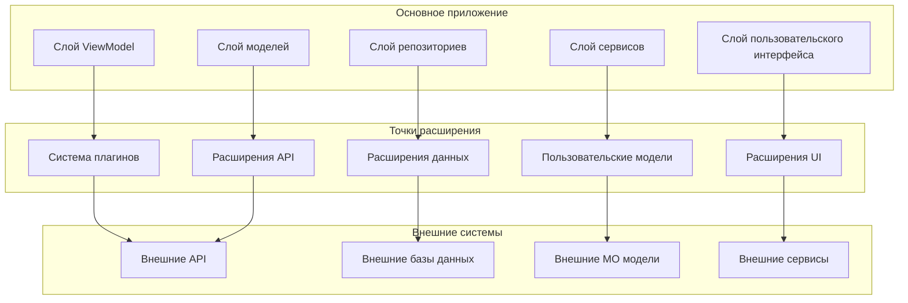

# Расширение функциональности CulicidaeLab Mobile

## Обзор

Мобильное приложение CulicidaeLab разработано с учетом расширяемости, предоставляя множественные пути для исследователей, разработчиков и учреждений для настройки и расширения его функциональности. Это руководство охватывает разработку плагинов, интеграцию пользовательских моделей, расширения конвейера данных и подходы к настройке пользовательского интерфейса.

## Архитектура для расширений

### Точки расширения

Приложение предоставляет несколько четко определенных точек расширения:



### Архитектура плагинов

Основная система плагинов предоставляет стандартизированный способ расширения функциональности:

```dart
// Основной интерфейс плагина
abstract class CulicidaeLabPlugin {
  /// Уникальный идентификатор плагина
  String get pluginId;
  
  /// Человекочитаемое название плагина
  String get name;
  
  /// Версия плагина
  String get version;
  
  /// Список функций, которые предоставляет этот плагин
  List<String> get supportedFeatures;
  
  /// Зависимости плагина
  List<String> get dependencies;
  
  /// Инициализация плагина
  Future<void> initialize(PluginContext context);
  
  /// Обработка данных через плагин
  Future<PluginResult> processData(PluginInput input);
  
  /// Получение UI конфигурации плагина
  Widget? getConfigurationWidget();
  
  /// Очистка ресурсов плагина
  Future<void> dispose();
  
  /// Метаданные плагина
  Map<String, dynamic> get metadata;
}

// Контекст плагина предоставляет доступ к основным сервисам
class PluginContext {
  final DatabaseService databaseService;
  final ClassificationService classificationService;
  final UserService userService;
  final Map<String, dynamic> appConfiguration;
  final PluginLogger logger;
  
  PluginContext({
    required this.databaseService,
    required this.classificationService,
    required this.userService,
    required this.appConfiguration,
    required this.logger,
  });
}

// Стандартизированный ввод/вывод плагина
class PluginInput {
  final String operation;
  final Map<String, dynamic> data;
  final Map<String, dynamic> metadata;
  
  PluginInput({
    required this.operation,
    required this.data,
    this.metadata = const {},
  });
}

class PluginResult {
  final bool success;
  final Map<String, dynamic> data;
  final String? errorMessage;
  final Map<String, dynamic> metadata;
  
  PluginResult({
    required this.success,
    this.data = const {},
    this.errorMessage,
    this.metadata = const {},
  });
  
  factory PluginResult.success(Map<String, dynamic> data) {
    return PluginResult(success: true, data: data);
  }
  
  factory PluginResult.error(String message) {
    return PluginResult(success: false, errorMessage: message);
  }
}
```

## Пользовательские модели классификации

### Интерфейс интеграции моделей

```dart
// Интерфейс для пользовательских моделей классификации
abstract class CustomClassificationModel {
  /// Идентификатор модели
  String get modelId;
  
  /// Версия модели
  String get version;
  
  /// Список поддерживаемых видов
  List<String> get supportedSpecies;
  
  /// Метаданные модели
  ModelMetadata get metadata;
  
  /// Загрузка модели
  Future<void> loadModel();
  
  /// Классификация изображения
  Future<ClassificationResult> classify(File imageFile);
  
  /// Пакетная классификация
  Future<List<ClassificationResult>> classifyBatch(List<File> imageFiles);
  
  /// Получение метрик производительности модели
  Future<ModelPerformanceMetrics> getPerformanceMetrics();
  
  /// Выгрузка модели
  Future<void> unloadModel();
  
  /// Проверка загружена ли модель
  bool get isLoaded;
}

class ModelMetadata {
  final String name;
  final String description;
  final String author;
  final DateTime createdAt;
  final String license;
  final List<String> trainingDatasets;
  final Map<String, dynamic> hyperparameters;
  final ModelPerformanceMetrics performanceMetrics;
  
  ModelMetadata({
    required this.name,
    required this.description,
    required this.author,
    required this.createdAt,
    required this.license,
    required this.trainingDatasets,
    required this.hyperparameters,
    required this.performanceMetrics,
  });
}

class ModelPerformanceMetrics {
  final double accuracy;
  final double precision;
  final double recall;
  final double f1Score;
  final Map<String, double> perClassAccuracy;
  final int totalParameters;
  final double modelSizeMB;
  final double averageInferenceTimeMs;
  
  ModelPerformanceMetrics({
    required this.accuracy,
    required this.precision,
    required this.recall,
    required this.f1Score,
    required this.perClassAccuracy,
    required this.totalParameters,
    required this.modelSizeMB,
    required this.averageInferenceTimeMs,
  });
}
```#
## Пример модели TensorFlow Lite

```dart
class CustomTensorFlowLiteModel implements CustomClassificationModel {
  late Interpreter _interpreter;
  late List<String> _labels;
  bool _isLoaded = false;
  
  @override
  String get modelId => 'custom_tflite_mosquito_v2';
  
  @override
  String get version => '2.1.0';
  
  @override
  List<String> get supportedSpecies => _labels;
  
  @override
  ModelMetadata get metadata => ModelMetadata(
    name: 'Пользовательский классификатор комаров TensorFlow Lite',
    description: 'Улучшенная модель классификации видов комаров с повышенной точностью',
    author: 'Исследовательская команда XYZ',
    createdAt: DateTime(2024, 1, 15),
    license: 'Apache 2.0',
    trainingDatasets: ['mosquito_dataset_46_3139', 'custom_field_data_2024'],
    hyperparameters: {
      'learning_rate': 0.001,
      'batch_size': 32,
      'epochs': 100,
      'optimizer': 'Adam',
      'input_size': [224, 224, 3],
    },
    performanceMetrics: ModelPerformanceMetrics(
      accuracy: 0.94,
      precision: 0.93,
      recall: 0.92,
      f1Score: 0.925,
      perClassAccuracy: {
        'Aedes aegypti': 0.96,
        'Aedes albopictus': 0.94,
        'Culex pipiens': 0.91,
        // ... другие виды
      },
      totalParameters: 2500000,
      modelSizeMB: 9.8,
      averageInferenceTimeMs: 180.0,
    ),
  );
  
  @override
  bool get isLoaded => _isLoaded;
  
  @override
  Future<void> loadModel() async {
    try {
      // Загрузка модели TensorFlow Lite
      final modelFile = await _loadModelAsset('assets/models/custom_model.tflite');
      _interpreter = Interpreter.fromFile(modelFile);
      
      // Загрузка меток
      final labelsString = await rootBundle.loadString('assets/models/custom_labels.txt');
      _labels = labelsString.split('\n').where((label) => label.isNotEmpty).toList();
      
      _isLoaded = true;
      print('Пользовательская модель TensorFlow Lite успешно загружена');
    } catch (e) {
      throw ModelLoadException('Не удалось загрузить пользовательскую модель TensorFlow Lite: $e');
    }
  }
  
  @override
  Future<ClassificationResult> classify(File imageFile) async {
    if (!_isLoaded) {
      throw ModelNotLoadedException('Модель должна быть загружена перед классификацией');
    }
    
    final stopwatch = Stopwatch()..start();
    
    try {
      // Предобработка изображения
      final input = await _preprocessImage(imageFile);
      
      // Выполнение вывода
      final output = List.filled(_labels.length, 0.0).reshape([1, _labels.length]);
      _interpreter.run(input, output);
      
      // Постобработка результатов
      final probabilities = output[0] as List<double>;
      final maxIndex = probabilities.indexOf(probabilities.reduce(math.max));
      final confidence = probabilities[maxIndex];
      final speciesName = _labels[maxIndex];
      
      stopwatch.stop();
      
      // Создание объекта вида
      final species = await _createSpeciesFromName(speciesName);
      final relatedDiseases = await _getRelatedDiseases(species);
      
      return ClassificationResult(
        species: species,
        confidence: confidence,
        inferenceTime: stopwatch.elapsedMilliseconds,
        relatedDiseases: relatedDiseases,
        imageFile: imageFile,
      );
    } catch (e) {
      throw ClassificationException('Классификация не удалась: $e');
    }
  }
  
  @override
  Future<List<ClassificationResult>> classifyBatch(List<File> imageFiles) async {
    final results = <ClassificationResult>[];
    
    for (final imageFile in imageFiles) {
      try {
        final result = await classify(imageFile);
        results.add(result);
      } catch (e) {
        print('Не удалось классифицировать ${imageFile.path}: $e');
        // Продолжить с другими изображениями
      }
    }
    
    return results;
  }
  
  Future<List<List<List<List<double>>>>> _preprocessImage(File imageFile) async {
    // Загрузка и декодирование изображения
    final bytes = await imageFile.readAsBytes();
    final image = img.decodeImage(bytes);
    
    if (image == null) {
      throw ImageProcessingException('Не удалось декодировать изображение');
    }
    
    // Изменение размера до размера входа модели
    final resized = img.copyResize(image, width: 224, height: 224);
    
    // Преобразование в нормализованный массив float
    final input = List.generate(
      1,
      (batch) => List.generate(
        224,
        (y) => List.generate(
          224,
          (x) => List.generate(3, (c) {
            final pixel = resized.getPixel(x, y);
            switch (c) {
              case 0: return (pixel.r / 255.0 - 0.485) / 0.229; // Красный канал
              case 1: return (pixel.g / 255.0 - 0.456) / 0.224; // Зеленый канал
              case 2: return (pixel.b / 255.0 - 0.406) / 0.225; // Синий канал
              default: return 0.0;
            }
          }),
        ),
      ),
    );
    
    return input;
  }
  
  @override
  Future<ModelPerformanceMetrics> getPerformanceMetrics() async {
    return metadata.performanceMetrics;
  }
  
  @override
  Future<void> unloadModel() async {
    if (_isLoaded) {
      _interpreter.close();
      _isLoaded = false;
      print('Пользовательская модель TensorFlow Lite выгружена');
    }
  }
  
  Future<File> _loadModelAsset(String assetPath) async {
    final byteData = await rootBundle.load(assetPath);
    final tempDir = await getTemporaryDirectory();
    final file = File('${tempDir.path}/custom_model.tflite');
    await file.writeAsBytes(byteData.buffer.asUint8List());
    return file;
  }
}

// Пользовательские исключения
class ModelLoadException implements Exception {
  final String message;
  ModelLoadException(this.message);
  @override
  String toString() => 'ModelLoadException: $message';
}

class ModelNotLoadedException implements Exception {
  final String message;
  ModelNotLoadedException(this.message);
  @override
  String toString() => 'ModelNotLoadedException: $message';
}

class ClassificationException implements Exception {
  final String message;
  ClassificationException(this.message);
  @override
  String toString() => 'ClassificationException: $message';
}

class ImageProcessingException implements Exception {
  final String message;
  ImageProcessingException(this.message);
  @override
  String toString() => 'ImageProcessingException: $message';
}
```

### Интеграция модели ONNX

```dart
class ONNXClassificationModel implements CustomClassificationModel {
  late OnnxDart _session;
  late List<String> _labels;
  bool _isLoaded = false;
  
  @override
  String get modelId => 'onnx_mosquito_classifier_v1';
  
  @override
  String get version => '1.0.0';
  
  @override
  List<String> get supportedSpecies => _labels;
  
  @override
  bool get isLoaded => _isLoaded;
  
  @override
  Future<void> loadModel() async {
    try {
      // Загрузка модели ONNX
      final modelBytes = await rootBundle.load('assets/models/mosquito_classifier.onnx');
      _session = OnnxDart.createSession(modelBytes.buffer.asUint8List());
      
      // Загрузка меток
      final labelsString = await rootBundle.loadString('assets/models/onnx_labels.txt');
      _labels = labelsString.split('\n').where((label) => label.isNotEmpty).toList();
      
      _isLoaded = true;
      print('Модель ONNX успешно загружена');
    } catch (e) {
      throw ModelLoadException('Не удалось загрузить модель ONNX: $e');
    }
  }
  
  @override
  Future<ClassificationResult> classify(File imageFile) async {
    if (!_isLoaded) {
      throw ModelNotLoadedException('Модель ONNX должна быть загружена перед классификацией');
    }
    
    final stopwatch = Stopwatch()..start();
    
    try {
      // Предобработка изображения для ONNX
      final inputTensor = await _preprocessImageForONNX(imageFile);
      
      // Выполнение вывода ONNX
      final outputs = _session.run({'input': inputTensor});
      final probabilities = outputs['output'] as List<double>;
      
      // Поиск лучшего предсказания
      final maxIndex = probabilities.indexOf(probabilities.reduce(math.max));
      final confidence = probabilities[maxIndex];
      final speciesName = _labels[maxIndex];
      
      stopwatch.stop();
      
      // Создание результата
      final species = await _createSpeciesFromName(speciesName);
      final relatedDiseases = await _getRelatedDiseases(species);
      
      return ClassificationResult(
        species: species,
        confidence: confidence,
        inferenceTime: stopwatch.elapsedMilliseconds,
        relatedDiseases: relatedDiseases,
        imageFile: imageFile,
      );
    } catch (e) {
      throw ClassificationException('Классификация ONNX не удалась: $e');
    }
  }
  
  Future<List<List<List<double>>>> _preprocessImageForONNX(File imageFile) async {
    // Предобработка специфичная для ONNX
    final bytes = await imageFile.readAsBytes();
    final image = img.decodeImage(bytes);
    
    if (image == null) {
      throw ImageProcessingException('Не удалось декодировать изображение для ONNX');
    }
    
    final resized = img.copyResize(image, width: 224, height: 224);
    
    // ONNX ожидает формат CHW (Channel, Height, Width)
    final input = List.generate(3, (c) =>
      List.generate(224, (h) =>
        List.generate(224, (w) {
          final pixel = resized.getPixel(w, h);
          switch (c) {
            case 0: return (pixel.r / 255.0 - 0.485) / 0.229;
            case 1: return (pixel.g / 255.0 - 0.456) / 0.224;
            case 2: return (pixel.b / 255.0 - 0.406) / 0.225;
            default: return 0.0;
          }
        })
      )
    );
    
    return input;
  }
  
  @override
  Future<void> unloadModel() async {
    if (_isLoaded) {
      _session.release();
      _isLoaded = false;
      print('Модель ONNX выгружена');
    }
  }
}
```

## Расширения конвейера данных

### Пользовательские процессоры данных

```dart
// Интерфейс для плагинов обработки данных
abstract class DataProcessor {
  String get processorId;
  String get name;
  List<String> get supportedDataTypes;
  
  Future<ProcessingResult> processData(ProcessingInput input);
  Future<void> initialize();
  Future<void> dispose();
}

// Пример процессора экологических данных
class EnvironmentalDataProcessor implements DataProcessor {
  late WeatherAPI _weatherAPI;
  late SoilAPI _soilAPI;
  
  @override
  String get processorId => 'environmental_data_processor';
  
  @override
  String get name => 'Процессор экологических данных';
  
  @override
  List<String> get supportedDataTypes => [
    'weather_data',
    'soil_data',
    'vegetation_data',
    'water_quality_data'
  ];
  
  @override
  Future<void> initialize() async {
    _weatherAPI = WeatherAPI(apiKey: await _getWeatherAPIKey());
    _soilAPI = SoilAPI(apiKey: await _getSoilAPIKey());
  }
  
  @override
  Future<ProcessingResult> processData(ProcessingInput input) async {
    final location = Location.fromJson(input.data['location']);
    final timestamp = DateTime.parse(input.data['timestamp']);
    
    try {
      final results = <String, dynamic>{};
      
      // Сбор данных о погоде
      if (input.requestedTypes.contains('weather_data')) {
        results['weather_data'] = await _collectWeatherData(location, timestamp);
      }
      
      // Сбор данных о почве
      if (input.requestedTypes.contains('soil_data')) {
        results['soil_data'] = await _collectSoilData(location);
      }
      
      // Сбор данных о растительности
      if (input.requestedTypes.contains('vegetation_data')) {
        results['vegetation_data'] = await _collectVegetationData(location);
      }
      
      return ProcessingResult.success(results);
    } catch (e) {
      return ProcessingResult.error('Сбор экологических данных не удался: $e');
    }
  }
  
  Future<Map<String, dynamic>> _collectWeatherData(Location location, DateTime timestamp) async {
    final weatherData = await _weatherAPI.getWeatherData(
      latitude: location.lat,
      longitude: location.lng,
      timestamp: timestamp,
    );
    
    return {
      'temperature_celsius': weatherData.temperature,
      'humidity_percent': weatherData.humidity,
      'pressure_hpa': weatherData.pressure,
      'wind_speed_ms': weatherData.windSpeed,
      'wind_direction_degrees': weatherData.windDirection,
      'precipitation_mm': weatherData.precipitation,
      'cloud_cover_percent': weatherData.cloudCover,
      'uv_index': weatherData.uvIndex,
      'visibility_km': weatherData.visibility,
    };
  }
  
  Future<Map<String, dynamic>> _collectSoilData(Location location) async {
    final soilData = await _soilAPI.getSoilData(
      latitude: location.lat,
      longitude: location.lng,
    );
    
    return {
      'soil_type': soilData.type,
      'ph_level': soilData.phLevel,
      'organic_matter_percent': soilData.organicMatter,
      'nitrogen_ppm': soilData.nitrogen,
      'phosphorus_ppm': soilData.phosphorus,
      'potassium_ppm': soilData.potassium,
      'moisture_percent': soilData.moisture,
      'temperature_celsius': soilData.temperature,
    };
  }
  
  Future<Map<String, dynamic>> _collectVegetationData(Location location) async {
    // Использование спутниковых снимков или локальных баз данных для данных о растительности
    return {
      'vegetation_type': 'mixed_forest',
      'canopy_cover_percent': 75.0,
      'dominant_species': ['Дуб', 'Сосна', 'Береза'],
      'ndvi_index': 0.65,
      'leaf_area_index': 4.2,
    };
  }
  
  @override
  Future<void> dispose() async {
    await _weatherAPI.dispose();
    await _soilAPI.dispose();
  }
}

class ProcessingInput {
  final Map<String, dynamic> data;
  final List<String> requestedTypes;
  final Map<String, dynamic> options;
  
  ProcessingInput({
    required this.data,
    required this.requestedTypes,
    this.options = const {},
  });
}

class ProcessingResult {
  final bool success;
  final Map<String, dynamic> data;
  final String? errorMessage;
  final Map<String, dynamic> metadata;
  
  ProcessingResult({
    required this.success,
    this.data = const {},
    this.errorMessage,
    this.metadata = const {},
  });
  
  factory ProcessingResult.success(Map<String, dynamic> data) {
    return ProcessingResult(success: true, data: data);
  }
  
  factory ProcessingResult.error(String message) {
    return ProcessingResult(success: false, errorMessage: message);
  }
}
```##
# Пользовательские форматы экспорта

```dart
// Интерфейс для пользовательских форматов экспорта
abstract class DataExporter {
  String get exporterId;
  String get name;
  String get fileExtension;
  List<String> get supportedDataTypes;
  
  Future<ExportResult> exportData(ExportRequest request);
  Future<bool> validateData(List<dynamic> data);
}

// Экспортер для исследований
class ResearchDataExporter implements DataExporter {
  @override
  String get exporterId => 'research_data_exporter';
  
  @override
  String get name => 'Экспортер исследовательских данных';
  
  @override
  String get fileExtension => '.rdf'; // Формат исследовательских данных
  
  @override
  List<String> get supportedDataTypes => [
    'observations',
    'classifications',
    'environmental_data',
    'species_data'
  ];
  
  @override
  Future<ExportResult> exportData(ExportRequest request) async {
    try {
      final exportData = <String, dynamic>{};
      
      // Добавление метаданных
      exportData['metadata'] = {
        'export_timestamp': DateTime.now().toIso8601String(),
        'exporter_version': '1.0.0',
        'data_format_version': '2.1',
        'total_records': request.data.length,
        'export_parameters': request.parameters,
      };
      
      // Обработка различных типов данных
      if (request.dataType == 'observations') {
        exportData['observations'] = await _exportObservations(request.data as List<Observation>);
      } else if (request.dataType == 'classifications') {
        exportData['classifications'] = await _exportClassifications(request.data as List<ClassificationResult>);
      }
      
      // Добавление анализа при запросе
      if (request.parameters['include_analysis'] == true) {
        exportData['analysis'] = await _generateAnalysis(request.data);
      }
      
      // Преобразование в указанный формат
      final content = await _formatData(exportData, request.format);
      
      return ExportResult.success(content);
    } catch (e) {
      return ExportResult.error('Экспорт не удался: $e');
    }
  }
  
  Future<List<Map<String, dynamic>>> _exportObservations(List<Observation> observations) async {
    return observations.map((obs) => {
      'observation_id': obs.id,
      'species': {
        'scientific_name': obs.speciesScientificName,
        'taxonomic_classification': await _getTaxonomicClassification(obs.speciesScientificName),
      },
      'spatial': {
        'latitude': obs.location.lat,
        'longitude': obs.location.lng,
        'coordinate_system': 'WGS84',
        'accuracy_meters': obs.locationAccuracyM,
        'elevation_meters': null, // Может быть добавлено при наличии
      },
      'temporal': {
        'observed_at': obs.observedAt.toIso8601String(),
        'day_of_year': obs.observedAt.dayOfYear,
        'season': _calculateSeason(obs.observedAt),
        'time_of_day': _calculateTimeOfDay(obs.observedAt),
      },
      'identification': {
        'confidence': obs.confidence,
        'model_id': obs.modelId,
        'identification_method': obs.dataSource,
        'expert_verified': false, // Может быть расширено
      },
      'context': {
        'observer_notes': obs.notes,
        'specimen_count': obs.count,
        'additional_metadata': obs.metadata,
      },
    }).toList();
  }
  
  Future<String> _formatData(Map<String, dynamic> data, String format) async {
    switch (format.toLowerCase()) {
      case 'json':
        return jsonEncode(data);
      case 'yaml':
        return _convertToYAML(data);
      case 'xml':
        return _convertToXML(data);
      case 'csv':
        return _convertToCSV(data);
      default:
        throw ArgumentError('Неподдерживаемый формат: $format');
    }
  }
  
  @override
  Future<bool> validateData(List<dynamic> data) async {
    // Реализация логики валидации данных
    for (final item in data) {
      if (item is Observation) {
        if (!_isValidObservation(item)) return false;
      } else if (item is ClassificationResult) {
        if (!_isValidClassificationResult(item)) return false;
      }
    }
    return true;
  }
  
  bool _isValidObservation(Observation obs) {
    return obs.id.isNotEmpty &&
           obs.speciesScientificName.isNotEmpty &&
           obs.location.lat >= -90 && obs.location.lat <= 90 &&
           obs.location.lng >= -180 && obs.location.lng <= 180;
  }
}

class ExportRequest {
  final String dataType;
  final List<dynamic> data;
  final String format;
  final Map<String, dynamic> parameters;
  
  ExportRequest({
    required this.dataType,
    required this.data,
    required this.format,
    this.parameters = const {},
  });
}

class ExportResult {
  final bool success;
  final String? content;
  final String? errorMessage;
  final Map<String, dynamic> metadata;
  
  ExportResult({
    required this.success,
    this.content,
    this.errorMessage,
    this.metadata = const {},
  });
  
  factory ExportResult.success(String content) {
    return ExportResult(success: true, content: content);
  }
  
  factory ExportResult.error(String message) {
    return ExportResult(success: false, errorMessage: message);
  }
}
```

## Расширения пользовательского интерфейса

### Пользовательские экраны и виджеты

```dart
// Интерфейс для расширений UI
abstract class UIExtension {
  String get extensionId;
  String get name;
  List<String> get supportedScreens;
  
  Widget buildExtensionWidget(BuildContext context, Map<String, dynamic> parameters);
  List<NavigationItem> getNavigationItems();
  List<ActionItem> getActionItems(String screenId);
}

// Расширение UI исследовательских инструментов
class ResearchToolsExtension implements UIExtension {
  @override
  String get extensionId => 'research_tools_extension';
  
  @override
  String get name => 'Исследовательские инструменты';
  
  @override
  List<String> get supportedScreens => [
    'data_analysis',
    'field_session',
    'batch_processing',
    'export_manager'
  ];
  
  @override
  Widget buildExtensionWidget(BuildContext context, Map<String, dynamic> parameters) {
    final screenId = parameters['screen_id'] as String;
    
    switch (screenId) {
      case 'data_analysis':
        return DataAnalysisScreen();
      case 'field_session':
        return FieldSessionScreen();
      case 'batch_processing':
        return BatchProcessingScreen();
      case 'export_manager':
        return ExportManagerScreen();
      default:
        return Container(
          child: Text('Неизвестный экран: $screenId'),
        );
    }
  }
  
  @override
  List<NavigationItem> getNavigationItems() {
    return [
      NavigationItem(
        id: 'research_tools',
        title: 'Исследовательские инструменты',
        icon: Icons.science,
        route: '/research-tools',
      ),
      NavigationItem(
        id: 'data_analysis',
        title: 'Анализ данных',
        icon: Icons.analytics,
        route: '/research-tools/analysis',
      ),
    ];
  }
  
  @override
  List<ActionItem> getActionItems(String screenId) {
    switch (screenId) {
      case 'classification_screen':
        return [
          ActionItem(
            id: 'start_field_session',
            title: 'Начать полевую сессию',
            icon: Icons.play_arrow,
            onTap: (context) => _startFieldSession(context),
          ),
        ];
      case 'observation_details_screen':
        return [
          ActionItem(
            id: 'add_environmental_data',
            title: 'Добавить экологические данные',
            icon: Icons.eco,
            onTap: (context) => _addEnvironmentalData(context),
          ),
        ];
      default:
        return [];
    }
  }
  
  void _startFieldSession(BuildContext context) {
    Navigator.push(
      context,
      MaterialPageRoute(builder: (context) => FieldSessionScreen()),
    );
  }
  
  void _addEnvironmentalData(BuildContext context) {
    showDialog(
      context: context,
      builder: (context) => EnvironmentalDataDialog(),
    );
  }
}

class NavigationItem {
  final String id;
  final String title;
  final IconData icon;
  final String route;
  
  NavigationItem({
    required this.id,
    required this.title,
    required this.icon,
    required this.route,
  });
}

class ActionItem {
  final String id;
  final String title;
  final IconData icon;
  final Function(BuildContext) onTap;
  
  ActionItem({
    required this.id,
    required this.title,
    required this.icon,
    required this.onTap,
  });
}

// Пример пользовательского исследовательского экрана
class DataAnalysisScreen extends StatefulWidget {
  @override
  _DataAnalysisScreenState createState() => _DataAnalysisScreenState();
}

class _DataAnalysisScreenState extends State<DataAnalysisScreen> {
  List<Observation> _observations = [];
  Map<String, dynamic> _analysisResults = {};
  bool _isAnalyzing = false;
  
  @override
  void initState() {
    super.initState();
    _loadObservations();
  }
  
  @override
  Widget build(BuildContext context) {
    return Scaffold(
      appBar: AppBar(
        title: Text('Анализ данных'),
        actions: [
          IconButton(
            icon: Icon(Icons.refresh),
            onPressed: _refreshAnalysis,
          ),
          IconButton(
            icon: Icon(Icons.export_notes),
            onPressed: _exportResults,
          ),
        ],
      ),
      body: Column(
        children: [
          _buildAnalysisControls(),
          Expanded(
            child: _isAnalyzing
                ? Center(child: CircularProgressIndicator())
                : _buildAnalysisResults(),
          ),
        ],
      ),
    );
  }
  
  Widget _buildAnalysisControls() {
    return Card(
      margin: EdgeInsets.all(16),
      child: Padding(
        padding: EdgeInsets.all(16),
        child: Column(
          crossAxisAlignment: CrossAxisAlignment.start,
          children: [
            Text(
              'Параметры анализа',
              style: Theme.of(context).textTheme.headlineSmall,
            ),
            SizedBox(height: 16),
            Row(
              children: [
                Expanded(
                  child: ElevatedButton(
                    onPressed: _performSpeciesAnalysis,
                    child: Text('Анализ видов'),
                  ),
                ),
                SizedBox(width: 8),
                Expanded(
                  child: ElevatedButton(
                    onPressed: _performTemporalAnalysis,
                    child: Text('Временной анализ'),
                  ),
                ),
              ],
            ),
            SizedBox(height: 8),
            Row(
              children: [
                Expanded(
                  child: ElevatedButton(
                    onPressed: _performSpatialAnalysis,
                    child: Text('Пространственный анализ'),
                  ),
                ),
                SizedBox(width: 8),
                Expanded(
                  child: ElevatedButton(
                    onPressed: _performQualityAnalysis,
                    child: Text('Анализ качества'),
                  ),
                ),
              ],
            ),
          ],
        ),
      ),
    );
  }
  
  Widget _buildAnalysisResults() {
    if (_analysisResults.isEmpty) {
      return Center(
        child: Text(
          'Выберите тип анализа для начала',
          style: Theme.of(context).textTheme.bodyLarge,
        ),
      );
    }
    
    return ListView(
      padding: EdgeInsets.all(16),
      children: _analysisResults.entries.map((entry) {
        return Card(
          child: ListTile(
            title: Text(entry.key),
            subtitle: Text(entry.value.toString()),
          ),
        );
      }).toList(),
    );
  }
  
  Future<void> _loadObservations() async {
    // Загрузка наблюдений из базы данных
    final repository = locator<ObservationRepository>();
    final observations = await repository.getAllObservations();
    setState(() {
      _observations = observations;
    });
  }
  
  Future<void> _performSpeciesAnalysis() async {
    setState(() {
      _isAnalyzing = true;
    });
    
    try {
      final analyzer = SpeciesAnalyzer();
      final results = await analyzer.analyzeSpeciesDistribution(_observations);
      
      setState(() {
        _analysisResults = results;
        _isAnalyzing = false;
      });
    } catch (e) {
      setState(() {
        _isAnalyzing = false;
      });
      _showErrorDialog('Ошибка анализа видов: $e');
    }
  }
  
  Future<void> _performTemporalAnalysis() async {
    setState(() {
      _isAnalyzing = true;
    });
    
    try {
      final analyzer = TemporalAnalyzer();
      final results = await analyzer.analyzeTemporalPatterns(_observations);
      
      setState(() {
        _analysisResults = results;
        _isAnalyzing = false;
      });
    } catch (e) {
      setState(() {
        _isAnalyzing = false;
      });
      _showErrorDialog('Ошибка временного анализа: $e');
    }
  }
  
  Future<void> _performSpatialAnalysis() async {
    setState(() {
      _isAnalyzing = true;
    });
    
    try {
      final analyzer = SpatialAnalyzer();
      final results = await analyzer.analyzeSpatialPatterns(_observations);
      
      setState(() {
        _analysisResults = results;
        _isAnalyzing = false;
      });
    } catch (e) {
      setState(() {
        _isAnalyzing = false;
      });
      _showErrorDialog('Ошибка пространственного анализа: $e');
    }
  }
  
  Future<void> _performQualityAnalysis() async {
    setState(() {
      _isAnalyzing = true;
    });
    
    try {
      final analyzer = QualityAnalyzer();
      final results = await analyzer.analyzeDataQuality(_observations);
      
      setState(() {
        _analysisResults = results;
        _isAnalyzing = false;
      });
    } catch (e) {
      setState(() {
        _isAnalyzing = false;
      });
      _showErrorDialog('Ошибка анализа качества: $e');
    }
  }
  
  void _refreshAnalysis() {
    _loadObservations();
    setState(() {
      _analysisResults.clear();
    });
  }
  
  void _exportResults() {
    // Реализация экспорта результатов
    final exporter = ResearchDataExporter();
    // ... логика экспорта
  }
  
  void _showErrorDialog(String message) {
    showDialog(
      context: context,
      builder: (context) => AlertDialog(
        title: Text('Ошибка'),
        content: Text(message),
        actions: [
          TextButton(
            onPressed: () => Navigator.of(context).pop(),
            child: Text('OK'),
          ),
        ],
      ),
    );
  }
}
```

## Заключение

Система расширений CulicidaeLab предоставляет мощные возможности для настройки и расширения функциональности мобильного приложения. Следуя архитектурным паттернам и интерфейсам, описанным в этом руководстве, разработчики могут:

- **Создавать пользовательские модели классификации** для специализированных случаев использования
- **Разрабатывать плагины обработки данных** для интеграции с внешними системами
- **Реализовывать пользовательские форматы экспорта** для исследовательских нужд
- **Расширять пользовательский интерфейс** с дополнительными экранами и функциями

Эта расширяемая архитектура обеспечивает, что приложение CulicidaeLab может адаптироваться к разнообразным исследовательским потребностям и развиваться вместе с научным сообществом.