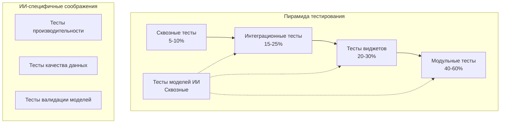

# Руководство по тестированию для мобильных приложений с поддержкой ИИ

Это комплексное руководство охватывает стратегии и подходы к тестированию, специально разработанные для мобильных приложений с поддержкой ИИ, с примерами из системы классификации комаров проекта CulicidaeLab.

## Содержание

1. [Обзор стратегии тестирования](#обзор-стратегии-тестирования)
2. [Модульное тестирование](#модульное-тестирование)
3. [Тестирование виджетов](#тестирование-виджетов)
4. [Интеграционное тестирование](#интеграционное-тестирование)
5. [Тестирование моделей ИИ](#тестирование-моделей-ии)
6. [Тестирование производительности](#тестирование-производительности)
7. [Сквозное тестирование](#сквозное-тестирование)
8. [Стратегии мокирования](#стратегии-мокирования)
9. [Управление тестовыми данными](#управление-тестовыми-данными)
10. [Тестирование непрерывной интеграции](#тестирование-непрерывной-интеграции)

## Обзор стратегии тестирования

### Пирамида тестирования для ИИ приложений



### Категории тестов

1. **Модульные тесты**: Тестирование отдельных компонентов в изоляции
2. **Тесты виджетов**: Тестирование UI компонентов и их взаимодействий
3. **Интеграционные тесты**: Тестирование взаимодействий компонентов и потока данных
4. **Тесты моделей ИИ**: Валидация поведения и производительности моделей
5. **Тесты производительности**: Измерение и валидация метрик производительности
6. **Сквозные тесты**: Тестирование полных пользовательских рабочих процессов

## Модульное тестирование

### Тестирование ViewModel

ViewModels содержат основную бизнес-логику и должны быть тщательно протестированы.

#### Базовая структура теста ViewModel

```dart
// test/unit/view_models/classification_view_model_test.dart
import 'package:flutter_test/flutter_test.dart';
import 'package:mockito/mockito.dart';
import 'package:mockito/annotations.dart';

@GenerateMocks([ClassificationRepository, UserService])
import 'classification_view_model_test.mocks.dart';

void main() {
  group('ClassificationViewModel', () {
    late ClassificationViewModel viewModel;
    late MockClassificationRepository mockRepository;
    late MockUserService mockUserService;
    
    setUp(() {
      mockRepository = MockClassificationRepository();
      mockUserService = MockUserService();
      viewModel = ClassificationViewModel(
        repository: mockRepository,
        userService: mockUserService,
      );
    });
    
    tearDown(() {
      viewModel.dispose();
    });
    
    group('Начальное состояние', () {
      test('должен начинать с правильного начального состояния', () {
        expect(viewModel.state, ClassificationState.initial);
        expect(viewModel.hasImage, false);
        expect(viewModel.result, null);
        expect(viewModel.errorMessage, null);
      });
    });
    
    group('Классификация изображений', () {
      test('должен обновлять состояние во время процесса классификации', () async {
        // Arrange
        final testFile = File('test_image.jpg');
        final expectedResult = ClassificationResult(
          species: createTestSpecies(),
          confidence: 95.0,
          inferenceTime: 150,
          relatedDiseases: [],
          imageFile: testFile,
        );
        
        when(mockRepository.classifyImage(any, any))
            .thenAnswer((_) async => expectedResult);
        
        viewModel.setImageFile(testFile);
        
        // Act & Assert
        expect(viewModel.state, ClassificationState.initial);
        
        final future = viewModel.classifyImage(MockAppLocalizations());
        expect(viewModel.state, ClassificationState.loading);
        
        await future;
        expect(viewModel.state, ClassificationState.success);
        expect(viewModel.result, expectedResult);
      });
      
      test('должен грациозно обрабатывать ошибки классификации', () async {
        // Arrange
        when(mockRepository.classifyImage(any, any))
            .thenThrow(Exception('Ошибка сети'));
        
        viewModel.setImageFile(File('test_image.jpg'));
        
        // Act
        await viewModel.classifyImage(MockAppLocalizations());
        
        // Assert
        expect(viewModel.state, ClassificationState.error);
        expect(viewModel.errorMessage, contains('Классификация не удалась'));
        expect(viewModel.result, null);
      });
    });
  });
}
```

### Тестирование сервисов

Тестирование сервисов, которые обрабатывают внешние зависимости и сложную логику.

#### Тесты сервиса классификации

```dart
// test/unit/services/classification_service_test.dart
void main() {
  group('ClassificationService', () {
    late ClassificationService service;
    late MockPytorchWrapper mockWrapper;
    late MockClassificationModel mockModel;
    
    setUp(() {
      mockWrapper = MockPytorchWrapper();
      mockModel = MockClassificationModel();
      service = ClassificationService(pytorchWrapper: mockWrapper);
    });
    
    group('Загрузка модели', () {
      test('должен успешно загружать модель', () async {
        // Arrange
        when(mockWrapper.loadClassificationModel(any, any, any, labelPath: any))
            .thenAnswer((_) async => mockModel);
        
        // Act
        await service.loadModel();
        
        // Assert
        expect(service.isModelLoaded, true);
        verify(mockWrapper.loadClassificationModel(
          'assets/models/mosquito_classifier.pt',
          224,
          224,
          labelPath: 'assets/labels/mosquito_species.txt',
        )).called(1);
      });
      
      test('должен обрабатывать исключения платформы', () async {
        // Arrange
        when(mockWrapper.loadClassificationModel(any, any, any, labelPath: any))
            .thenThrow(PlatformException(code: 'UNAVAILABLE'));
        
        // Act & Assert
        expect(
          () => service.loadModel(),
          throwsA(isA<Exception>().having(
            (e) => e.toString(),
            'message',
            contains('поддерживается только для Android/iOS'),
          )),
        );
      });
    });
    
    group('Классификация изображений', () {
      test('должен классифицировать изображение и возвращать результаты', () async {
        // Arrange
        final testFile = File('test_image.jpg');
        final mockBytes = Uint8List.fromList([1, 2, 3, 4]);
        
        when(mockModel.getImagePredictionResult(any))
            .thenAnswer((_) async => {
              'label': 'Aedes aegypti',
              'probability': 0.95,
            });
        
        // Мокирование файловых операций
        when(testFile.readAsBytes()).thenAnswer((_) async => mockBytes);
        
        service.setModel(mockModel); // Вспомогательный метод для тестов
        
        // Act
        final result = await service.classifyImage(testFile);
        
        // Assert
        expect(result['scientificName'], 'Aedes aegypti');
        expect(result['confidence'], 0.95);
        verify(mockModel.getImagePredictionResult(mockBytes)).called(1);
      });
      
      test('должен выбрасывать исключение когда модель не загружена', () async {
        // Arrange
        final testFile = File('test_image.jpg');
        
        // Act & Assert
        expect(
          () => service.classifyImage(testFile),
          throwsA(isA<Exception>().having(
            (e) => e.toString(),
            'message',
            contains('Модель не загружена'),
          )),
        );
      });
    });
  });
}
```

### Тестирование репозиториев

Тестирование слоя доступа к данным и интеграции бизнес-логики.

```dart
// test/unit/repositories/classification_repository_test.dart
void main() {
  group('ClassificationRepository', () {
    late ClassificationRepository repository;
    late MockClassificationService mockService;
    late MockMosquitoRepository mockMosquitoRepo;
    late MockHttpClient mockHttpClient;
    
    setUp(() {
      mockService = MockClassificationService();
      mockMosquitoRepo = MockMosquitoRepository();
      mockHttpClient = MockHttpClient();
      
      repository = ClassificationRepository(
        classificationService: mockService,
        mosquitoRepository: mockMosquitoRepo,
        httpClient: mockHttpClient,
      );
    });
    
    test('должен обогащать результаты классификации данными о видах', () async {
      // Arrange
      final testFile = File('test_image.jpg');
      final rawResult = {
        'scientificName': 'Aedes aegypti',
        'confidence': 0.95,
      };
      final species = createTestSpecies(name: 'Aedes aegypti');
      final diseases = [createTestDisease()];
      
      when(mockService.classifyImage(testFile))
          .thenAnswer((_) async => rawResult);
      when(mockMosquitoRepo.getSpeciesByName('Aedes aegypti', 'en'))
          .thenAnswer((_) async => species);
      when(mockMosquitoRepo.getDiseasesByVector('Aedes aegypti', 'en'))
          .thenAnswer((_) async => diseases);
      
      // Act
      final result = await repository.classifyImage(testFile, 'en');
      
      // Assert
      expect(result.species, species);
      expect(result.confidence, 95.0);
      expect(result.relatedDiseases, diseases);
      expect(result.imageFile, testFile);
    });
  });
}
```